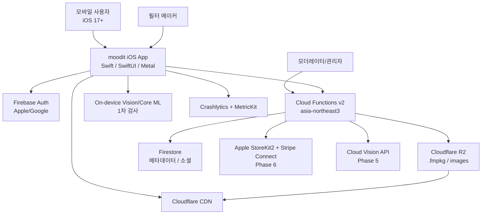
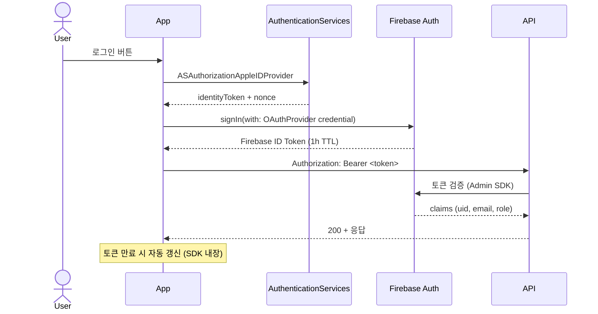
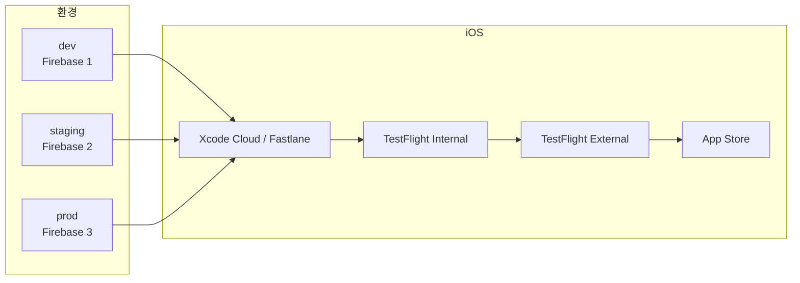

# moodit · Architecture Overview (PM Brief)

> 외부 협업자/투자자/신규 합류자에게 *시스템 그림*을 한 페이지에 전달하기 위한 PM brief. 깊은 디테일은 [`../../docs/ARCHITECTURE.md`](../../docs/ARCHITECTURE.md), [`../../docs/SYSTEM_DESIGN.md`](../../docs/SYSTEM_DESIGN.md)에 있다.

## 1. 아키텍처 원칙 9개

1. iOS-first, native-depth — SwiftUI/UIKit + Metal
2. Mobile-first, offline-tolerant — 다운로드 필터는 오프라인에서 즉시 동작
3. GPU-on-device first — 서버 GPU 비용 회피
4. Stateless backend — 토큰 기반 인증
5. Eventual consistency for social — 카운터(좋아요/다운로드)는 최종 일관성
6. Scale storage horizontally — 미디어는 객체 스토리지(R2) + CDN
7. Cost-aware — 핫 데이터 NoSQL, 콜드 데이터 R2
8. Boring tech where possible — Firebase로 시작, 필요 시 점진 분리
9. Future-proof for Android — 도메인 모델/.fmpkg/REST API는 플랫폼 중립

## 2. 시스템 컨텍스트 (C4 L1)



## 3. 클라이언트 모듈 맵

```
Sources/App           ← 화면 + 라우팅 + 스토어
   ├─ Camera          : AVCaptureSession 캡처, PhotoLibrary 저장
   ├─ FilterEngine    : Metal 라이브 프리뷰, LUT 샘플러, .fmpkg 빌더/검증
   ├─ Marketplace     : FilterRepository, ReviewStore, Social/Feed/Notification
   ├─ Models          : Filter / FilterManifest / Review / LightingTag
   ├─ Storage         : FilterCache (in-memory actor)
   ├─ DesignSystem    : FMColors / FMTypography / FMButton 등 토큰+컴포넌트
   └─ Auth            : AuthState (Firebase Auth 어댑터 슬롯)
```

| 모듈 | 책임 | 외부 의존 |
|---|---|---|
| App | DI, NavigationStack, AppRoute, RootShell, MooditStore | Firebase iOS SDK, GoogleSignIn |
| Camera | `CameraSession`, 라이브 프리뷰(MTKView), 셔터, 권한 | AVFoundation, Photos |
| FilterEngine | Metal 4-pass 셰이더, LUT 텍스처, .fmpkg loader | Metal, MetalKit |
| Marketplace | 피드/검색/상세/리뷰/소셜 저장소 | Firestore SDK |
| Models | Codable 도메인 타입, JSON Schema 검증 | — |
| DesignSystem | 토큰(Color/Type/Spacing) + 재사용 컴포넌트 | SwiftUI |
| Storage | LRU 디스크 캐시, in-memory actor | FileManager |
| Auth | Firebase Auth + AuthenticationServices | FirebaseAuth, GoogleSignIn |

## 4. 백엔드 표면

```
functions/src
   ├─ http/                       — 30 callables (asia-northeast3, enforceAppCheck:true)
   │   ├─ filters.ts              16: uploadInit / uploadFinalize / reviewImageUploadInit / sampleImageUploadInit /
   │   │                              addUserSample / submitReview / listReviews / listSamples / deleteReview /
   │   │                              markReviewHelpful / removeSample / toggleFilterLike / submitForReview /
   │   │                              recordUse / getFilterDetail / reportFilter
   │   ├─ identity.ts              5: setHandle / updateProfile / profileAvatarUploadInit / deleteAccount / setRole
   │   ├─ wallet.ts                4: purchaseFilter / creditCoinsFromIAP / proSubscriptionUpdate / refundRequest
   │   └─ moderation.ts            5: approveFilter / rejectFilter / undoModerationDecision / reportReview / reportUser
   └─ triggers/index.ts           — 11 triggers: onFilterPublished* / onReportCreated* / onFollowCreated|Deleted /
                                    onReviewCreated|Updated|Deleted / onSampleCreated|Deleted /
                                    onFilterLikeCreated|Deleted    (* = 본문 TODO)
```

상세 시그니처: [`../api-and-data/CLOUD_FUNCTIONS.md`](../api-and-data/CLOUD_FUNCTIONS.md)

## 5. 핵심 데이터 흐름 3개

| 흐름 | 단계 | 비고 |
|---|---|---|
| 필터 업로드 | `uploadInit` → R2 PUT(presigned) → `uploadFinalize` → `submitForReview` → 트리거(검수) | F8 시퀀스 다이어그램 참고 |
| 필터 다운로드 | (캐시 미스 시) `getFilterDetail` → CDN GET → 디스크 캐시 → MTLTexture | F2 다이어그램 |
| 라이브 카메라 | AVCapture → CVPixelBuffer → CVMetalTextureCache → 4-pass 셰이더 → MTKView | F9 시퀀스 |

## 6. 보안 / 인증 흐름



- Backend: Firebase Admin SDK 토큰 검증
- API: 무상태 (no session cookies)
- TLS 1.3, 인증서 핀닝 Phase 5
- App Attest(`DCAppAttestService`) Phase 5

## 7. 환경 / 배포 구조



- 시크릿: GCP Secret Manager + Xcode Cloud env vars
- 빌드 변형: Debug(dev) / Staging(TF Internal) / Release(App Store)
- Feature flag: Firebase Remote Config

## 8. 관측성

| 레이어 | 도구 | 핵심 지표 |
|---|---|---|
| 클라이언트 크래시 | Crashlytics + Sentry | 크래시율, 핵심 플로우 에러 |
| 클라이언트 성능 | MetricKit + os_signpost + Firebase Perf | 카메라 FPS, 필터 로드, hang rate |
| 백엔드 로그 | Cloud Logging | 에러율, p95 latency |
| 백엔드 메트릭 | Cloud Monitoring | RPS, 에러율, 비용 |
| 비즈니스 분석 | PostHog + BigQuery | KPI(WAFA, D1, 다운로드) |

**SLO**
- API p95 < 300ms
- 가용성 99.5% (월 다운타임 < 3.6h)
- 카메라 평균 FPS ≥ 30 / iPhone 12+ ≥ 60

## 9. 확장 시나리오

### 9.1 Firebase → 자체 백엔드 마이그레이션 트리거
- Firestore 읽기 비용 ≥ 매출 30%
- p95 > 500ms 지속
- 추천/검색이 Firestore에 종속되어 한계

### 9.2 Android 진출 시나리오 (Phase 4 게이트)
- A: 네이티브 Kotlin
- B: Compose Multiplatform (UI 일부 공유)
- C: iOS 단독 유지

결정 기준: 누적 매출 / 메이커 수 / 시장조사 / 팀 규모. ADR로 결정 — Phase 4 §6 [`../roadmap/ROADMAP.md`](../roadmap/ROADMAP.md).

---

**참조**: [`../../docs/ARCHITECTURE.md`](../../docs/ARCHITECTURE.md) · [`../../docs/SYSTEM_DESIGN.md`](../../docs/SYSTEM_DESIGN.md) · [`../../docs/TECH_STACK.md`](../../docs/TECH_STACK.md) · [`../api-and-data/CLOUD_FUNCTIONS.md`](../api-and-data/CLOUD_FUNCTIONS.md)
