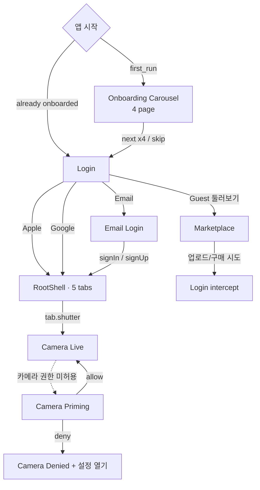
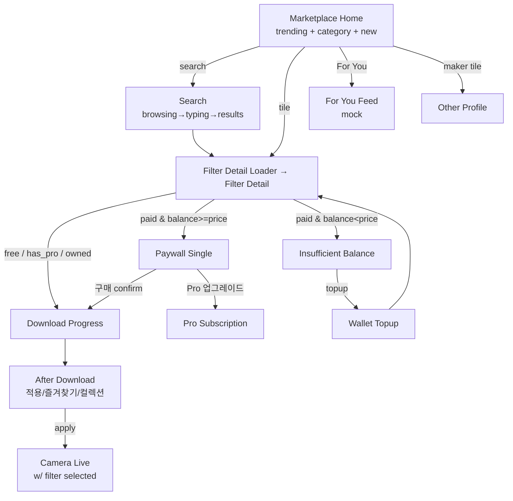
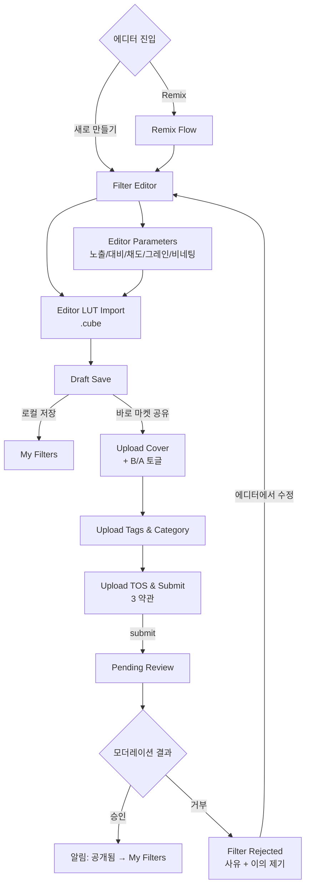
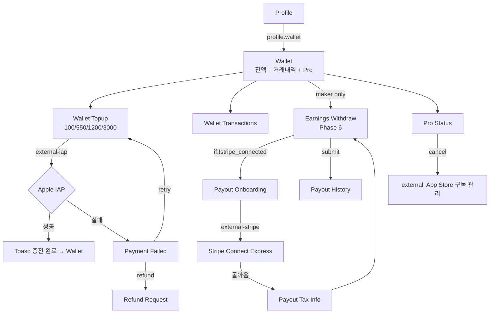
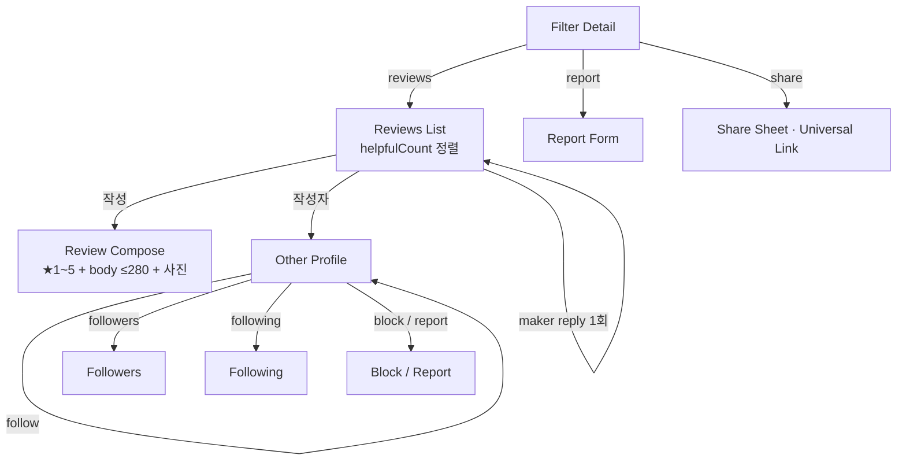
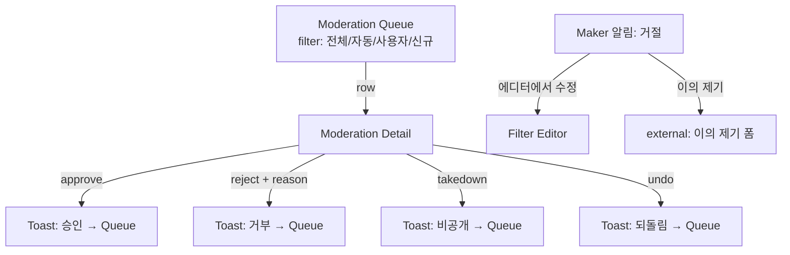
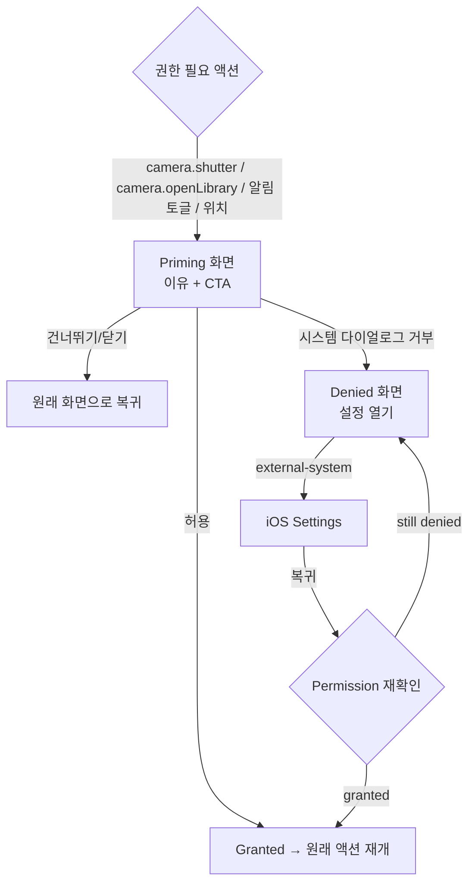
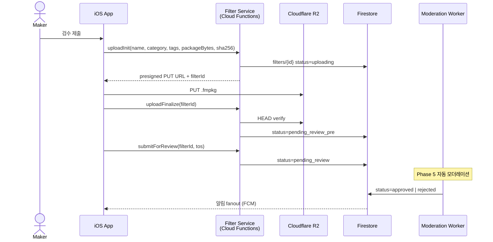
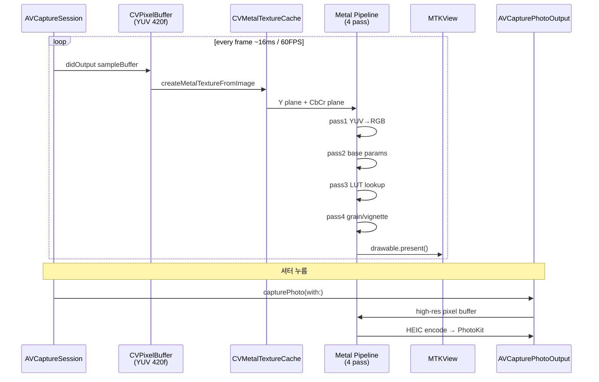

# moodit · Core Flows (Mermaid)

> 본 문서의 다이어그램은 GitHub / VS Code / Obsidian에서 Mermaid 자동 렌더링됩니다. 별도 환경은 [mermaid.live](https://mermaid.live)에 코드를 붙여넣으세요.
> Action ID 1:1 매핑은 [`../../docs/NAVIGATION.md`](../../docs/NAVIGATION.md), 화면 인벤토리는 [`../screens/SCREEN_INVENTORY.md`](../screens/SCREEN_INVENTORY.md).

## F1 — Auth & Onboarding

**의사결정 포인트**
- 게스트 → 인증 전환은 *행동 인터셉트*(다운로드/구매 시도)로 트리거. 이 위치를 변경하면 회원가입 funnel이 흔들린다.
- Onboarding은 4페이지 캐러셀로 고정. 페이지 수 변경은 카피·일러스트 자산 함께 갱신.

---

## F2 — Discover → Download → Apply

**의사결정 포인트**
- `if:filter.paid && balance>=price` 분기는 **3중 조건**(잔액 / Pro / 소유)으로 단순화 가능 여부 검토.
- 다운로드 화면은 *진행 + 취소 + 재시도*만 — 광고/추가 CTA 금지(드롭 방지).

---

## F3 — Maker Upload

**의사결정 포인트**
- 약관 3종(Original / Policy / Commercial) 동시 동의 강제 — 약관 변경 시 `submitForReview` callable 검증 동기 갱신.
- 거절→수정 루프가 메이커 retention의 핵심. 거부 사유 *구체성*이 부족하면 메이커 D7 떨어짐.

---

## F4 — Wallet & Payment

**의사결정 포인트**
- 출금은 `closed-loop coin` 정책상 Phase 6 후반까지 *앱 진입점 비노출* 상태로 유지.
- Topup 패키지 4단계 — 시장 데이터 후 5번째 패키지(예: 5,000) 추가 검토.

---

## F5 — Social & Reviews

**의사결정 포인트**
- App Store 패턴(1인 1리뷰, 메이커 답글 1회). 변경은 약관·Cloud Function `submitReview` 검증 동시 갱신.
- 신고는 *임계값 도달 시* 자동 큐 진입 — Phase 5 트리거 작업 (`onReportCreated` TODO).

---

## F6 — Moderation

**의사결정 포인트**
- 24h SLA 위반 시 알람 — Phase 5에서 모더레이션 BPO 외주 결정.
- `undoModerationDecision`은 운영 실수 복구용. 사용 빈도 추적 → SLA 지표.

---

## F7 — Permissions Priming

**의사결정 포인트**
- 거부 후 복귀율은 권한별 다름. 카메라 priming 카피가 가장 큰 lever.

---

## F8 — System: .fmpkg Upload (서버 시퀀스)

**의사결정 포인트**
- 멱등성 보장: `uploadInit`은 filterId 예약, 중복 호출 시 동일 ID 반환.
- 검수 단계가 너무 많은 상태(uploading→pre→review→approved)지만 *각 단계가 다른 actor*. 합치면 추적성 손실.

---

## F9 — System: Live Camera + Filter (단말 내부)

**의사결정 포인트**
- A11~A13에서는 4-pass 중 grain/vignette 패스 자동 단순화 — `ProcessInfo.thermalState` 모니터링 트리거.
- iPhone X 미만은 720p + 30FPS 강제 (호환성 정책 R-T04).

---

**참조**: [`INDEX.md`](./INDEX.md) · [`../../docs/NAVIGATION.md`](../../docs/NAVIGATION.md) · [`../../docs/SYSTEM_DESIGN.md`](../../docs/SYSTEM_DESIGN.md)
