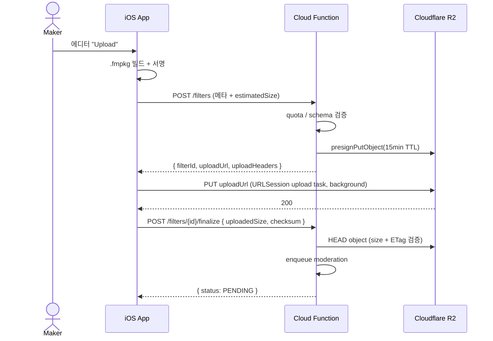

# moodit - API Specification (REST + Firestore)

> 버전: v1.0 · 작성일: 2026-05-06
>
> 이 문서는 [SYSTEM_DESIGN.md](./SYSTEM_DESIGN.md) §8의 API 개요를 정식 스펙으로 확장한다. MVP 백엔드는 Firebase 기반(Auth + Firestore + Cloud Functions). Phase 4 이후 Cloud Run + Vapor/Ktor 분리 옵션은 [TECH_STACK.md](./TECH_STACK.md) §4 참조.
>
> Base URL (예시):
> - dev: `https://us-central1-moodit-dev.cloudfunctions.net`
> - staging: `https://asia-northeast3-moodit-staging.cloudfunctions.net`
> - prod: `https://api.moodit.app`

---

## 1. API 분류

moodit은 두 가지 호출 경로를 사용한다.

| 경로 | 사용처 | 인증 |
|---|---|---|
| **Firestore Direct** | 단순 read/write 가 보안 룰로 안전한 경우 (피드, 프로필 read 등) | Firebase ID Token |
| **HTTPS Callable / REST** | 원자성·정합성·외부 시스템 통합이 필요한 경우 (업로드, 결제, 모더레이션) | Firebase ID Token (Bearer) |

원칙:
- **읽기 1순위**: Firestore SDK 직접 (오프라인 캐시 + 실시간 stream)
- **쓰기 1순위**: 보안 룰로 강제 가능하면 Firestore 직접, 아니면 Cloud Function
- **카운터/원자적 작업**: 항상 Cloud Function (샤드 카운터)

---

## 2. 인증 (Authentication)

### 2.1 토큰
- 모든 요청 헤더: `Authorization: Bearer <Firebase ID Token>`
- ID Token TTL: 1시간 (Firebase SDK가 자동 갱신)
- Custom Claims: `role` (`user`, `moderator`, `admin`), `signingPublicKey` (메이커)

### 2.2 익명/게스트
- 둘러보기 read는 익명 허용 (Firestore Rules에서 `allow read: if true` 또는 제한적 read)
- 업로드/다운로드/평가는 인증 필수

---

## 3. Firestore 직접 접근 작업

### 3.1 콜렉션 일람

| 콜렉션 | 문서 ID | 용도 |
|---|---|---|
| `users/{uid}` | Firebase UID | 사용자 프로필 + stats |
| `filters/{filterId}` | UUID v7 | 필터 메타데이터 |
| `filters/{filterId}/ratings/{uid}` | 사용자 UID | 별점 (1-5) |
| `filters/{filterId}/comments/{commentId}` | 자동 ID | 댓글 |
| `users/{uid}/favorites/{filterId}` | filterId | 즐겨찾기 |
| `users/{uid}/downloads/{filterId}` | filterId | 다운로드 이력 |
| `follows/{followerUid}_{followingUid}` | 결합 ID | 팔로우 관계 |
| `reports/{reportId}` | 자동 ID | 신고 |
| `recommendations/{uid}` | 사용자 UID | 추천 결과 캐시 (Phase 4+) |

### 3.2 콜렉션별 접근 패턴 요약

| 콜렉션 | Read | Write |
|---|---|---|
| `users/{uid}` (public 필드) | 누구나 (게스트 포함) | 본인 only |
| `users/{uid}` (private 필드) | 본인 only | 본인 only |
| `filters/{filterId}` (status=PUBLISHED) | 누구나 | 작성자 only (status 변경은 모더레이터만) |
| `filters/{filterId}` (status≠PUBLISHED) | 작성자 + 모더레이터 | 작성자 + 모더레이터 |
| `ratings/{uid}` | 누구나 | 본인 only, 1회만 |
| `comments/{commentId}` | 누구나 (status=visible) | 인증 사용자 작성, 본인 수정 |
| `favorites/{filterId}` | 본인 only | 본인 only |
| `downloads/{filterId}` | 본인 only | 본인 only (Cloud Function이 검증된 다운로드 후 작성) |
| `follows/...` | 누구나 (관계 read 공개) | 본인이 follower 일 때 only |
| `reports/...` | 모더레이터 + 작성자 | 인증 사용자가 작성, 수정 불가 |

> 정확한 보안 룰 코드는 [FIRESTORE_RULES.md](./FIRESTORE_RULES.md) 참조.

### 3.3 페이지네이션 (Firestore)
- Cursor-based: `startAfter(lastDocSnapshot)` + `.limit(20)`
- 클라이언트는 마지막 문서 ID와 정렬 키 값 보관
- 무한 스크롤 시 `limit=20`, 최대 `limit=50`

### 3.4 인덱스
필요한 composite index는 [FIRESTORE_RULES.md](./FIRESTORE_RULES.md) §인덱스 정의에 정리.

---

## 4. HTTPS Callable / REST 엔드포인트

### 4.1 표준 응답 envelope

성공:
```json
{
  "ok": true,
  "data": { ... },
  "error": null,
  "meta": { "cursor": "...", "total": 1234 }
}
```

실패:
```json
{
  "ok": false,
  "data": null,
  "error": {
    "code": "FILTER_NOT_FOUND",
    "message": "Filter does not exist or has been removed.",
    "details": { "id": "..." }
  }
}
```

표준 에러 코드:

| code | HTTP | 의미 |
|---|---|---|
| `UNAUTHENTICATED` | 401 | 토큰 누락/만료 |
| `PERMISSION_DENIED` | 403 | 권한 부족 |
| `NOT_FOUND` | 404 | 자원 없음 (또는 비공개) |
| `INVALID_ARGUMENT` | 400 | 요청 본문/쿼리 오류 |
| `FAILED_PRECONDITION` | 409 | 상태 충돌 (예: 이미 평가) |
| `RESOURCE_EXHAUSTED` | 429 | rate limit / quota |
| `ALREADY_EXISTS` | 409 | 중복 리소스 |
| `UNAVAILABLE` | 503 | 일시 오류 |
| `INTERNAL` | 500 | 서버 버그 |
| `FILTER_NOT_FOUND` | 404 | 도메인 — 필터 없음 |
| `FILTER_INVALID_PACKAGE` | 422 | .fmpkg 검증 실패 |
| `FILTER_REJECTED` | 403 | 모더레이션 거부됨 |
| `MAKER_NOT_VERIFIED` | 403 | 메이커 키 미등록 |

### 4.2 엔드포인트 카탈로그

#### Identity / Profile

| Method | Path | 설명 | Auth |
|---|---|---|---|
| POST | `/me/init` | 첫 로그인 시 user 문서 upsert | 인증 |
| GET | `/me` | 본인 프로필 + private 필드 | 인증 |
| PATCH | `/me` | 프로필 갱신 | 인증 |
| DELETE | `/me` | 계정 삭제 요청 (30일 grace) | 인증 |
| GET | `/me/export` | GDPR 내보내기 (JSON) | 인증 |
| CALLABLE | `profileAvatarUploadInit` | 프로필 아바타 R2 presigned PUT URL 발급 | 인증 |

#### Filter — Maker

| Method | Path | 설명 | Auth |
|---|---|---|---|
| POST | `/filters` | 메타 + presigned URL 발급 | 인증 |
| POST | `/filters/{id}/finalize` | 업로드 완료 통지 → 검수 큐 | 작성자 |
| POST | `/filters/{id}/submitForReview` | 검수 재요청 (REJECTED 후) | 작성자 |
| PATCH | `/filters/{id}` | 메타 수정 (status PENDING/REJECTED만) | 작성자 |
| DELETE | `/filters/{id}` | 본인 삭제 또는 admin | 작성자/admin |

#### Filter — Reader

| Method | Path | 설명 | Auth |
|---|---|---|---|
| GET | `/filters` | 검색/카테고리/태그 필터 | optional |
| GET | `/filters/{id}` | 상세 + signed CDN URL | optional |
| POST | `/filters/{id}/use` | 다운로드/적용 카운트 (idempotent) | 인증 |
| POST | `/filters/{id}/like` / `DELETE` | 좋아요 토글 | 인증 |
| POST | `/filters/{id}/rate` | 별점 1-5 (1회) | 인증 |
| POST | `/filters/{id}/report` | 신고 | 인증 |

#### Comments

| Method | Path | 설명 | Auth |
|---|---|---|---|
| GET | `/filters/{id}/comments` | 목록 (cursor) | optional |
| POST | `/filters/{id}/comments` | 작성 | 인증 |
| DELETE | `/comments/{id}` | 본인 삭제 또는 모더레이터 | 작성자/모더레이터 |

#### Social

| Method | Path | 설명 | Auth |
|---|---|---|---|
| GET | `/users/{uid}` | 공개 프로필 + filters | optional |
| POST | `/users/{uid}/follow` / `DELETE` | 팔로우 토글 | 인증 |
| GET | `/feed` | 팔로우 + 추천 혼합 | 인증 |
| GET | `/recommendations` | For You (Phase 4+) | 인증 |

#### Moderation

| Method | Path | 설명 | Auth |
|---|---|---|---|
| GET | `/moderation/queue` | 큐 조회 | 모더레이터 |
| POST | `/moderation/{filterId}/approve` | 승인 → PUBLISHED | 모더레이터 |
| POST | `/moderation/{filterId}/reject` | 거부 + 사유 | 모더레이터 |
| POST | `/moderation/{filterId}/takedown` | 사후 takedown | 모더레이터/admin |
| GET | `/reports` | 신고 큐 | 모더레이터 |
| POST | `/reports/{id}/resolve` | 신고 처리 | 모더레이터 |

#### Wallet & Coins (Phase 6 — see [`CURRENCY_DESIGN.md`](./CURRENCY_DESIGN.md))

| Method | Path | 설명 | Auth |
|---|---|---|---|
| GET | `/config/economy` | 코인 패키지 카탈로그 + 환율 + 임계치 | optional |
| GET | `/me/wallet` | 잔액·earnedCoins·proUntil | 인증 |
| POST | `/wallet/topup/init` | StoreKit IAP 시작 (intentId 발급) | 인증 |
| POST | `/wallet/topup/finalize` | Apple 영수증 검증 + 코인 지급 (idempotent) | 인증 |
| POST | `/filters/{id}/purchase` | 코인 차감 + 필터 보유권 (Idempotency-Key 필수) | 인증 |
| GET | `/me/transactions` | 거래 ledger (페이지네이션) | 인증 |
| GET | `/me/owned-filters` | 보유 필터 목록 | 인증 |
| POST | `/pro/subscribe` | Pro 멤버십 구독 (StoreKit 자동 갱신) | 인증 |
| POST | `/me/withdraw` | 메이커 코인 → 원화 출금 신청 | 인증 + KYC |
| GET | `/me/payouts` | 메이커 정산 내역 | 메이커 |

---

## 5. 핵심 엔드포인트 상세

### 5.1 `POST /filters` — 업로드 시작

**요청**
```http
POST /filters
Content-Type: application/json
Authorization: Bearer <id-token>

{
  "title": "Sunset Vibes",
  "category": "cinematic",
  "tags": ["warm", "summer"],
  "license": "CC-BY-4.0",
  "engineType": "lut+params",
  "estimatedSize": 184320
}
```

**응답** (200)
```json
{
  "ok": true,
  "data": {
    "filterId": "01900b14-7b1c-7c1e-a4f4-9b2c1d2e3f4a",
    "uploadUrl": "https://<r2>.r2.cloudflarestorage.com/...?X-Amz-Signature=...",
    "uploadHeaders": { "Content-Type": "application/x-moodit-package" },
    "expiresAt": "2026-05-06T09:15:00Z"
  },
  "error": null
}
```

**에러**
- `INVALID_ARGUMENT` — 필드 누락/검증 실패
- `RESOURCE_EXHAUSTED` — quota 초과 (20/day)

### 5.2 `POST /filters/{id}/finalize` — 업로드 완료 통지

**요청**
```json
{
  "uploadedSize": 184320,
  "checksum": "sha256:0b2f91...c3a4"
}
```

**응답** (202 Accepted, 검수 큐 진입)
```json
{
  "ok": true,
  "data": { "filterId": "...", "status": "PENDING" },
  "error": null
}
```

### 5.3 `POST /filters/{id}/submitForReview`

REJECTED 또는 작성자 수정 후 재검수.

```json
{ "ok": true, "data": { "status": "PENDING" } }
```

### 5.3aa `profileAvatarUploadInit` — 프로필 아바타 업로드 URL 발급

Firebase callable. 프로필 편집 화면에서 사진을 선택하고 저장할 때 호출한다.

**요청**
```json
{
  "contentType": "image/jpeg",
  "imageBytes": 412832
}
```

**응답**
```json
{
  "objectKey": "users/u-1/avatar/123456-avatar-id.jpg",
  "uploadUrl": "https://<r2>.r2.cloudflarestorage.com/...?X-Amz-Signature=...",
  "uploadHeaders": { "Content-Type": "image/jpeg" },
  "publicURL": "https://cdn.moodit.app/users/u-1/avatar/123456-avatar-id.jpg",
  "expiresAt": 1770000000
}
```

클라이언트는 `uploadUrl`로 PUT을 완료한 뒤 `updateProfile` callable에 `avatarURL`, `photoURL`, `avatarObjectKey`를 함께 저장한다. Functions 환경에는 `R2_PUBLIC_BASE_URL`이 필요하다. 현재 허용 타입은 JPEG/PNG, 최대 크기는 1.5MB다.

### 5.3a `reviewImageUploadInit` — 리뷰 첨부 사진 업로드 URL 발급

Firebase callable. 리뷰 작성 화면에서 사진을 첨부하면 게시 직전에 호출한다.

**요청**
```json
{
  "filterId": "abc-123",
  "contentType": "image/jpeg",
  "imageBytes": 523144
}
```

**응답**
```json
{
  "filterId": "abc-123",
  "objectKey": "reviews/abc-123/u-1/123456-image-id.jpg",
  "uploadUrl": "https://<r2>.r2.cloudflarestorage.com/...?X-Amz-Signature=...",
  "uploadHeaders": { "Content-Type": "image/jpeg" },
  "publicURL": "https://cdn.moodit.app/reviews/abc-123/u-1/123456-image-id.jpg",
  "expiresAt": 1770000000
}
```

클라이언트는 `uploadUrl`로 PUT을 완료한 뒤 review 문서에 `photoUrl`과 `photoObjectKey`를 저장한다. Functions 환경에는 `R2_PUBLIC_BASE_URL`이 필요하다.

### 5.4 `POST /moderation/{filterId}/approve` (모더레이터)

**요청**
```json
{ "notes": "looks good" }
```

**응답** — `status=PUBLISHED`, `publishedAt` 갱신, search index 큐 발행.

### 5.5 `POST /moderation/{filterId}/reject` (모더레이터)

```json
{
  "reason": "NSFW",
  "details": "preview/after.jpg violates community guidelines",
  "notifyMaker": true
}
```

**응답** — `status=REJECTED`, 메이커에게 푸시 알림 + 인앱 알림.

### 5.6 `POST /filters/{id}/report`

```json
{
  "reason": "COPYRIGHT" | "NSFW" | "SPAM" | "VIOLENCE" | "OTHER",
  "detail": "matches commercial preset XYZ"
}
```

**응답** — `reports/{reportId}` 생성, 누적 N회 시 자동 비공개.

### 5.7 `POST /filters/{id}/use` — 다운로드/적용 카운트 (idempotent)

```http
POST /filters/01900b.../use
Idempotency-Key: <client-generated-uuid>
```

서버는 동일 Idempotency-Key 60초 내 중복 무시. 샤드 카운터(10 샤드) 증가 + downloads 컬렉션에 사용자 이력 기록.

### 5.8 `GET /filters/{id}` — 상세 (signed CDN URL)

**응답**
```json
{
  "ok": true,
  "data": {
    "id": "01900b...",
    "title": "Sunset Vibes",
    "version": "1.0.0",
    "author": { "uid": "...", "displayName": "Alex" },
    "engine": { "type": "lut+params", "minAppVersion": "1.0.0", "minIOSVersion": "17.0" },
    "metrics": { "downloads": 1234, "likes": 88, "ratingAvg": 4.6, "ratingCount": 42 },
    "urls": {
      "fmpkg": "https://cdn.moodit.app/filters/01900b/v1.0.0/filter.fmpkg?sig=...&exp=...",
      "thumb": "https://cdn.moodit.app/filters/01900b/v1.0.0/preview/thumb.jpg",
      "before": "...",
      "after": "..."
    }
  }
}
```

### 5.9 Wallet & Coin Endpoints (Phase 6)

> 단일 진실원: [`CURRENCY_DESIGN.md`](./CURRENCY_DESIGN.md). 모든 잔액 변경은 서버 트랜잭션 한정 (Firestore 보안 규칙 deny-write).

#### 5.9.1 `POST /wallet/topup/init`

```json
{ "productId": "moodit.coins.popular_550" }
```

응답:
```json
{
  "ok": true,
  "data": {
    "intentId": "tu_a1b2c3",
    "productId": "moodit.coins.popular_550",
    "expiresAt": 1730003600
  }
}
```

#### 5.9.2 `POST /wallet/topup/finalize`

```json
{
  "intentId": "tu_a1b2c3",
  "signedTransaction": "<StoreKit 2 JWS>"
}
```

서버 동작:
1. JWS 서명 검증 (Apple 공개키)
2. 디코딩한 `transactionId`가 이전에 처리되지 않았는지 확인 (replay 방지)
3. Firestore 트랜잭션: `wallets/{uid}.balance += package.coins`, `transactions` 레코드 추가
4. 응답: 신규 잔액

응답:
```json
{ "ok": true, "data": { "balance": 1800, "granted": 600 } }
```

오류 코드:
- `INVALID_RECEIPT` — JWS 서명/만료 검증 실패
- `IDEMPOTENCY_REPLAY` — 동일 transactionId 이미 처리됨 (성공으로 간주, 잔액만 반환)

#### 5.9.3 `POST /filters/{id}/purchase`

헤더: `Idempotency-Key: <uuid>` 필수

```json
{}
```

서버 트랜잭션:
1. 필터 published 상태 + owner 자기 자신 아님 확인
2. Pro 멤버십 활성 → 코인 차감 0, 보유 부여 (응답 `proGranted: true`)
3. 그 외: `wallets/{uid}.balance >= filter.priceCoins` 확인 → 차감 → 메이커에게 60% earnedCoins 적립 → ledger 4개 doc 기록

응답 (코인 사용 시):
```json
{
  "ok": true,
  "data": {
    "filterId": "01900b...",
    "balanceAfter": 1170,
    "downloadUrl": "https://cdn.moodit.app/...",
    "downloadExpiresAt": 1730004200
  }
}
```

오류 코드:
- `INSUFFICIENT_BALANCE` — `data.shortBy` 에 부족 코인량
- `ALREADY_OWNED` — 이미 보유한 필터
- `FILTER_NOT_AVAILABLE` — published 아니거나 takedown

#### 5.9.4 `GET /me/transactions?cursor=...&limit=50&type=...`

응답:
```json
{
  "ok": true,
  "data": {
    "transactions": [
      { "id": "tx_...", "type": "topup", "amount": 600, "balanceAfter": 1800, "createdAt": 1730003620 },
      { "id": "tx_...", "type": "purchase", "amount": -80, "balanceAfter": 1720, "filterId": "01900b...", "createdAt": 1730003700 }
    ],
    "nextCursor": "eyJ0czoxNzMwMDAzNzAwfQ"
  }
}
```

#### 5.9.5 `POST /me/withdraw`

```json
{ "coins": 10000 }
```

전제: Stripe Connect onboarding 완료 + 세무 정보 등록 + 잔액 ≥ 5,000 + KYC 통과.

응답:
```json
{
  "ok": true,
  "data": {
    "payoutId": "po_...",
    "coins": 10000,
    "amountKRW": 140000,
    "estimatedPaidAt": 1730172800,
    "status": "requested"
  }
}
```

오류:
- `KYC_REQUIRED` — Stripe Connect / 세무 미완
- `BELOW_THRESHOLD` — 임계치 미달 (5,000 코인)
- `INSUFFICIENT_EARNED` — 적립 코인 부족

---

## 6. Cloudflare R2 직접 업로드 흐름



핵심:
- presigned PUT URL TTL: 15분
- 단일 파일 < 100MB는 단일 PUT, 그 이상은 multipart (현재 .fmpkg 1MB 상한이라 미해당)
- 업로드 후 `finalize`까지 1시간 미호출 시 GC가 staging key 삭제
- ETag/checksum 불일치 시 finalize 거부 + R2 삭제

---

## 7. Rate Limiting

### 7.1 정책 (참고: [SYSTEM_DESIGN.md](./SYSTEM_DESIGN.md) §8.4)

| 사용자 | 일반 API | 업로드 | 신고 |
|---|---|---|---|
| 익명 (IP 기준) | 30 req/min | — | — |
| 인증 사용자 | 300 req/min | 20 filters/day | 10 reports/day |
| 모더레이터 | 1000 req/min | — | — |
| Admin | 무제한 (감사 로그) | — | — |

### 7.2 구현
- **Cloud Functions 미들웨어**: Memorystore (Redis) sliding window
- **Cloudflare**: 엣지 단에서 `firewall_rules` + bot management (DDoS 보호)
- **App Attest**: 인증된 디바이스만 허용 quota 부여 (Phase 5+)

### 7.3 응답
- 초과 시 `429 Too Many Requests`
- 헤더: `Retry-After: <seconds>`, `X-RateLimit-Remaining`, `X-RateLimit-Reset`

---

## 8. 페이지네이션 / 정렬 / 필터링

### 8.1 페이지네이션 (cursor)

```http
GET /filters?category=cinematic&sort=-downloads&limit=20
GET /filters?category=cinematic&sort=-downloads&limit=20&cursor=eyJsYXN0SWQiOiIw...
```

응답 meta:
```json
{ "meta": { "cursor": "eyJsYXN0SWQiOiI...", "hasMore": true } }
```

cursor는 base64 JSON `{ lastId, lastSortValue }` (서버 서명 권장).

### 8.2 정렬
- `sort=-downloads,createdAt` (콤마로 다단)
- `-` 접두사: 내림차순
- 허용 키: `downloads`, `createdAt`, `ratingAvg`, `likes`, `popularity` (조합 점수)

### 8.3 필터링
- `category`, `tag`, `q`(검색어), `authorUid`, `engineType`
- `q`는 MVP에서 prefix 매칭 (Phase 4 Algolia 도입 후 fuzzy)

---

## 9. 멱등성 (Idempotency)

다음 엔드포인트는 `Idempotency-Key` 헤더 (UUID v4) 지원:
- `POST /filters/{id}/use` (60초 윈도)
- `POST /wallet/topup/finalize` (StoreKit transactionId replay 방지)
- `POST /filters/{id}/purchase` (24시간 윈도, Coin 이중 차감 방지)
- `POST /filters/{id}/like` (자체 토글이라 자연 idempotent)

서버는 동일 키 + 동일 사용자면 첫 응답을 캐시 후 재사용.

---

## 10. 알림 (Notifications)

### 10.1 트리거
- 신규 팔로워, 새 댓글, 별점 받음, 모더레이션 결과 (승인/거부), 다운로드 milestone (100, 1k, 10k)

### 10.2 채널
- **APNs Push** (FCM 경유 또는 직접) — 디바이스 토큰 `users/{uid}/devices/{deviceId}`
- **인앱 알림센터** — `notifications/{uid}/items/{itemId}`

### 10.3 사용자 설정
- `users/{uid}.notificationPrefs.{channel}` (Boolean)
- iOS 권한 거부 시 인앱 알림센터만 동작

---

## 11. 보안 요약

- 모든 통신 TLS 1.3
- ID Token 검증: Firebase Admin SDK (`verifyIdToken`)
- Custom Claims로 role 강제
- 모더레이터/admin 작업은 감사 로그 (`auditLogs/{logId}`) 필수
- 메이커 서명 검증은 [FMPKG_SCHEMA.md](./FMPKG_SCHEMA.md) §8 참조
- App Attest (Phase 5+): 디바이스 무결성 검증 → 허용 quota 차등

---

## 12. OpenAPI 산출물

본 문서의 엔드포인트는 `docs/openapi/v1.yaml` (Phase 1 작업)으로 추출하여 다음에 활용한다:
- 자동 클라이언트 코드 생성 (Swift `Codable`)
- 모킹 서버 (Prism)
- API 변경 감시 (CI에서 swagger-diff)

---

## 13. 관련 문서

- [SYSTEM_DESIGN.md](./SYSTEM_DESIGN.md) §8
- [FIRESTORE_RULES.md](./FIRESTORE_RULES.md)
- [FMPKG_SCHEMA.md](./FMPKG_SCHEMA.md)
- [MSL_SECURITY.md](./MSL_SECURITY.md)
- [TECH_STACK.md](./TECH_STACK.md) §4 백엔드
- [ARCHITECTURE.md](./ARCHITECTURE.md) §4 데이터 흐름
