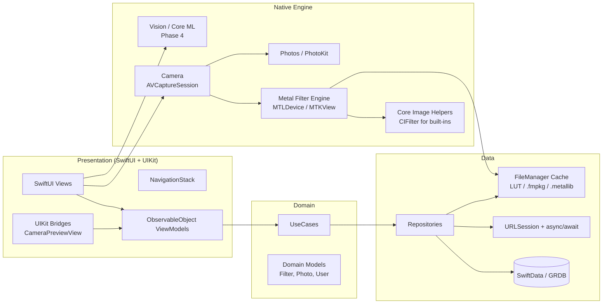
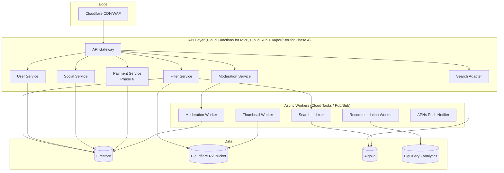
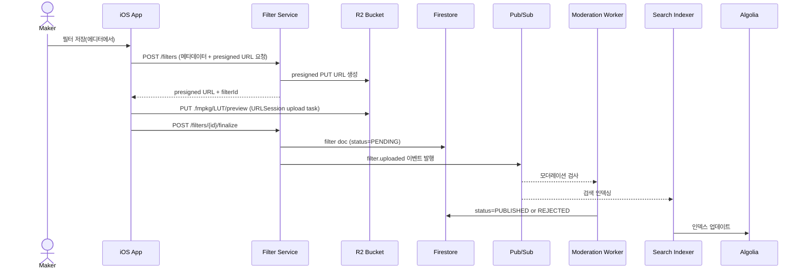
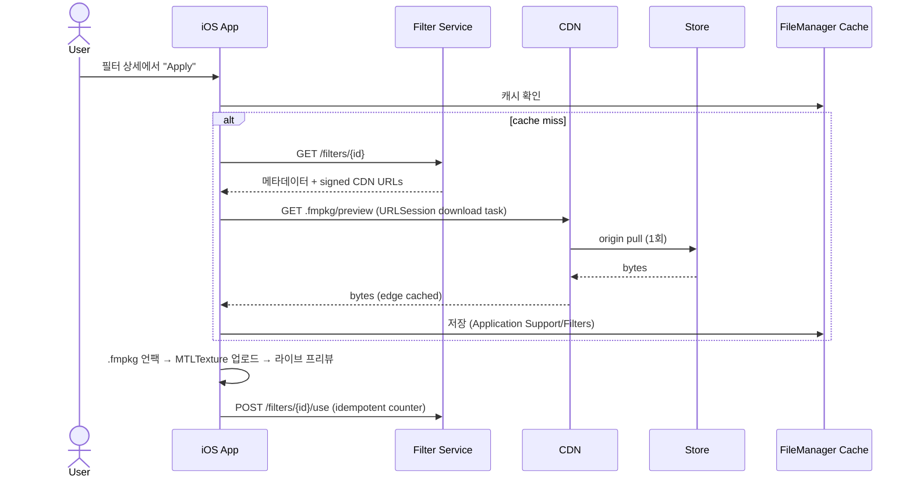
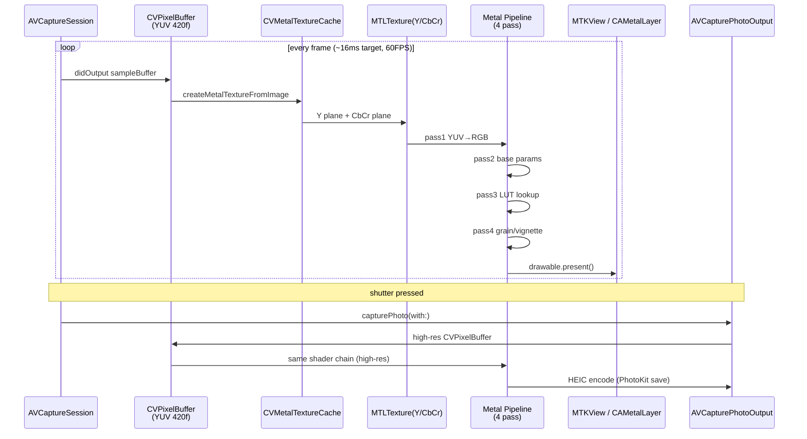
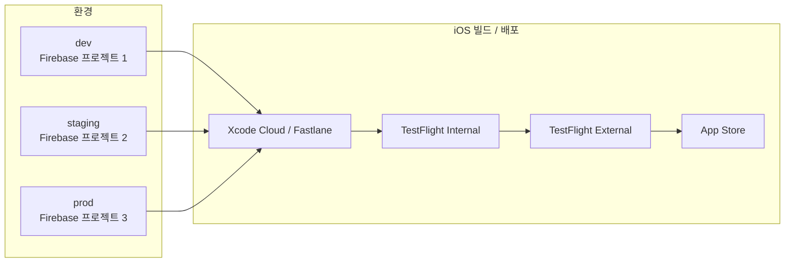
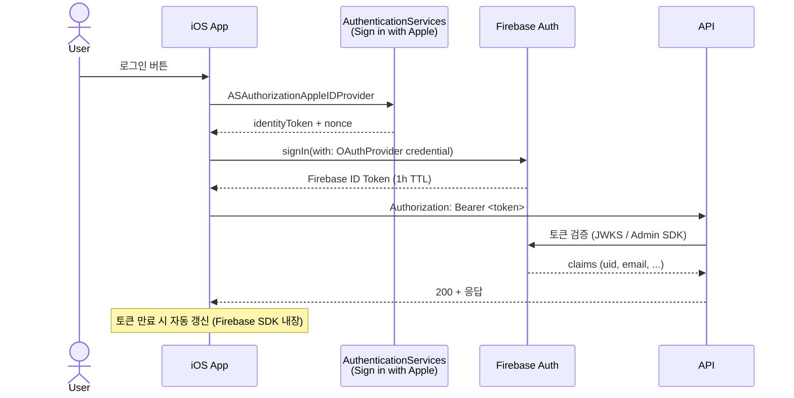

# filterMarket - System Architecture

> 버전: v1.1 (Draft, iOS native pivot) · 작성일: 2026-05-06

---

## 1. 아키텍처 원칙 (Architectural Principles)

1. **iOS-first, native-depth**: SwiftUI/UIKit + Metal로 플랫폼 표현력 최대 활용
2. **Mobile-first, offline-tolerant**: 다운로드한 필터는 오프라인에서 즉시 동작
3. **GPU-on-device first**: 필터 렌더링은 모두 클라이언트에서 처리(서버 GPU 비용 회피)
4. **Stateless backend**: API 서버는 세션을 저장하지 않고 토큰 기반 인증
5. **Eventual consistency for social**: 카운터(좋아요/다운로드 수)는 최종 일관성 허용
6. **Scale storage horizontally**: 미디어는 객체 스토리지 + CDN 캐싱
7. **Cost-aware**: 핫 데이터(필터 메타)는 NoSQL, 콜드 데이터(원본 미디어)는 R2/S3
8. **Boring tech where possible**: Firebase로 시작, 필요 시 점진 분리
9. **Future-proof for Android**: 도메인 모델/.fmpkg 포맷/REST API는 플랫폼 중립적으로 설계 → Phase 4 이후 Android 포팅 시 재사용

---

## 2. 시스템 컨텍스트 다이어그램 (C4 Level 1)

```mermaid
graph TB
    User[모바일 사용자<br/>iOS 17+]
    Maker[필터 메이커<br/>iOS - 향후 데스크탑]
    Admin[모더레이터/관리자<br/>Web Admin]

    App[filterMarket iOS App<br/>Swift / SwiftUI / Metal]

    Auth[Firebase Auth<br/>+ Sign in with Apple/Google]
    API[Backend API<br/>Cloud Functions / Cloud Run]
    Store[Cloudflare R2<br/>미디어 객체 (.fmpkg/preview)]
    DB[Firestore<br/>메타데이터 / 소셜]
    CDN[Cloudflare CDN<br/>edge cache]
    Search[Algolia<br/>검색 인덱스 (Phase 4)]
    ML[Recommendation Service<br/>Phase 4+]
    Pay[Apple IAP + Stripe Connect<br/>Phase 6]
    Mod[Cloud Vision API<br/>모더레이션]
    OnDevice[On-device Vision/Core ML<br/>1차 검사]
    Crash[Crashlytics + MetricKit]
    Analytics[PostHog]

    User --> App
    Maker --> App
    Admin --> API

    App --> Auth
    App --> API
    App --> CDN
    App --> Crash
    App --> Analytics
    App --> OnDevice

    API --> DB
    API --> Store
    API --> Search
    API --> Mod
    API --> Pay
    API --> ML

    Store --> CDN
```

---

## 3. 컴포넌트 다이어그램 (C4 Level 2)

### 3.1 클라이언트 (iOS 앱) — Swift Package 기반 모듈 분할



#### 클라이언트 모듈(SPM 패키지) 책임

| 모듈 (Swift Package) | 책임 |
|---|---|
| `App` | 앱 엔트리(`@main`), DI 컨테이너, NavigationStack 라우팅 |
| `Camera` | `AVCaptureSession`, 라이브 프리뷰(MTKView), 셔터, 권한 |
| `FilterEngine` | Metal 디바이스/큐, 4-pass 셰이더 파이프라인, LUT 텍스처, .fmpkg 로더 |
| `Editor` | 필터 에디터 (LUT 변환, 파라미터→LUT bake, .fmpkg 빌더) |
| `Marketplace` | 피드, 검색, 카테고리, 상세 |
| `Profile` | 사용자 프로필, 내 필터, 즐겨찾기 |
| `Auth` | Firebase Auth + AuthenticationServices(Sign in with Apple) |
| `Storage` | URLSession 클라이언트, 로컬 DB, 디스크 캐시(LRU) |
| `Models` | 도메인 모델, Codable, JSON Schema 검증 |
| `DesignSystem` | 컬러/타이포/스페이싱, 재사용 컴포넌트 |
| `Analytics` | PostHog/Crashlytics/MetricKit 래퍼 |

> 모든 모듈은 Swift Package Manager로 관리되며, 외부 의존성(Firebase iOS SDK 등)은 `Package.swift`에 명시.

### 3.2 백엔드



---

## 4. 데이터 흐름 (Data Flow)

### 4.1 필터 업로드 플로우



### 4.2 필터 다운로드 / 적용 플로우



### 4.3 라이브 카메라 + 필터 (단말 내부)



---

## 5. 외부 서비스 의존성

| 서비스 | 용도 | 대안 | 비용 영향 |
|---|---|---|---|
| **Firebase Auth** | 로그인 (Apple/Google/Email) | Auth0, Supabase Auth | 50K MAU까지 무료 |
| **Firestore** | 메타데이터, 소셜 그래프 | Postgres+Supabase | 읽기 비용 주의 → 캐시 필수 |
| **Cloudflare R2** | .fmpkg/preview/photo 저장 | Firebase Storage, S3 | egress 무료(R2 강점) |
| **Cloudflare CDN** | 미디어 edge 캐싱 | CloudFront | R2와 무료 통합 |
| **Algolia** (or Typesense self-host) | 필터 검색 | Elasticsearch | 1K req/mo 무료 → 유료 전환 시점 검토 |
| **Cloud Vision API** | 모더레이션(누드/폭력) | AWS Rekognition, OpenAI Moderation | 1K img/mo 무료 |
| **On-device Vision / Core ML** | 업로드 전 1차 NSFW/얼굴 검출 | - | 무료, 사용자 프라이버시 우호 |
| **Crashlytics** + **MetricKit** | 크래시/성능 | Sentry | 무료 |
| **Sentry** | 에러 / 소스맵 | Bugsnag | 5K event/mo 무료 |
| **PostHog** | 제품 분석 | Mixpanel, GA4 | 1M event/mo 무료 |
| **Stripe Connect** (Phase 6) | 메이커 정산 | IAP(필수) + 웹 우회 | 수수료 2.9% |
| **Apple IAP** (Phase 6) | 인앱 결제 (필수) | - | 15~30% |
| **APNs** | 푸시 알림 | FCM 경유 가능 | 무료 |

---

## 6. 환경 / 배포 구조



- **dev/staging/prod 환경 분리**: Firebase 프로젝트 단위로 격리. 시크릿은 GCP Secret Manager + Xcode Cloud 환경 변수.
- **앱 빌드 변형**: Xcode Configuration `Debug` (dev), `Staging` (TestFlight Internal), `Release` (App Store).
- **Feature Flag**: Firebase Remote Config로 점진 롤아웃.
- **Code Signing**: Fastlane match로 인증서/프로비저닝 프로파일 관리.

---

## 7. 보안 / 인증 흐름



- 백엔드는 **Firebase Admin SDK**로 ID 토큰 검증.
- API는 **무상태(stateless)**, 세션 쿠키 사용 안 함(모바일 친화).
- 모든 통신은 **TLS 1.3**, 인증서 핀닝(Phase 5에서, `URLSessionDelegate`).
- Keychain Services로 토큰 보관, App Attest(`DCAppAttestService`)로 디바이스 무결성 검증(Phase 5).

---

## 8. 관측성 (Observability)

| 레이어 | 도구 | 핵심 지표 |
|---|---|---|
| 클라이언트 크래시 | Crashlytics + Sentry | 크래시율, 핵심 플로우 에러 |
| 클라이언트 성능 | MetricKit + os_signpost + Firebase Perf | 카메라 FPS, 필터 로드 시간, hang rate |
| 백엔드 로그 | Cloud Logging | 에러율, p95 latency |
| 백엔드 메트릭 | Cloud Monitoring | RPS, 에러율, 비용 |
| 비즈니스 분석 | PostHog + BigQuery | KPI(WAFA, D1, 다운로드) |
| 알림 | PagerDuty (Phase 4) | SLO 위반 시 호출 |

### SLO (Service Level Objectives)
- API p95 레이턴시 < 300ms
- 가용성 99.5% (월 다운타임 < 3.6시간)
- 카메라 평균 FPS ≥ 30 (95퍼센타일, iPhone 12 이상에서 ≥60)

---

## 9. 확장 시나리오

### 9.1 Firebase → 자체 백엔드 마이그레이션 트리거
- Firestore 읽기 비용이 매출의 30% 초과
- p95 레이턴시 > 500ms 지속
- 추천/검색이 Firestore에 종속되어 한계

### 9.2 마이그레이션 경로
1. API Gateway 도입(Cloud Run + **Vapor(Swift)** 또는 **Ktor**) — Firestore 직접 접근 제거
2. 핵심 도메인을 Postgres로 이전(filters, users, social_graph)
3. Cloudflare R2 + 자체 CDN으로 전환 완료
4. Auth는 Firebase Auth 유지(전환 비용 큼)

> Vapor 선택 시 모바일과 동일한 Swift 언어 → 모델 공유(Codable). Ktor는 Android 진출 시(Phase 4 이후) 재고려.

### 9.3 Android 진출 시나리오 (Phase 4 게이트)
- 옵션 A: 네이티브 Kotlin(SwiftUI 동등 표현력, 코드베이스 분리)
- 옵션 B: Compose Multiplatform 도입(UI 일부 공유, 카메라/Metal 등가물은 GLES/Vulkan + AGSL/Vulkan SC)
- 옵션 C: iOS 단독 유지(시장 반응이 iOS 집중을 정당화하는 경우)
- 결정 기준: 누적 매출, 메이커 수, 시장조사, 팀 규모 → [TASK_LIST.md](./TASK_LIST.md) Phase 4 게이트 참고

---

## 10. 관련 문서
- [SYSTEM_DESIGN.md](./SYSTEM_DESIGN.md) — 핵심 컴포넌트 상세 설계
- [TECH_STACK.md](./TECH_STACK.md) — 기술 선택 근거
- [RISKS.md](./RISKS.md) — 아키텍처 위험과 완화
