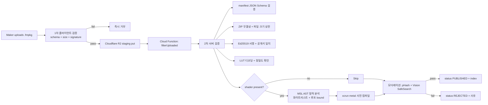

# moodit - .fmpkg 필터 패키지 정식 스펙

> 버전: v1.0 (Schema Version 1) · 작성일: 2026-05-06
>
> 이 문서는 [SYSTEM_DESIGN.md](./SYSTEM_DESIGN.md) §2의 .fmpkg 포맷을 정식 스펙으로 확장한다. iOS 클라이언트 / 서버 검증 / Phase 4 이후 Android 포팅 모두 본 스펙을 단일 진실 출처(SoT)로 사용한다.

---

## 1. 설계 목표

1. **메이커 친화적**: LUT 1개 + manifest 1개로 최소 패키지 가능
2. **확장 가능**: 셰이더, 파라미터, 프리셋, 다국어 메타 추가 시 forward-compatible
3. **플랫폼 중립**: iOS(MSL) 1차, Phase 4+ Android(GLSL/AGSL) 포팅 가능 구조 (참고: [ADR-0003](./ADR/0003-metal-msl-shader-pipeline.md))
4. **무결성 검증**: SHA-256 해시 + Ed25519 서명으로 위변조 차단
5. **소형**: 평균 200KB 이내, 1MB 상한
6. **오프라인 호환**: 한 번 다운로드된 패키지는 네트워크 없이 동작

---

## 2. 컨테이너 구조

`.fmpkg`는 **ZIP 컨테이너** (deflate, 비밀번호 없음). MIME: `application/x-moodit-package`.

### 2.1 표준 디렉토리 트리

```
my_filter.fmpkg/
├── manifest.json              # 필수, UTF-8 JSON, 4KB 권장 상한
├── shaders/                   # 선택 (engine.type == "lut+msl"부터)
│   ├── filter.metal           # MSL 소스 (검증/감사용)
│   └── filter.metallib        # 사전 컴파일 Metal Library (즉시 로드용)
├── luts/                      # 선택 (engine.type 이 LUT 사용 시 필수)
│   ├── lut.png                # 1024x1024 PNG (33^3 packing) 1차
│   └── lut.cube               # (선택) 원본 .cube 백업
├── preview/                   # 필수
│   ├── thumb.jpg              # 256x256 정사각 썸네일
│   ├── before.jpg             # 1080x1080 비포 미리보기
│   └── after.jpg              # 1080x1080 애프터 미리보기
├── signature                  # 필수 (Ed25519 detached signature)
│   ├── signature.bin          # 서명 (64 bytes)
│   └── pubkey.txt             # 메이커 공개키 (Base64)
└── README.md                  # 선택, 메이커 노트 (i18n 문구는 manifest의 description.i18n에)
```

### 2.2 파일 명명 규칙
- 모든 파일명: 소문자 + 숫자 + `_`/`-`만 허용, 확장자 소문자
- 한글/유니코드 파일명 금지 (호환성)
- `manifest.json`은 항상 ZIP 루트
- 서명 대상에서 `signature/` 디렉토리 자체는 제외 (서명은 나머지 파일들의 정렬된 SHA-256 해시 트리에 대해 생성)

---

## 3. manifest.json — JSON Schema (Draft 2020-12)

### 3.1 스키마

```json
{
  "$schema": "https://json-schema.org/draft/2020-12/schema",
  "$id": "https://moodit.app/schemas/fmpkg/v1/manifest.json",
  "title": "moodit Filter Manifest v1",
  "type": "object",
  "required": ["schemaVersion", "id", "version", "title", "author", "engine", "createdAt", "checksum"],
  "additionalProperties": false,
  "properties": {
    "schemaVersion": { "type": "integer", "const": 1 },
    "id": { "type": "string", "format": "uuid", "description": "UUID v7 권장 (timestamp-ordered)" },
    "version": {
      "type": "string",
      "pattern": "^\\d+\\.\\d+\\.\\d+(?:-[\\w.-]+)?(?:\\+[\\w.-]+)?$",
      "description": "Semantic Versioning 2.0"
    },
    "title": { "type": "string", "minLength": 1, "maxLength": 60 },
    "slug": { "type": "string", "pattern": "^[a-z0-9]+(?:-[a-z0-9]+)*$", "maxLength": 60 },
    "description": {
      "oneOf": [
        { "type": "string", "maxLength": 500 },
        {
          "type": "object",
          "patternProperties": {
            "^[a-z]{2}(-[A-Z]{2})?$": { "type": "string", "maxLength": 500 }
          },
          "minProperties": 1,
          "additionalProperties": false
        }
      ]
    },
    "author": {
      "type": "object",
      "required": ["uid", "displayName"],
      "properties": {
        "uid": { "type": "string", "minLength": 1 },
        "displayName": { "type": "string", "maxLength": 40 }
      },
      "additionalProperties": false
    },
    "category": {
      "type": "string",
      "enum": ["cinematic", "vintage", "pastel", "bw", "portrait", "food", "travel", "anime", "mood", "bright", "moody", "skin"]
    },
    "tags": {
      "type": "array",
      "items": { "type": "string", "pattern": "^[a-z0-9-]+$", "maxLength": 24 },
      "maxItems": 12
    },
    "license": {
      "type": "string",
      "enum": ["CC0-1.0", "CC-BY-4.0", "CC-BY-SA-4.0", "CC-BY-NC-4.0", "All-Rights-Reserved", "Commercial"]
    },
    "copyright": { "type": "string", "maxLength": 200 },
    "remix": {
      "type": "object",
      "required": ["enabled"],
      "properties": {
        "enabled": { "type": "boolean" },
        "parentId": { "type": ["string", "null"], "format": "uuid" }
      },
      "additionalProperties": false
    },
    "engine": {
      "type": "object",
      "required": ["type", "minAppVersion", "minIOSVersion"],
      "properties": {
        "type": { "type": "string", "enum": ["lut+params", "lut+msl", "nodegraph"] },
        "minAppVersion": { "type": "string", "pattern": "^\\d+\\.\\d+\\.\\d+$" },
        "minIOSVersion": { "type": "string", "pattern": "^\\d+\\.\\d+$" },
        "lutSize": { "type": "integer", "enum": [17, 33, 65] },
        "lutFile": { "type": ["string", "null"], "pattern": "^luts/.*\\.(png|cube)$" },
        "shaderEntry": {
          "type": ["object", "null"],
          "properties": {
            "metalSource": { "type": ["string", "null"], "pattern": "^shaders/.*\\.metal$" },
            "metalLibrary": { "type": ["string", "null"], "pattern": "^shaders/.*\\.metallib$" },
            "fragmentName": { "type": "string", "pattern": "^[A-Za-z_][A-Za-z0-9_]*$" },
            "vertexName": { "type": "string", "pattern": "^[A-Za-z_][A-Za-z0-9_]*$" },
            "uniforms": {
              "type": "array",
              "items": { "$ref": "#/$defs/uniform" },
              "maxItems": 32
            }
          },
          "additionalProperties": false
        }
      },
      "additionalProperties": false
    },
    "parameters": {
      "type": "array",
      "items": { "$ref": "#/$defs/parameter" },
      "maxItems": 16
    },
    "presets": {
      "type": "array",
      "items": { "$ref": "#/$defs/preset" },
      "maxItems": 8
    },
    "capabilities": {
      "type": "object",
      "properties": {
        "minGPUFamily": { "type": "string", "enum": ["apple4", "apple5", "apple6", "apple7", "apple8"] },
        "needsBlueNoise": { "type": "boolean", "default": false },
        "maxTextureSize": { "type": "integer", "minimum": 256, "maximum": 4096 }
      },
      "additionalProperties": false
    },
    "createdAt": { "type": "string", "format": "date-time" },
    "checksum": {
      "type": "string",
      "pattern": "^sha256:[a-f0-9]{64}$",
      "description": "manifest 외 모든 파일의 정렬된 sha256 트리 합산"
    }
  },
  "$defs": {
    "parameter": {
      "type": "object",
      "required": ["key", "label", "type"],
      "properties": {
        "key": { "type": "string", "pattern": "^[a-z][a-zA-Z0-9_]*$", "maxLength": 24 },
        "label": { "oneOf": [
          { "type": "string", "maxLength": 30 },
          { "type": "object", "patternProperties": { "^[a-z]{2}(-[A-Z]{2})?$": { "type": "string", "maxLength": 30 } } }
        ]},
        "type": { "type": "string", "enum": ["float", "color", "bool"] },
        "min": { "type": "number" },
        "max": { "type": "number" },
        "default": {},
        "step": { "type": "number" }
      },
      "additionalProperties": false
    },
    "preset": {
      "type": "object",
      "required": ["name", "values"],
      "properties": {
        "name": { "type": "string", "maxLength": 30 },
        "values": { "type": "object", "additionalProperties": true }
      }
    },
    "uniform": {
      "type": "object",
      "required": ["name", "type"],
      "properties": {
        "name": { "type": "string", "pattern": "^[A-Za-z_][A-Za-z0-9_]*$" },
        "type": { "type": "string", "enum": ["float", "float2", "float3", "float4", "int", "bool"] },
        "boundParameter": { "type": "string" }
      }
    }
  }
}
```

### 3.2 i18n 키
- 언어 코드: BCP 47 short form (`en`, `ko`, `ja`, `zh-CN`, `zh-TW`, `es`, `de`, `fr`, `pt-BR`)
- description / parameter.label에 사용
- 클라이언트는 사용자 locale → 매칭 실패 시 `en` fallback

---

## 4. 예시 manifest.json

### 4.1 최소 (LUT only)

```json
{
  "schemaVersion": 1,
  "id": "01900b14-7b1c-7c1e-a4f4-9b2c1d2e3f4a",
  "version": "1.0.0",
  "title": "Sunset Vibes",
  "slug": "sunset-vibes",
  "description": {
    "en": "Warm cinematic look inspired by golden hour.",
    "ko": "골든아워에서 영감을 받은 따뜻한 시네마틱 톤."
  },
  "author": { "uid": "fb_uid_alex_1234", "displayName": "Alex" },
  "category": "cinematic",
  "tags": ["warm", "golden-hour", "summer"],
  "license": "CC-BY-4.0",
  "copyright": "© 2026 Alex Kim",
  "remix": { "enabled": true, "parentId": null },
  "engine": {
    "type": "lut+params",
    "minAppVersion": "1.0.0",
    "minIOSVersion": "17.0",
    "lutSize": 33,
    "lutFile": "luts/lut.png"
  },
  "parameters": [
    { "key": "intensity", "label": { "en": "Intensity", "ko": "강도" }, "type": "float", "min": 0, "max": 1, "default": 1.0, "step": 0.01 },
    { "key": "grain", "label": "Grain", "type": "float", "min": 0, "max": 0.3, "default": 0.05, "step": 0.005 },
    { "key": "vignette", "label": "Vignette", "type": "float", "min": 0, "max": 1, "default": 0.2, "step": 0.05 }
  ],
  "presets": [
    { "name": "Soft", "values": { "intensity": 0.5, "grain": 0.02, "vignette": 0.1 } },
    { "name": "Strong", "values": { "intensity": 1.0, "grain": 0.08, "vignette": 0.4 } }
  ],
  "capabilities": { "minGPUFamily": "apple4" },
  "createdAt": "2026-05-06T09:00:00Z",
  "checksum": "sha256:0b2f91...c3a4"
}
```

### 4.2 셰이더 포함 (Phase 3+ engine.type = "lut+msl")

```json
{
  "schemaVersion": 1,
  "id": "01900b14-7b1c-7c1f-bcde-2233445566aa",
  "version": "1.1.0",
  "title": "Halation Bloom",
  "slug": "halation-bloom",
  "description": "Filmic halation around highlights.",
  "author": { "uid": "fb_uid_studio_xyz", "displayName": "StudioXYZ" },
  "category": "cinematic",
  "tags": ["film", "halation", "bloom"],
  "license": "Commercial",
  "copyright": "© 2026 StudioXYZ. All Rights Reserved.",
  "remix": { "enabled": false, "parentId": null },
  "engine": {
    "type": "lut+msl",
    "minAppVersion": "1.5.0",
    "minIOSVersion": "17.0",
    "lutSize": 33,
    "lutFile": "luts/lut.png",
    "shaderEntry": {
      "metalSource": "shaders/halation.metal",
      "metalLibrary": "shaders/halation.metallib",
      "fragmentName": "halation_fragment",
      "vertexName": "fullscreen_vertex",
      "uniforms": [
        { "name": "u_threshold", "type": "float", "boundParameter": "threshold" },
        { "name": "u_radius",    "type": "float", "boundParameter": "radius" },
        { "name": "u_tint",      "type": "float3", "boundParameter": "tint" }
      ]
    }
  },
  "parameters": [
    { "key": "threshold", "label": "Threshold", "type": "float", "min": 0.5, "max": 1.0, "default": 0.85 },
    { "key": "radius",    "label": "Radius",    "type": "float", "min": 0.0, "max": 0.05, "default": 0.015 },
    { "key": "tint",      "label": "Tint",      "type": "color", "default": [1.0, 0.4, 0.2] }
  ],
  "capabilities": { "minGPUFamily": "apple7", "maxTextureSize": 2048 },
  "createdAt": "2026-05-06T10:30:00Z",
  "checksum": "sha256:9912ab...77fe"
}
```

---

## 5. 셰이더 파일 규칙

### 5.1 MSL 소스 (.metal)
- UTF-8, LF 라인 엔딩
- Fragment 함수 1개, vertex 함수 1개 (또는 표준 fullscreen vertex 재사용)
- 시그니처:

```metal
#include <metal_stdlib>
using namespace metal;

struct VertexOut {
    float4 position [[position]];
    float2 uv;
};

vertex VertexOut fullscreen_vertex(uint vid [[vertex_id]]) {
    // 풀스크린 트라이앵글 패턴
}

struct Params {
    float threshold;
    float radius;
    float3 tint;
};

fragment float4 halation_fragment(
    VertexOut in [[stage_in]],
    texture2d<float, access::sample> srcTex [[texture(0)]],
    texture3d<float, access::sample> lutTex [[texture(1)]],
    constant Params& p           [[buffer(0)]],
    sampler s                    [[sampler(0)]]
) {
    // ...
}
```

- 입력 텍스처는 0번부터 정해진 슬롯 사용 (참고: [MSL_SECURITY.md](./MSL_SECURITY.md) §리소스 바인딩)
- `kernel` 함수 / atomic / threadgroup 메모리 / `device` 포인터 모두 **금지**

### 5.2 사전 컴파일 (.metallib)
- 빌드: `xcrun metal -c filter.metal -o filter.air && xcrun metallib filter.air -o filter.metallib`
- 메이커는 클라이언트 앱(에디터) 또는 서버 빌더에서 컴파일
- 검증 실패 시 업로드 거부 (참고: [MSL_SECURITY.md](./MSL_SECURITY.md))

---

## 6. LUT 파일 규칙

### 6.1 .cube (입력 표준)
- Adobe `.cube` 포맷 (LUT_3D_SIZE 17/33/65)
- 첫 라인 `LUT_3D_SIZE N`, 이후 `R G B` 라인 N³개
- `DOMAIN_MIN`/`DOMAIN_MAX` 미지원 시 0.0~1.0 가정
- 파서: 클라이언트 Swift(`luts/CubeParser.swift`) — vImage 가속

### 6.2 PNG 패킹 (1차 저장 포맷)
- 33³ → **1024×1024 PNG** (32 슬라이스 × 32×32 grid + 1 padding row)
- 65³ → **2048×2048 PNG**
- 채널: RGB (sRGB) 또는 RGBA16F (premium 메이커 옵션)
- 무손실 PNG, 인덱스 색 금지

### 6.3 슬라이스 레이아웃
- B 슬라이스 인덱스 b ∈ [0..N-1]
- 그리드 위치: `slice = b`, `tilesPerRow = ceil(sqrt(N))`
- 각 슬라이스는 `N×N` 픽셀, U=R(0..N-1), V=G(0..N-1)

### 6.4 권장 정밀도
- Phase 1 MVP: 33³ + RGBA8 (banding 방지를 위해 dithering)
- Premium / Phase 3+: 33³ RGBA16F 또는 65³ RGBA8
- 65³ + RGBA16F는 디바이스 GPU family ≥ apple7

---

## 7. 프리뷰 이미지 규칙

| 파일 | 크기 | 포맷 | 용도 |
|---|---|---|---|
| `preview/thumb.jpg` | 256×256 | JPEG q=80 | 마켓 그리드 썸네일 |
| `preview/before.jpg` | 1080×1080 | JPEG q=85, sRGB | 비포 (필터 미적용) |
| `preview/after.jpg` | 1080×1080 | JPEG q=85, sRGB | 애프터 (필터 적용) |

- 정사각 강제 (UI 일관성)
- EXIF/방향 메타 제거 (개인정보 + 용량)
- 색역 sRGB 강제 (Display P3는 변환)
- 저작권 침해 이미지 사용 금지 — 메이커가 권리 보유 (모더레이션 검증, [SYSTEM_DESIGN.md](./SYSTEM_DESIGN.md) §6)

---

## 8. 서명 / 검증 (Signature)

### 8.1 서명 알고리즘
- **Ed25519** (RFC 8032)
- 공개키: 32 bytes, 서명: 64 bytes
- 메이커는 onboarding 시 키페어 생성, 공개키를 Firestore `users/{uid}.signingPublicKey`에 등록

### 8.2 서명 대상 (Canonical Hash)

```
1. 모든 파일을 ZIP 안의 경로 알파벳 순으로 정렬 (signature/ 디렉토리 자체는 제외)
2. 각 파일별 SHA-256 해시 계산
3. concat( utf8(path) || ":" || hex(hash) || "\n" ) 으로 해시 트리 직렬화
4. 직렬화 문자열에 대해 다시 SHA-256 → 32 bytes 다이제스트
5. Ed25519.sign(privateKey, digest) → 64 bytes 서명
```

이 다이제스트는 manifest.json의 `checksum` 필드와도 동일하다 (`sha256:<hex>`).

### 8.3 클라이언트 검증 절차

```
1. signature/pubkey.txt 읽기 → Base64 decode → 32 bytes
2. 서버에서 받은 메이커 등록 공개키와 일치 확인 (TOFU 거부)
3. signature/signature.bin 읽기 → 64 bytes
4. checksum 재계산 (위 §8.2 절차)
5. Ed25519.verify(pubkey, digest, signature) → true 여야 함
6. manifest.checksum == "sha256:<digest hex>" 일치 확인
7. 위 6단계 모두 통과해야 .fmpkg 로드 진행. 하나라도 실패 시 ``FilterError.invalidPackage`` 던짐
```

### 8.4 서버측 추가 검증
- 모더레이션 워커가 동일 절차 + 다음을 추가:
  - 공개키가 등록된 메이커의 키와 일치
  - manifest의 author.uid가 서명자와 일치
  - 알려진 악성 pHash와 LUT 비교 (R-B01)
  - 셰이더 정적 검증 ([MSL_SECURITY.md](./MSL_SECURITY.md))

### 8.5 키 회전
- 메이커가 키를 분실/유출 시 새 키 등록
- 기존 패키지는 server-side `legacyKeys` 테이블로 90일간 유효
- 90일 후 강제 재서명 또는 takedown

---

## 9. 버전 관리 (Semver + 호환성 정책)

### 9.1 manifest의 `version`
- Semantic Versioning 2.0
- **Major** 변경: 파라미터 키 제거/타입 변경, 셰이더 시그니처 변경 — breaking
- **Minor** 변경: 파라미터 추가, LUT 교체(시각적 변경), 프리셋 추가
- **Patch** 변경: 메타데이터(설명, 태그, 라이선스), 미리보기 교체

### 9.2 `schemaVersion`
- 본 문서는 schemaVersion=1
- 신규 schemaVersion 도입 시 기존 v1 패키지는 영구 호환 유지
- 클라이언트는 미지의 schemaVersion 만나면 사용자에게 앱 업데이트 안내

### 9.3 호환성 가드
- `engine.minAppVersion`, `engine.minIOSVersion` — 클라이언트가 자신보다 높으면 거부 + 안내
- `capabilities.minGPUFamily` — `MTLDevice.supportsFamily()`로 검사

### 9.4 다운로드된 패키지 업데이트
- 동일 `id` + 더 높은 `version` 발견 시 마켓 화면에 "Update" 표시
- 사용자 확인 후 새 버전 다운로드, 이전 버전은 LRU에 의해 자연 삭제

---

## 10. 검증 파이프라인 다이어그램



---

## 11. 클라이언트 로딩 플로우 (요약)

1. CDN/캐시에서 `.fmpkg` 다운로드 (URLSession Background Task)
2. `Application Support/Filters/{id}/v{version}/` 에 압축 해제 (또는 ZIP 그대로 + 메모리 unpack)
3. `signature/` 검증 → 실패 시 패키지 삭제 + 에러
4. `manifest.json` 파싱 (Codable, JSON Schema 1차 검증은 SDK가 모델로 보장)
5. LUT → `MTLTexture` 업로드 (RGBA8 또는 RGBA16F)
6. (옵션) `.metallib` → `MTLDevice.makeLibrary(URL:)`
7. (옵션) `.metal` 소스만 있을 시 `MTLDevice.makeLibrary(source:)` 컴파일 (100ms timeout)
8. 파라미터 → `MTLBuffer` 업데이트
9. 4-pass 파이프라인의 LUT/post 패스에 결합

---

## 12. 크기 / 품질 가이드 (메이커 권장)

| 항목 | 목표 | 상한 |
|---|---|---|
| 패키지 전체 크기 | ≤ 200 KB | 1 MB |
| LUT PNG | 80~150 KB | 600 KB |
| Preview before/after | 80 KB 각 | 200 KB 각 |
| Thumb | 12 KB | 30 KB |
| Shader 소스 | 4 KB | 16 KB |
| Shader .metallib | 16 KB | 64 KB |

> 서버는 1MB 초과 시 거부. 평균 다운로드 시간을 LTE 4G 기준 1초 이하로 유지하기 위함.

---

## 13. 향후 확장 (forward compatibility)

| 영역 | 예정 변경 | 호환 정책 |
|---|---|---|
| `engine.type = "nodegraph"` | Phase 3+ 도입 | schemaVersion 유지, 미지원 클라이언트는 minAppVersion으로 차단 |
| 파라미터 type 추가 (`enum`, `vec2`) | Phase 3+ | manifest에서 추가 type 출현 시 클라이언트 fallback (default 사용) |
| 다중 셰이더 (multi-pass user shader) | Phase 5+ | `shaderEntry`를 배열로 확장 → schemaVersion=2로 bump |
| Android (Phase 4+) | GLSL/AGSL `shaders/filter.agsl` | engine.shaderEntry에 platform-specific 키 추가 (`metal`, `agsl`) |

---

## 14. 관련 문서

- [SYSTEM_DESIGN.md](./SYSTEM_DESIGN.md) §2 필터 포맷
- [MSL_SECURITY.md](./MSL_SECURITY.md) — 셰이더 보안 정책
- [API_SPEC.md](./API_SPEC.md) — 업로드/검수 엔드포인트
- [FIRESTORE_RULES.md](./FIRESTORE_RULES.md) — 메이커 키 등록 보안
- [ADR/0003-metal-msl-shader-pipeline.md](./ADR/0003-metal-msl-shader-pipeline.md)
