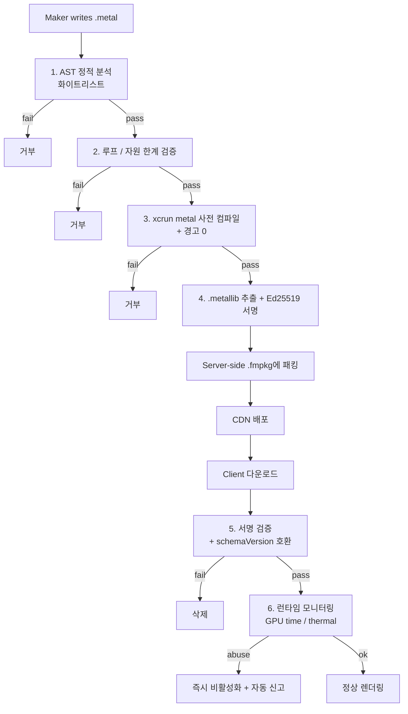

# moodit - 메이커 셰이더(MSL) 보안 정책

> 버전: v1.0 · 작성일: 2026-05-06
>
> 본 문서는 [SYSTEM_DESIGN.md](./SYSTEM_DESIGN.md) §2.5와 [RISKS.md](./RISKS.md) R-T01의 완화 계획을 정식 보안 정책으로 확장한다. v1 MVP에서는 메이커 셰이더 비활성화 (engine.type = `lut+params`만 허용). Phase 3+ `lut+msl` 활성화 시 본 정책 전체가 적용된다.

---

## 1. 위협 모델 (Threat Model)

### 1.1 자산 (Assets)
- 사용자 디바이스의 GPU/메모리/배터리
- 사용자의 카메라/사진 데이터 (CVPixelBuffer/MTLTexture)
- 앱의 다른 메모리 영역 (간접적 — Metal 자체는 sandbox)
- 앱의 안정성 / 평판 (크래시 → App Store 평점 하락)

### 1.2 위협 행위자 (Actors)
- **악의적 메이커**: 의도적으로 자원을 남용하는 셰이더 업로드
- **부주의 메이커**: 무한 루프나 비효율 코드를 실수로 작성
- **공급망 침해**: 메이커 계정 탈취 후 악성 셰이더 배포

### 1.3 공격 벡터 / 시나리오

| ID | 위협 | 잠재 영향 |
|---|---|---|
| T-01 | 무한 루프 (`while(true)`, 동적 bound) | GPU 정지 → 앱 hang/크래시 → 5분 미반응 시 watchdog kill |
| T-02 | 무한 재귀 흉내 (큰 루프 깊이) | 동일 |
| T-03 | 메모리 폭발 (큰 텍스처/threadgroup 메모리) | 메모리 부족 → 앱 크래시, 시스템 압박 |
| T-04 | 잘못된 메모리 접근 (`device` 포인터 산술) | 정의되지 않은 동작, 다른 메모리 영역 읽기 |
| T-05 | 타이밍 사이드채널 | 다른 셰이더의 처리 시간 측정 → 정보 유출 |
| T-06 | atomic / threadgroup_barrier 남용 | GPU 직렬화로 throughput 저하 |
| T-07 | thermal stress (의도적 GPU 100% 점유) | 디바이스 발열 / 배터리 급감 |
| T-08 | 화면 캡처 / 다른 앱 데이터 유출 | iOS 자체가 sandbox로 차단하지만 GPU 공유 메모리 우려 |
| T-09 | 컴파일 타임 자원 소진 (큰 셰이더 소스) | `MTLDevice.makeLibrary` hang |
| T-10 | 알려진 GPU 드라이버 취약점 활용 | 디바이스 GPU 크래시 (드물게 OS 재부팅) |

### 1.4 안전한 가정
- iOS는 앱 sandbox + GPU 자원의 cross-process 격리 (Metal command queue 단위)
- App Store 메이커 게정 가입 시 Apple ID 검증 (스팸 가입 어려움)
- 본인 셰이더 = 본인 디바이스 영향 (다른 사용자 디바이스 직접 공격 불가, 단 다운로드 시 공격 가능)

---

## 2. 다층 방어 (Defense in Depth)



| 계층 | 위치 | 차단 위협 |
|---|---|---|
| 1. AST 정적 분석 | 서버 (Cloud Function 워커) | T-01,T-02,T-04,T-05,T-06,T-08 |
| 2. 자원 / 루프 bound | 서버 + 클라이언트 | T-01,T-02,T-03 |
| 3. 사전 컴파일 (xcrun metal) | 서버 (Build container) | T-09,T-10 |
| 4. Ed25519 서명 | 서버 | 공급망 침해 |
| 5. 클라이언트 서명 검증 | 디바이스 | 패키지 변조 |
| 6. 런타임 모니터링 | 디바이스 | T-07, 미검출 GPU 폭주 |

---

## 3. AST 정적 분석 — 화이트리스트

### 3.1 허용되는 함수 (Whitelist)

> 메이커 셰이더는 다음 함수들만 호출할 수 있다. 기타 모든 식별자는 거부.

#### 수학 (Metal Standard Library subset)
```
abs, ceil, clamp, cos, dot, exp, exp2, fabs, floor, fract, length, log, log2,
max, min, mix, mod, normalize, pow, round, rsqrt, saturate, sign, sin, smoothstep,
sqrt, step, tan, tanh, atan, atan2, asin, acos
```

#### 행렬 / 벡터
```
float2, float3, float4, float2x2, float3x3, float4x4,
make_float2, make_float3, make_float4, transpose
```

#### 색상 변환 (서버 헬퍼 헤더 `<moodit/colors.h>`)
```
rgb_to_hsv, hsv_to_rgb, rgb_to_yuv, yuv_to_rgb, srgb_to_linear, linear_to_srgb,
luminance_bt709, apply_lut3d
```

#### 텍스처 / 샘플러
```
texture2d<float>::sample, texture2d<float>::read,
texture3d<float>::sample, sampler  (constructor 인자 제한)
```

> `texture2d<float>::write`, `read_write`, `texture_buffer`, `depth2d` 등은 금지.

### 3.2 금지 키워드 / 식별자 (Blacklist)

| 카테고리 | 금지 |
|---|---|
| 함수 종류 | `kernel`, `compute`, `vertex`(메이커는 fragment만) |
| 메모리 | `device`, `threadgroup`, `constant_or_device`, `ray_data` |
| atomic | `atomic_*`, `simd_*`, `quad_*` |
| barrier | `threadgroup_barrier`, `threadgroup_memory_barrier`, `simdgroup_barrier` |
| 포인터 | `*` (포인터 declarator), `&` (참조는 헬퍼 시그니처에서만) |
| 비표준 | `metal_raytracing`, `intersection_*`, `mesh`, `object_data` |
| 동적 디스패치 | 함수 포인터, `visible_function_table` |
| 디버그 | `os_log`, `log_to_metal_capture` |

### 3.3 구조 제약

| 제약 | 한계 |
|---|---|
| 함수 정의 개수 | 최대 8개 (entry + 헬퍼) |
| 함수 본문 라인 수 | ≤ 200 |
| 표현식 트리 깊이 | ≤ 24 |
| 매크로 사용 | 금지 (전처리 후 검증) |
| `#include` | `<metal_stdlib>`, `<simd/simd.h>`, `<moodit/*>`만 |
| 전역 상수 | `constexpr` 또는 `constant` only, ≤ 16KB |

### 3.4 파서 / 검증 도구
- **1차**: 토큰 레벨 정규식 (Cloud Function의 Node.js 파서)
- **2차**: clang-based Metal AST (서버 컨테이너에서 `clang -fsyntax-only -target air`)
- **3차**: 화이트리스트 매칭 + 노드 트리 검증 (자체 visitor)

거부 시 메이커에게 위반 내역을 노출 (예: `unsupported function: atomic_fetch_add at line 42`).

---

## 4. 루프 제한 (Loop Bounds)

### 4.1 정책
- **모든 `for`/`while` 루프는 컴파일 타임 상수 bound 필수**
- `while (cond)` 는 금지 — `for (int i = 0; i < N; ++i)` 패턴만 허용
- `N`은 정수 리터럴 또는 `constexpr` 상수
- 중첩 루프 곱 ≤ 1024
- `break`/`continue`는 허용, `goto` 금지

### 4.2 예시

ALLOWED:
```metal
constexpr int kRadius = 8;
for (int i = -kRadius; i <= kRadius; ++i) {
    for (int j = -kRadius; j <= kRadius; ++j) {
        // 17x17 = 289 iterations, OK
    }
}
```

REJECTED:
```metal
for (int i = 0; i < uniforms.count; ++i) { ... }    // dynamic bound
while (color.r > 0.5) { color *= 0.9; }             // unbounded
for (int i = 0; i < 64; ++i)
  for (int j = 0; j < 64; ++j)
    for (int k = 0; k < 64; ++k) { ... }            // 64^3 = 262144 > 1024
```

### 4.3 검증 알고리즘
1. AST에서 모든 ForStmt 추출
2. init/cond/inc 패턴이 `int i = C0; i < C1; ++i` 형태인지 확인 (또는 `--i` 변형)
3. C0, C1이 컴파일 타임 평가 가능한지 확인
4. iteration count 추정 → 누적 product ≤ 1024

---

## 5. 리소스 제한 (Resource Limits)

### 5.1 텍스처
- 입력 텍스처: 최대 4개 (소스 카메라, LUT3D, blue noise, 1 추가 슬롯)
- 텍스처 사이즈: ≤ 4096 × 4096 (`capabilities.maxTextureSize` 체크)
- 출력은 단일 fragment color (drawable 텍스처)
- 픽셀 포맷: `bgra8Unorm`, `rgba8Unorm`, `rgba16Float` 만 허용

### 5.2 Uniform Buffer
- 단일 `constant Params&` 만 허용
- 사이즈 ≤ 16 KB
- `Params` 구조체 필드는 manifest의 `engine.shaderEntry.uniforms`와 일치 필수

### 5.3 샘플러
- `sampler` 생성자 인자 화이트리스트:
  ```
  s_address::clamp_to_edge, address::repeat, address::mirrored_repeat
  filter::linear, filter::nearest
  mip_filter::linear, mip_filter::nearest, mip_filter::none
  coord::normalized
  ```
- `compare_func`, `lod_clamp` 등은 금지
- 최대 4개 sampler

### 5.4 컴파일 타임 자원
- 셰이더 소스 크기 ≤ 16 KB
- 헬퍼 헤더 포함 후 전처리 결과 ≤ 64 KB
- 컴파일 타임아웃: 100ms (`MTLDevice.makeLibrary(source:)` 별 thread + DispatchSourceTimer)

---

## 6. 컴파일 검증 (`xcrun metal`)

### 6.1 서버 빌더 컨테이너
- macOS runner (Xcode Cloud build action 또는 self-hosted Mac mini)
- 명령:
  ```bash
  xcrun -sdk iphoneos metal -Werror -Wall \
    -target air64-apple-ios17.0 \
    -std=metal2.4 \
    -fmetal-math-fp32 \
    -c filter.metal -o filter.air

  xcrun -sdk iphoneos metallib filter.air -o filter.metallib
  ```
- `-Werror`로 모든 경고를 에러로 승격
- 컴파일 결과 `.metallib`만 패키지에 포함, 원본 `.metal`은 감사 목적으로 별도 보관

### 6.2 추가 검증
- 결과 `.metallib`의 함수 시그니처 확인 (manifest의 `vertexName`/`fragmentName`과 일치)
- ABI 호환성 — uniforms 구조체 offset/size 일치
- AIR(Apple Intermediate Representation) 분석 — 의심 명령 (atomic-like) 출현 차단

### 6.3 빌드 환경 격리
- 컨테이너는 1회 실행 후 폐기 (immutable)
- 네트워크 차단 (예: 외부 fetch 시도 방어)
- 빌드 시간 상한 30초

---

## 7. 런타임 모니터링

### 7.1 GPU 시간 측정
```swift
let startTime = CACurrentMediaTime()
commandBuffer.addCompletedHandler { buffer in
    let gpuTime = buffer.gpuEndTime - buffer.gpuStartTime
    if gpuTime > 0.020 {  // 20ms (1프레임=16.6ms)
        FilterAuditor.shared.report(filterId, overrun: gpuTime)
    }
}
```

- 단일 프레임 GPU 시간 > 20ms → 카운트
- 5 프레임 연속 초과 → 즉시 셰이더 비활성화 + LUT-only fallback
- 10회 누적 시 자동 신고 (서버 모더레이션 큐로 push)

### 7.2 Thermal 모니터링
- `ProcessInfo.thermalState` 관찰 (`.serious`/`.critical` 진입)
- 사용자 셰이더 활성 + 5분 내 thermal serious → 셰이더 영향 가능성 → 자동 LUT-only 모드
- 사용자에게 "이 필터가 디바이스를 뜨겁게 만들고 있어요" 알림

### 7.3 메모리 사용량
- `os_proc_available_memory()` 모니터링
- 하한 100MB 미만 시 셰이더 캐시 비우기 + 단일 패스로 fallback

### 7.4 Crash Sentinel
- 사용자 셰이더 적용 직후 크래시 발생 비율 트래킹 (Crashlytics 커스텀 키)
- 동일 필터에서 24시간 내 크래시율 > 1% → 서버에서 자동 takedown

---

## 8. 화이트리스트 함수 표 (카테고리별)

### 8.1 수학 (Metal Standard Library)
| 함수 | 시그니처 | 비고 |
|---|---|---|
| `abs` | `T abs(T)` | float/int |
| `ceil` | `T ceil(T)` | float |
| `floor` | `T floor(T)` | float |
| `fract` | `T fract(T)` | float |
| `round` | `T round(T)` | float |
| `mod` | `T mod(T,T)` | |
| `clamp` | `T clamp(T,T,T)` | |
| `saturate` | `T saturate(T)` | clamp(0,1) |
| `mix` | `T mix(T,T,T)` | linear interp |
| `min`/`max` | `T min(T,T)` | |
| `step`/`smoothstep` | | |
| `sin`/`cos`/`tan` | | |
| `asin`/`acos`/`atan`/`atan2` | | |
| `exp`/`exp2`/`log`/`log2` | | |
| `pow`/`sqrt`/`rsqrt` | | |
| `tanh` | | |
| `sign` | | |

### 8.2 벡터 / 행렬
| 함수 | 비고 |
|---|---|
| `dot` | 내적 |
| `cross` | 외적 (float3) |
| `length` | |
| `distance` | |
| `normalize` | |
| `transpose` | float[N]xN |
| `determinant` | |

### 8.3 텍스처 샘플링
| 함수 | 비고 |
|---|---|
| `texture2d<float>::sample(sampler, float2)` | 표준 |
| `texture2d<float>::sample(sampler, float2, level(L))` | LOD 지정 (L은 상수) |
| `texture3d<float>::sample(sampler, float3)` | LUT 적용 |
| `texture2d<float>::read(uint2)` | 비normalized 정수 좌표 |

> `gather`, `compare`, `sample_compare`, `write` 모두 금지.

### 8.4 색상 변환 (moodit 헬퍼)
```metal
// <moodit/colors.h>
inline float luminance_bt709(float3 rgb);
inline float3 rgb_to_hsv(float3 rgb);
inline float3 hsv_to_rgb(float3 hsv);
inline float3 rgb_to_yuv(float3 rgb);
inline float3 yuv_to_rgb(float3 yuv);
inline float3 srgb_to_linear(float3 srgb);
inline float3 linear_to_srgb(float3 lin);
inline float3 apply_lut3d(texture3d<float> lut, sampler s, float3 rgb, float intensity);
```

이 헬퍼들은 서버에서 미리 빌드되어 `<moodit/colors.h>`로 제공된다. 메이커는 이 함수들을 통해 표준화된 색상 처리를 수행할 수 있다.

---

## 9. 거부 사례 예시

### 9.1 포인터 산술
```metal
fragment float4 bad(constant float* arr [[buffer(0)]]) {
    return float4(arr[100]);  // REJECTED: device pointer
}
```

### 9.2 무한 / 동적 루프
```metal
fragment float4 bad(constant Params& p [[buffer(0)]]) {
    float4 c = 0;
    for (int i = 0; i < p.count; ++i) {  // REJECTED: dynamic bound
        c += sample_something(i);
    }
    return c;
}
```

### 9.3 atomic / threadgroup 남용
```metal
kernel void bad(...) {
    threadgroup int shared[1024];          // REJECTED: kernel + threadgroup
    atomic_fetch_add_explicit(...);         // REJECTED: atomic
}
```

### 9.4 재귀 흉내 (큰 깊이)
```metal
fragment float4 bad(...) {
    float4 c = 0;
    for (int i = 0; i < 256; ++i)
      for (int j = 0; j < 256; ++j)
        for (int k = 0; k < 256; ++k) {    // REJECTED: 16M > 1024
            c += sample(...);
        }
    return c;
}
```

### 9.5 매크로 트릭
```metal
#define BAD(x) for (int i = 0; ; ++i) x   // REJECTED: 매크로 금지 + 무한 루프
fragment float4 bad(...) { BAD(c += 1); }
```

---

## 10. CI 자동 검증 절차

```yaml
# .github/workflows/verify-shaders.yml (개념)
on: [pull_request]
jobs:
  verify-shaders:
    runs-on: macos-14
    steps:
      - uses: actions/checkout@v4
      - name: Run AST whitelist
        run: node tools/shader-verify/index.mjs Sources/Filters/**/*.metal
      - name: Compile with -Werror
        run: |
          for f in $(git diff --name-only origin/main...HEAD | grep '\.metal$'); do
            xcrun metal -Werror -Wall -target air64-apple-ios17.0 -c "$f" -o /tmp/out.air
          done
      - name: Loop bound check
        run: node tools/shader-verify/loop-bounds.mjs ...
```

서버측 메이커 업로드 검증은 동일 도구를 Cloud Function에서 실행한다.

---

## 11. 사고 대응 (Incident Response)

| 시나리오 | 즉시 조치 | 후속 |
|---|---|---|
| 미검출 셰이더가 다수 디바이스 크래시 | 서버에서 takedown → 다음 fetch 시 클라이언트가 비활성 | 검증 룰 추가 + 영향 메이커 키 회전 |
| 메이커 키 유출 | `users/{uid}.signingPublicKey` 무효화, `legacyKeys` 90일 처리 | 메이커 본인 확인 후 재등록 |
| 새 GPU 드라이버 버그 발견 | 영향 디바이스 모델 + iOS 버전 조합 식별 → Remote Config로 셰이더 비활성 | Apple Feedback 제출 |

---

## 12. v1 MVP 정책 (요약)

- 메이커 업로드 셰이더 **비활성화** (`engine.type ≠ lut+msl`)
- LUT + 파라미터 조합만 허용 → 본 보안 정책 대부분 비활성
- Phase 5에서 본 정책 전체 활성화 + 베타 메이커에 한정 노출

---

## 13. 관련 문서

- [SYSTEM_DESIGN.md](./SYSTEM_DESIGN.md) §2.5
- [FMPKG_SCHEMA.md](./FMPKG_SCHEMA.md) §5 셰이더 규칙
- [RISKS.md](./RISKS.md) R-T01
- [FIRESTORE_RULES.md](./FIRESTORE_RULES.md) §3.1 — 메이커 키 등록
- [ADR/0003-metal-msl-shader-pipeline.md](./ADR/0003-metal-msl-shader-pipeline.md)
