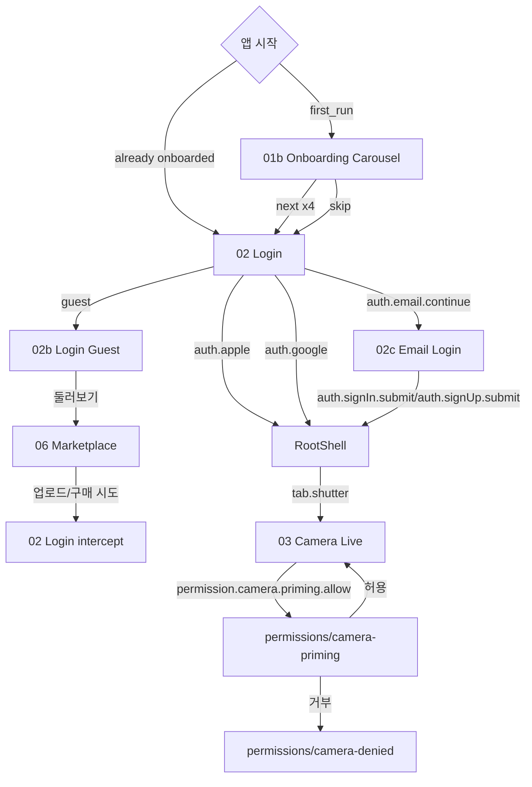
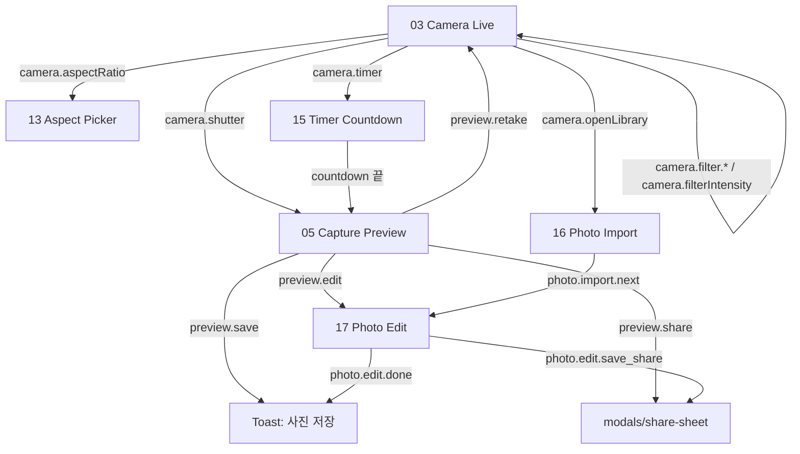
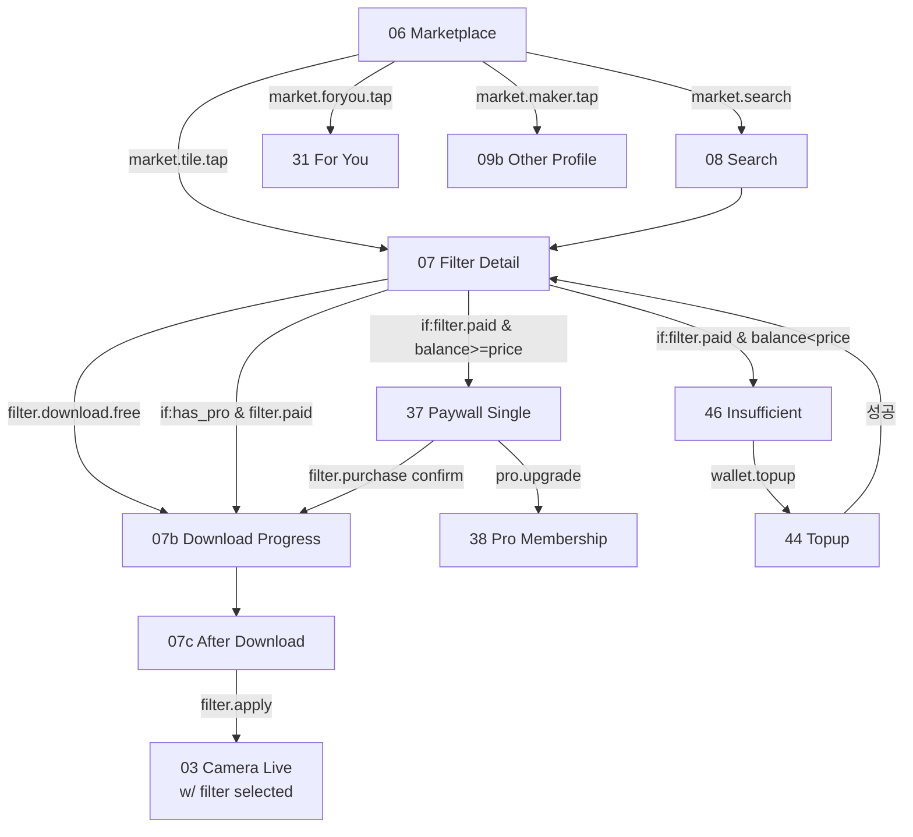
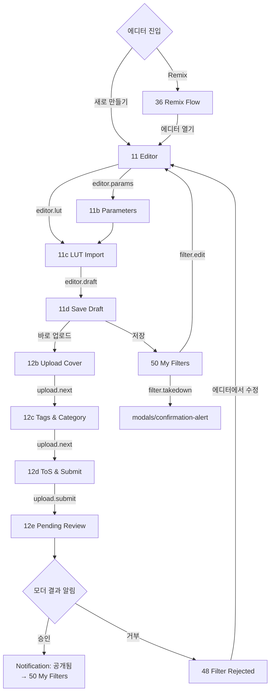
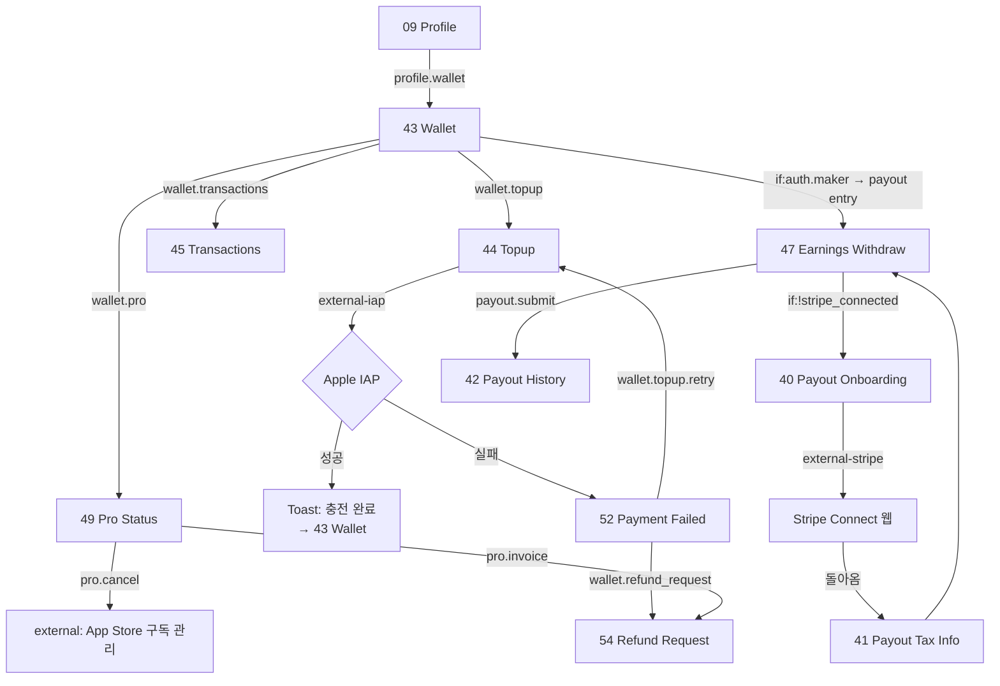
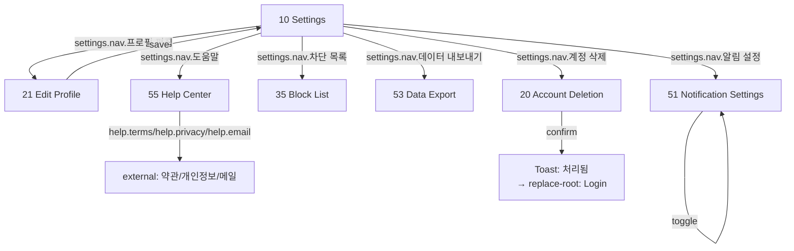
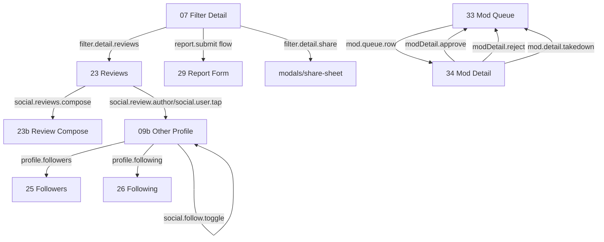

# moodit — Navigation & Action Map

> 버전: v1.1 · 작성일: 2026-05-09 · 상태: Active · **단일 진실원**
>
> 본 문서는 **모든 화면의 모든 버튼 액션**과 **화면 간 연결**을 규정한다. SwiftUI 구현 시 곧바로 매핑 가능한 형태로 작성됐다. 화면이 추가되거나 라우트가 바뀌면 본 문서를 먼저 갱신한 뒤 코드를 수정한다.
>
> 현재 구현/QA의 canonical screen registry는 [`SCREEN_ACTIONS_QA_DEFINITION.md`](./SCREEN_ACTIONS_QA_DEFINITION.md) §4이며, 본 문서는 목업 번호와 실제 SwiftUI route/action을 연결하는 상세 맵이다. SwiftUI에서 E2E가 필요한 버튼은 `accessibilityIdentifier`가 아래 Action ID와 일치해야 한다.

---

## 1. 사용법

### 1.1 개발 에이전트를 위한 빠른 참조

| 필요한 정보 | 어디 보면 되는가 |
|---|---|
| 특정 버튼이 어디로 이동? | §4 Per-screen Action Tables |
| 흐름 전체 부감 | §3 Flow Diagrams (Mermaid) |
| Action 타입 → SwiftUI API 매핑 | §2.2 |
| 5탭 + 셔터 글로벌 동작 | §5 Tab Bar Actions |
| `AppAction` enum 골격 | §6.1 |
| `NavigationStack` 구현 패턴 | §6.2 |
| 분기 조건 (auth/pro/balance) | §2.3 + §6.4 |

### 1.2 작성 규칙

- 모든 버튼은 **stable Action ID**를 가진다 (`<group>.<verb>` 형식, 마침표 구분).
- HTML 목업의 `<button>`/`<a>` 에는 `data-action="camera.shutter"` 속성을 붙여 추적 가능하게 한다.
- SwiftUI 구현 시 `enum AppAction`의 `case`로 1:1 매핑.
- 조건부 분기는 단일 액션이 여러 target을 가질 수 있으며, 첫 번째 매칭이 우선.

---

## 2. Action Conventions

### 2.1 Action ID 명명 규약

| 그룹 prefix | 영역 |
|---|---|
| `app.*` | 앱 전역 (탭 전환·딥링크) |
| `auth.*` | 로그인·회원가입·계정삭제 |
| `onboard.*` | 온보딩 carousel |
| `camera.*` | 카메라 라이브 |
| `preview.*` | 촬영 후 처리 |
| `cam.*` | 카메라 보조 route picker |
| `photo.*` | 갤러리 후보정 |
| `market.*` | 마켓 둘러보기·검색 |
| `filter.*` | 필터 detail·다운로드·구매 |
| `editor.*` | 에디터 (파라미터·LUT·draft) |
| `upload.*` | 업로드 흐름 (3단계) |
| `mod.*` | 모더레이션 (큐·승인·거부) |
| `wallet.*` | 지갑·충전·거래 |
| `pro.*` | Pro 멤버십 |
| `payout.*` | 메이커 출금 |
| `social.*` | 댓글·팔로우·신고·차단 |
| `notif.*` | 알림 인박스·설정 |
| `profile.*` | 본인/타인 프로필 |
| `settings.*` | 설정·데이터 |

동사는 짧고 명확하게: `next`, `back`, `submit`, `confirm`, `cancel`, `apply`, `share`, `purchase`, `topup`, `withdraw`, `report`, `block`, `mute`, `delete`, `save`, `publish` 등.

### 2.2 Action Types — SwiftUI 매핑

| Type | 의미 | SwiftUI API | 비고 |
|---|---|---|---|
| `navigate` | 같은 스택에서 push | `NavigationPath.append(AppRoute.x)` 또는 `NavigationLink` | 표준 push |
| `present-sheet` | bottom sheet (medium/large detents) | `.sheet(isPresented:)` + `.presentationDetents([.medium, .large])` | 가벼운 보조 |
| `present-cover` | 풀스크린 모달 | `.fullScreenCover(isPresented:)` | 카메라·페이월 등 |
| `present-alert` | iOS 알림 다이얼로그 | `.alert(_, isPresented:)` | 확인/취소 |
| `present-action` | iOS action sheet | `.confirmationDialog(_, isPresented:)` | 옵션 선택 |
| `dismiss` | 현재 모달/페이지 닫기 | `dismiss()` env | `@Environment(\.dismiss)` |
| `pop` | 스택 한 단계 뒤로 | `path.removeLast()` | navigate 역동작 |
| `pop-to-root` | 루트까지 모두 pop | `path = NavigationPath()` | 탭 재선택 등 |
| `replace-root` | 루트 자체 교체 | scene 단위 `RootShell` 분기 | 로그인 ↔ 게스트 |
| `mutate-state` | 같은 화면 상태만 변경 | `@State` / `@Observable` | filter swipe 등 |
| `tab-switch` | 탭 인덱스 변경 | `selectedTab = .market` | 5탭 라우팅 |
| `external-link` | Safari/외부 앱 | `UIApplication.shared.open(URL)` | 약관·도움말 |
| `external-iap` | StoreKit 2 IAP | `Product.purchase()` | 충전·구독 |
| `external-system` | iOS 설정·App Store | `UIApplication.openSettingsURLString` | 권한 거부 후 |
| `external-stripe` | Stripe Connect 웹뷰 | `ASWebAuthenticationSession` | 메이커 출금 onboarding |
| `share-link` | 공유 시트 | `ShareLink(item:)` | Universal Link 공유 |

### 2.3 Condition 표기

target 앞에 `if:condition` 으로 분기를 명시한다. 같은 row에 복수 target이 있으면 첫 번째 매칭이 채택된다.

| Condition | 의미 |
|---|---|
| `if:auth.signed` | 로그인됨 |
| `if:auth.guest` | 게스트 모드 |
| `if:auth.maker` | 메이커 (필터 1개 이상 게시) |
| `if:auth.moderator` | 모더레이터 권한 |
| `if:has_pro` | Pro 멤버십 활성 |
| `if:balance>=price` | 코인 잔액 충분 |
| `if:owned` | 이미 보유한 필터 |
| `if:filter.free` | 무료 필터 |
| `if:filter.paid` | 유료 필터 |
| `if:offline` | 네트워크 오프라인 |
| `if:perm.camera.granted` | 카메라 권한 허용 |
| `if:perm.photos.granted` | 사진 권한 허용 |
| `if:first_run` | 첫 실행 |

조건 없이 비어 있으면 무조건 실행.

---

## 3. Flow Diagrams (Mermaid)

> GitHub·VS Code Markdown Preview·Obsidian 등에서 자동 렌더링. 다른 환경은 [mermaid.live](https://mermaid.live)에서 코드 붙여넣어 시각화 가능.

### 3.1 인증·온보딩



### 3.2 카메라·촬영



### 3.3 마켓·구매



### 3.4 메이커·업로드·검수



### 3.5 지갑·코인



### 3.6 설정·계정



### 3.7 소셜·신고·모더 (보조)



---

## 4. Per-screen Action Tables

> 핵심 30 화면의 모든 버튼/탭/제스처를 표로 정의. 표시 순서는 화면 번호 순.

### 4.1 `01b-onboarding-carousel.html`

| Action ID | Label | Type | Target | Condition |
|---|---|---|---|---|
| `onboard.skip` | 건너뛰기 | navigate | `02-login.html` | — |
| `onboard.next` | 다음 | mutate-state | (next page) | step < 4 |
| `onboard.next` | 시작하기 | navigate | `02-login.html` | step == 4 |
| `onboard.dot.tap` | (페이지 점) | mutate-state | (해당 step) | — |

### 4.2 `02-login.html` / `02b-login-guest.html`

| Action ID | Label | Type | Target | Condition |
|---|---|---|---|---|
| `auth.apple` | Apple로 계속하기 | external-system | AuthenticationServices sheet | — |
| `auth.google` | Google로 계속하기 | external-system | Google account picker | — |
| `auth.email.continue` | 이메일로 계속 | navigate | `AppRoute.emailLogin` | — |
| `auth.guest.continue` | 둘러보기 | replace-root | `06-marketplace-home.html` | — |
| `auth.terms` | 약관/개인정보 | external-link | legal links | — |

### 4.3 `03-camera-live.html`

| Action ID | Label | Type | Target | Condition |
|---|---|---|---|---|
| `camera.shutter` | (셔터) | navigate | `05-capture-preview.html` | `if:perm.camera.granted` |
| `camera.shutter` | (셔터) | present-cover | `permission.camera.priming` | `if:!perm.camera.granted` |
| `camera.openLibrary` | 갤러리 | navigate | `AppRoute.photoImport` | `if:perm.photos.granted` |
| `camera.flip` | 전후면 | mutate-state | — | — |
| `camera.flash` | 플래시 | mutate-state | — | — |
| `camera.aspectRatio` | 비율 | navigate | `AppRoute.cameraAspect` | — |
| `camera.zoom.*` | 0.5x/1x/3x | mutate-state | — | — |
| `camera.timer` | 타이머 | navigate | `AppRoute.cameraTimer` | — |
| `camera.filter.*` | 필터 선택 | mutate-state | — | — |
| `camera.filterIntensity` | 강도 슬라이더 | mutate-state | — | — |
| `camera.grid.toggle` | 그리드 | mutate-state | — | — |
| `camera.dismiss` | 닫기 | dismiss | — | — |

### 4.4 `05-capture-preview.html`

| Action ID | Label | Type | Target | Condition |
|---|---|---|---|---|
| `preview.dismiss` | 닫기 | dismiss | — | — |
| `preview.more` | 더보기 | present-action | info/change filter/copy metadata | — |
| `preview.share` | 공유 | share-link | (Universal Link + photo) | — |
| `preview.retake` | 재촬영 | pop | `03-camera-live.html` | — |
| `preview.changeFilter` | 필터 변경 | present-sheet | filter list | — |
| `preview.edit` | 편집 | navigate | `17-photo-edit.html` | — |
| `preview.discard` | 삭제 | present-alert | confirmation-alert | — |
| `preview.save` | 저장 | mutate-state + dismiss | (PhotoKit save) | `if:perm.photos.granted` |

### 4.5 `06-marketplace-home.html`

| Action ID | Label | Type | Target | Condition |
|---|---|---|---|---|
| `tab.search` | 검색 탭 | tab-switch | `08-search.html` | — |
| `market.trending.*` | 트렌딩 필터 | navigate | `07-filter-detail.html?id=xxx` | — |
| `market.category.*` | 카테고리 칩 | navigate | `08-search.html?cat=xxx` | — |
| `market.tile.*` | 필터 카드 | navigate | `07-filter-detail.html?id=xxx` | — |
| `market.collection.*` | 컬렉션 | navigate | `30-favorites-collection.html?id=xxx` | — |
| `tab.shutter` | (탭바 셔터) | present-cover | `03-camera-live.html` | — |

### 4.6 `07-filter-detail.html`

| Action ID | Label | Type | Target | Condition |
|---|---|---|---|---|
| `filter.detail.share` | 공유 | share-link | Universal Link | — |
| `filter.detail.follow` | 메이커 팔로우 | mutate-state | — | — |
| `filter.detail.reviews` | 리뷰 | navigate | `AppRoute.reviews(filterId:)` | — |
| `filter.detail.tags` | 태그 영역 | navigate | `AppRoute.search(category:)` | — |
| `filter.beforeafter.drag` | (슬라이더) | mutate-state | — | — |
| `filter.detail.download` | 다운로드 | navigate | `07b-filter-download.html` | `if:filter.free OR if:has_pro OR if:owned` |
| `filter.purchase.confirm` | (가격) 구매 | navigate | `07b-filter-download.html` | `if:filter.paid && balance>=price && !has_pro` |
| `filter.purchase.pro_upgrade` | Pro 멤버십 | navigate | `38-paywall-subscription.html` | `if:filter.paid && !has_pro` |

### 4.7 `07b-filter-download.html` / `07c-filter-after-download.html`

| Action ID | Label | Type | Target | Condition |
|---|---|---|---|---|
| `filter.download.cancel` | 취소 | pop | `07-filter-detail.html` | — |
| `filter.download.retry` | 다시 시도 | mutate-state | — | on error |
| `filter.apply` | 카메라로 적용 | replace-root | `03-camera-live.html?filter=xxx` | post-download |
| `filter.favorite.toggle` | 즐겨찾기 | mutate-state | — | — |
| `filter.collection.add` | 컬렉션 추가 | present-sheet | `30-favorites-collection.html` | — |
| `filter.remove` | 제거 | present-alert | confirmation | — |

### 4.8 `08-search.html`

| Action ID | Label | Type | Target | Condition |
|---|---|---|---|---|
| `search.cancel` | 취소 | pop | — | — |
| `search.recent.*` | 최근 검색어 | mutate-state | (필드 채움) | — |
| `search.suggested.*` | 추천 검색어 | mutate-state | (필드 채움 + 즉시) | — |
| `search.result.tile.*` | 결과 카드 | navigate | `07-filter-detail.html?id=xxx` | — |
| `search.typing.tile.*` | 입력 중 결과 카드 | navigate | `07-filter-detail.html?id=xxx` | — |
| `search.maker.*` | 메이커 | navigate | `09b-other-user-profile.html` | — |

### 4.9 `09-profile.html` (본인) / `09b-other-user-profile.html` (타인)

| Action ID | Label | Type | Target | Condition |
|---|---|---|---|---|
| `profile.edit.open` | 편집 (본인) | navigate | `21-edit-profile.html` | own |
| `profile.settings` | 설정 (본인) | navigate | `10-settings.html` | own |
| `profile.shortcut.wallet` | 지갑 | navigate | `43-wallet.html` | own |
| `profile.shortcut.myFilters` | 내 필터 | navigate | `50-my-filters.html` | own |
| `profile.shortcut.dashboard` | 대시보드 | navigate | `28-maker-dashboard.html` | own + maker |
| `profile.login` | 로그인 | navigate | `02-login.html` | guest |
| `profile.followers` | 팔로워 | navigate | `25-followers-list.html` | — |
| `profile.following` | 팔로잉 | navigate | `26-following-list.html` | — |
| `social.follow.toggle` | 팔로우 | mutate-state | — | other |
| `profile.share` | 공유 | share-link | Universal Link | other, future |
| `profile.report` | 신고 | navigate | `29-report-form.html` | other, future |
| `profile.block` | 차단 | present-alert | confirmation | other, future |
| `profile.tile.*` | (필터 카드) | navigate | `07-filter-detail.html?id=xxx` | — |

### 4.10 `10-settings.html`

| Action ID | Label | Type | Target | Condition |
|---|---|---|---|---|
| `settings.nav.프로필 편집` | 프로필 편집 | navigate | `21-edit-profile.html` | — |
| `settings.nav.알림 설정` | 알림 | navigate | `51-notification-settings.html` | — |
| `settings.nav.차단 목록` | 차단 사용자 | navigate | `35-block-list.html` | — |
| `settings.nav.지갑` | 지갑 | navigate | `43-wallet.html` | — |
| `settings.nav.Pro 멤버십` | Pro 멤버십 | navigate | `38-paywall-subscription.html` or `49-pro-status.html` | auth state |
| `settings.nav.데이터 내보내기` | 데이터 다운로드 | navigate | `53-data-export.html` | — |
| `settings.nav.계정 삭제` | 계정 삭제 | navigate | `20-account-deletion.html` | — |
| `settings.row.로그아웃` | 로그아웃 | present-alert | confirmation → replace-root `02-login.html` | — |
| `settings.nav.도움말` | 도움말 | navigate | `AppRoute.helpCenter` | — |
| `help.terms` | 약관 | external-link | https://moodit.app/terms | `settings.nav.도움말` 후 |
| `help.privacy` | 개인정보 | external-link | https://moodit.app/privacy | `settings.nav.도움말` 후 |
| `help.email` | 고객지원 | external-link | mailto:support@moodit.app | `settings.nav.도움말` 후 |

### 4.11 `13-15` 카메라 보조 (aspect/zoom/timer)

| Action ID | Label | Type | Target |
|---|---|---|---|
| `cam.aspect.set.1_1` | 1:1 | dismiss + mutate-state | `03-camera-live.html` |
| `cam.aspect.set.4_3` | 4:3 | dismiss + mutate-state | `03-camera-live.html` |
| `cam.aspect.set.16_9` | 16:9 | dismiss + mutate-state | `03-camera-live.html` |
| `cam.timer.set.off` | OFF | dismiss + mutate-state | `03-camera-live.html` |
| `cam.timer.set.3` | 3s | dismiss + mutate-state | `03-camera-live.html` |
| `cam.timer.set.10` | 10s | dismiss + mutate-state | `03-camera-live.html` |
| `cam.timer.cancel` | (카운트다운 취소) | dismiss | `03-camera-live.html` |
| `camera.flash` | (OFF/AUTO/ON) | mutate-state | — |
| `camera.grid.toggle` | 그리드 | mutate-state | — |

### 4.12 `16-photo-import.html` / `17-photo-edit.html`

| Action ID | Label | Type | Target | Condition |
|---|---|---|---|---|
| `photo.import.cell.tap` | (셀) | mutate-state | — | (선택 토글) |
| `photo.import.next` | 필터 적용 (n) | navigate | `17-photo-edit.html` | n ≥ 1 |
| `photo.edit.done` | 완료 | navigate | (저장 + 결과) | — |
| `photo.edit.filter.tap` | (필터 칩) | mutate-state | — | — |
| `photo.edit.filter.*` | (필터 칩 상세 ID) | mutate-state | — | — |
| `photo.edit.intensity` | (강도) | mutate-state | — | — |
| `photo.edit.save_share` | 저장 / 공유 | present-sheet | share-sheet | — |

### 4.13 `18-saved-filters.html` / `19-builtin-filter-library.html`

| Action ID | Label | Type | Target |
|---|---|---|---|
| `saved.tile.*` | 저장 필터 카드 | navigate | `07-filter-detail.html?id=xxx` |
| `saved.empty.cta` | 빈 상태 CTA | navigate | `08-search.html?source=saved` |
| `builtin.filter.apply.*` | 기본 필터 적용 | replace-root | `03-camera-live.html?filter=xxx` |
| `builtin.filter.info.*` | 기본 필터 정보 | navigate | `07-filter-detail.html?id=xxx` |
| `builtin.manage` | 관리 | navigate | `50-my-filters.html` (메이커) |

### 4.14 `11/11b/11c/11d` 에디터

| Action ID | Label | Type | Target |
|---|---|---|---|
| `editor.cancel` | 취소 | present-alert | discard or save draft |
| `editor.next` | 계속 | navigate | `11d-editor-save-draft.html` (or upload) |
| `editor.param.slider` | (각 슬라이더) | mutate-state | — |
| `editor.param.slider.*` | (개별 파라미터) | mutate-state | — |
| `editor.compare.hold` | (PRESS HOLD) | mutate-state | — |
| `editor.lut.import` | LUT 가져오기 | external-system | (Files app) |
| `editor.lut.replace` | 교체 | external-system | (Files) |
| `editor.draft.save` | 초안 저장 | navigate | `50-my-filters.html` |
| `editor.draft.publish` | 바로 마켓 공유 | navigate | `12b-upload-cover.html` |

### 4.15 `12/12b/12c/12d/12e` 업로드

| Action ID | Label | Type | Target |
|---|---|---|---|
| `upload.cancel` | 취소 | present-alert | discard |
| `upload.next` | 다음 | navigate | (다음 단계) |
| `upload.cover.add` | (사진 추가) | external-system | (PHPicker) |
| `upload.cover.remove` | (×) | mutate-state | — |
| `upload.cover.ba.toggle` | 자동 비포/애프터 | mutate-state | — |
| `upload.tag.add` | (Enter) | mutate-state | — |
| `upload.tag.remove` | (× on chip) | mutate-state | — |
| `upload.cat.tap` | (카테고리) | mutate-state | — |
| `upload.tos.toggle` | (체크박스) | mutate-state | — |
| `upload.submit` | 검수 제출 | navigate | `12e-upload-pending.html` |
| `upload.pending.dismiss` | 닫기 | replace-root | `50-my-filters.html` |
| `upload.pending.view_filter` | 내 필터 보기 | navigate | `50-my-filters.html` |

### 4.16 `20-account-deletion.html`

| Action ID | Label | Type | Target |
|---|---|---|---|
| `auth.delete.cancel` | 취소 | pop | — |
| `auth.delete.confirm.input` | (핸들 입력) | mutate-state | — |
| `auth.delete.submit` | 계정 영구 삭제 | external-iap (re-auth) → replace-root `02-login.html` | confirmed |

### 4.17 `21-edit-profile.html`

| Action ID | Label | Type | Target |
|---|---|---|---|
| `profile.edit.cancel` | 취소 | present-alert (if dirty) | discard or save |
| `profile.edit.save` | 저장 | navigate | (back to profile) |
| `profile.edit.avatar.change` | 사진 변경 | external-system | PHPicker |
| `profile.edit.handle.check` | (handle 입력) | mutate-state | (debounced) |

### 4.18 `22-universal-link-landing.html`

| Action ID | Label | Type | Target |
|---|---|---|---|
| `app.deeplink.confirm` | 다운로드 + 카메라 열기 | navigate | `07b-filter-download.html` |
| `app.deeplink.detail` | 상세 페이지 | navigate | `07-filter-detail.html?id=xxx` |
| `app.deeplink.cancel` | 닫기 | dismiss | — |

### 4.19 `23/23b/24` 댓글·평점

| Action ID | Label | Type | Target |
|---|---|---|---|
| `social.reviews.filter` | 필터 미니카드 | navigate | `07-filter-detail.html?id=xxx` |
| `social.reviews.compose` | 리뷰 작성 | navigate | `23b-review-compose.html` |
| `social.review.helpful` | 도움이 돼요 | mutate-state | — |
| `social.review.more` | 리뷰 더보기 | present-action | 신고/차단/복사 |
| `social.review.more.report` | 리뷰 신고 | present-sheet | `29-report-form.html` |
| `social.review.more.block` | 작성자 차단 | present-alert | confirmation |
| `social.review.more.copy` | 텍스트 복사 | mutate-state | clipboard |
| `social.review.author` | 작성자 | navigate | `09b-other-user-profile.html` |
| `social.compose.send` | 게시 | dismiss | post + back to 23 |
| `social.compose.input` | 리뷰 입력 | mutate-state | — |
| `social.compose.insertMention` | 멘션 추가 | mutate-state | — |
| `social.compose.attachImage` | 이미지 첨부 | external-system | PHPicker |
| `social.compose.removeImage` | 첨부 제거 | mutate-state | — |
| `social.compose.emojiToggle` | 이모지 팔레트 | mutate-state | — |
| `social.rating.star` | (별) | mutate-state | — |
| `social.rating.star.*` | 개별 별점 | mutate-state | — |
| `social.rating.body` | 평점 본문 | mutate-state | — |
| `social.rating.submit` | 평점 등록 | dismiss | post |

### 4.20 `25/26` 팔로워·팔로잉

| Action ID | Label | Type | Target |
|---|---|---|---|
| `social.follow.toggle` | 팔로우/팔로잉/맞팔 | mutate-state | — |
| `social.user.tap` | (행) | navigate | `09b-other-user-profile.html` |

### 4.21 `27` 알림 인박스

| Action ID | Label | Type | Target |
|---|---|---|---|
| `notif.settings` | 설정 | navigate | `51-notification-settings.html` |
| `notif.tap` | (각 알림) | navigate | (item-specific deep link) |
| `notif.cat.*` | (카테고리 칩) | mutate-state | — |
| `notif.follow.action.*` | (팔로우 버튼) | mutate-state | — |

### 4.22 `28` 메이커 대시보드

| Action ID | Label | Type | Target |
|---|---|---|---|
| `maker.dashboard.withdraw` | 출금 신청 | navigate | `47-earnings-withdraw.html` |
| `maker.period.set` | (7일/30일/90일/전체) | mutate-state | — |
| `maker.filter.row` | (행) | navigate | `07-filter-detail.html?id=xxx` |

### 4.23 `29-report-form.html`

| Action ID | Label | Type | Target |
|---|---|---|---|
| `report.filterId` | 필터 ID | mutate-state | — |
| `report.reason` | 신고 사유 | mutate-state | — |
| `report.detail` | 상세 설명 | mutate-state | — |
| `report.submit` | 신고 제출 | dismiss + present-alert | "감사합니다" |

### 4.24 `30` 즐겨찾기 컬렉션

| Action ID | Label | Type | Target |
|---|---|---|---|
| `collection.create` | 새 컬렉션 만들기 | present-sheet | (이름 입력 sheet) |
| `collection.card.tap` | (컬렉션 카드) | navigate | `08-search.html?collection=xxx` (or filter list) |
| `collection.edit` | 편집 (top right) | mutate-state | — |

### 4.25 `33-mod-queue.html` / `34-mod-detail.html`

| Action ID | Label | Type | Target |
|---|---|---|---|
| `mod.queue.filter.tap` | (전체/자동/사용자/신규) | mutate-state | — |
| `mod.queue.row` | (행) | navigate | `34-mod-detail.html?id=xxx` |
| `modDetail.approve` | 승인 | dismiss + back to queue | (TX) |
| `modDetail.reason` | 거부 사유 | mutate-state | — |
| `modDetail.reject` | 거부 | present-sheet | (사유 입력) → reject |
| `mod.detail.takedown` | Takedown | present-alert | confirm → takedown |

### 4.26 `35` 차단 목록

| Action ID | Label | Type | Target |
|---|---|---|---|
| `social.block.toggle` | 차단 해제 | present-alert | confirm |
| `social.block.tab` | 차단/뮤트 | mutate-state | — |

### 4.27 `36-remix-flow.html`

| Action ID | Label | Type | Target |
|---|---|---|---|
| `editor.remix.cancel` | 취소 | dismiss | — |
| `editor.remix.open_editor` | 에디터 열기 | navigate | `11-filter-editor.html?remix=xxx` |

### 4.28 `37-paywall-single.html`

| Action ID | Label | Type | Target |
|---|---|---|---|
| `filter.purchase.confirm` | (가격) 구매 | external-iap → navigate | `07b-filter-download.html` |
| `filter.purchase.pro_upgrade` | Pro 멤버십 | present-cover | `38-paywall-subscription.html` |
| `filter.purchase.cancel` | 닫기 | dismiss | — |

### 4.29 `38-paywall-subscription.html` / `49-pro-status.html`

| Action ID | Label | Type | Target |
|---|---|---|---|
| `pro.plan.toggle` | (월간/연간) | mutate-state | — |
| `pro.subscribe.com.jayl2kor.moodit.pro.monthly` | 월간 Pro 시작 | external-iap | StoreKit auto-renewable |
| `pro.subscribe.com.jayl2kor.moodit.pro.yearly` | 연간 Pro 시작 | external-iap | StoreKit auto-renewable |
| `pro.cancel` | 멤버십 해지 | external-system | App Store 구독 관리 |
| `pro.invoice` | 영수증 및 환불 문의 | navigate | `54-refund-request.html` |

### 4.30 `43-wallet.html` / `44-wallet-topup.html` / `45-wallet-transactions.html` / `46-insufficient-balance.html` / `47-earnings-withdraw.html`

| Action ID | Label | Type | Target |
|---|---|---|---|
| `wallet.topup` | 충전하기 | navigate | `44-wallet-topup.html` |
| `wallet.transactions` | 거래내역 / 모두 보기 | navigate | `45-wallet-transactions.html` |
| `wallet.pro` | Pro 시작 | present-cover | `38-paywall-subscription.html` |
| `wallet.pro.status` | Pro 상태 | navigate | `49-pro-status.html` (`if:has_pro`) |
| `wallet.topup.package.com.jayl2kor.moodit.coins.100` | 100 C 충전 | external-iap | StoreKit `Product.purchase()` |
| `wallet.topup.package.com.jayl2kor.moodit.coins.550` | 550 C 충전 | external-iap | StoreKit `Product.purchase()` |
| `wallet.topup.package.com.jayl2kor.moodit.coins.1200` | 1200 C 충전 | external-iap | StoreKit `Product.purchase()` |
| `wallet.topup.package.com.jayl2kor.moodit.coins.3000` | 3000 C 충전 | external-iap | StoreKit `Product.purchase()` |
| `wallet.topup.restore` | 복원 | external-iap | `Transaction.currentEntitlements` |
| `wallet.tx.filter.cat` | (필터 칩) | mutate-state | — |
| `insufficient.topup` | 충전 화면으로 | navigate | `44-wallet-topup.html` |
| `wallet.insufficient.cancel` | 취소 | dismiss | — |
| `wallet.refund_request` | 환불 요청 (45 row 길게) | present-sheet | `54-refund-request.html` |
| `payout.bank.change` | 은행 변경 | external-stripe | Stripe Connect Express |
| `payout.amount.quick` | (25/50/최대) | mutate-state | — |
| `payout.submit` | 출금 신청 | external-stripe → navigate | `42-payout-history.html` |

### 4.31 `48-filter-rejected.html` / `50-my-filters.html`

| Action ID | Label | Type | Target |
|---|---|---|---|
| `mod.rejected.review` | 검수 결과 → | navigate | `48-filter-rejected.html?id=xxx` |
| `mod.rejected.appeal` | 이의 제기 | external-link | https://moodit.app/appeal |
| `mod.rejected.edit` | 에디터에서 수정 | navigate | `11-filter-editor.html?draft=xxx` |
| `myfilters.status.filter` | (status 칩) | mutate-state | — |
| `myfilters.row.tap` | (행) | present-sheet | (액션 시트) |
| `myfilters.fab.create` | + (FAB) | navigate | `11-filter-editor.html` |
| `myfilters.row.edit` | 수정 | navigate | `11-filter-editor.html?draft=xxx` |
| `myfilters.row.takedown` | 비공개 전환 | present-alert | confirm |
| `myfilters.row.dashboard` | 통계 보기 | navigate | `28-maker-dashboard.html?filter=xxx` |

### 4.32 `51-notification-settings.html`

| Action ID | Label | Type | Target |
|---|---|---|---|
| `notif.system.open` | 설정 열기 → | external-system | iOS Settings |
| `notif.cat.toggle` | (각 토글) | mutate-state | — |
| `notif.quiet.toggle` | 방해 금지 | mutate-state | — |
| `notif.quiet.start/end` | (시간) | present-sheet | time picker |

### 4.33 `52-payment-failed.html`

| Action ID | Label | Type | Target |
|---|---|---|---|
| `wallet.topup.retry` | 다시 시도 | dismiss + retry | (StoreKit) |
| `payment.failed.restore` | 이전 구매 복원 | external-iap | restore |
| `wallet.topup.support` | 고객지원에 문의 | external-link | mailto |

### 4.34 `53-data-export.html`

| Action ID | Label | Type | Target |
|---|---|---|---|
| `settings.export.cat.toggle` | (체크박스) | mutate-state | — |
| `settings.export.format` | JSON/CSV/HTML | mutate-state | — |
| `settings.export.submit` | 데이터 사본 요청 | dismiss + present-alert | "5월 10일까지 안내" |

### 4.35 `54-refund-request.html`

| Action ID | Label | Type | Target |
|---|---|---|---|
| `refund.orderId` | 주문 ID | mutate-state | — |
| `refund.reason` | 환불 사유 | mutate-state | — |
| `refund.submit` | 환불 요청 제출 | callable/mock-submit | — |

---

## 5. Tab Bar Actions (전역)

[`DESIGN_SYSTEM.md` §8.5](./DESIGN_SYSTEM.md) 참조. 5탭 + 가운데 셔터 패턴.

| Tab Index | Action ID | Label | Type | Target |
|---|---|---|---|---|
| 0 | `tab.market` | 마켓 | tab-switch | `06-marketplace-home.html` |
| 1 | `tab.search` | 검색 | tab-switch | `08-search.html` |
| 2 | `tab.shutter` | (셔터) | present-cover | `03-camera-live.html` |
| 3 | `tab.saved` | 저장됨 | tab-switch | `18-saved-filters.html` |
| 4 | `tab.profile` | 프로필 | tab-switch | `09-profile.html` |

> 셔터는 일반 탭이 아니라 **모달 진입점**. 카메라 종료 시 이전 탭으로 복귀.

> 게스트는 셔터·저장됨·프로필 탭에서 `02-login.html`로 인터셉트.

---

## 6. SwiftUI 구현 가이드 (개발 에이전트용)

### 6.1 `AppAction` enum 골격

```swift
import Foundation

/// 화면 간 이동/모달/외부 연결을 표현하는 단일 enum.
/// NAVIGATION.md §4 의 모든 Action ID는 본 enum의 case와 1:1 매핑된다.
enum AppAction: Hashable {
    // 인증
    case authApple
    case authGoogle
    case authEmailContinue
    case authGuestContinue
    case authDeleteSubmit

    // 카메라
    case cameraShutter
    case cameraOpenLibrary
    case cameraFlip
    case cameraAspectRatio
    case cameraTimer
    case cameraFilter(id: String)
    case cameraFilterIntensity(Double)

    // 마켓 / 필터
    case tabSearch
    case marketTileTap(filterId: String)
    case filterDownload(filterId: String)
    case filterPurchaseConfirm(filterId: String)
    case filterPurchaseProUpgrade(filterId: String)

    // 지갑
    case walletTopup
    case walletTopupPackage(productId: String)
    case walletTransactions
    case walletInsufficientTopup
    case walletRefundRequest(transactionId: String)

    // ... (§4 의 모든 Action ID 추가)
}
```

### 6.2 `AppRoute` enum + `NavigationStack`

```swift
/// 스택에 push되는 화면 식별자. 실제 구현명은 `Sources/App/AppNavigation.swift`의 `AppRoute`.
enum AppRoute: Hashable {
    case login, emailLogin
    case search(initialQuery: String? = nil, category: String? = nil)
    case filterDetail(id: String), filterDownload(id: String), filterAfterDownload(id: String)
    case otherProfile(uid: String), settings, cameraAspect, cameraTimer, photoImport, photoEdit
    case savedFilters, builtinFilters, editor, editorParameters, editorLUT, editorDraft
    case uploadCover, uploadTags, uploadSubmit, uploadPending
    case accountDeletion, editProfile, universalLinkLanding
    case reviews(filterId: String), reviewCompose(filterId: String), rating(filterId: String)
    case followers(uid: String), following(uid: String)
    case notifications, notificationSettings, makerDashboard, reportForm, favoritesCollection
    case forYou, followingFeed, modQueue, modDetail(id: String), blockList, remixFlow
    case paywallSingle(filterId: String), proSubscription, ordersHistory
    case payoutOnboarding, payoutTaxInfo, payoutHistory
    case wallet, walletTopup, walletTransactions, insufficientBalance(filterId: String), earningsWithdraw
    case filterRejected(id: String), proStatus, myFilters, paymentFailed, dataExport, refundRequest, helpCenter
}

@Observable
final class AppRouter {
    var path = NavigationPath()
    var presentedSheet: SheetRoute?
    var presentedCover: CoverRoute?

    func dispatch(_ action: AppAction) {
        switch action {
        case .marketTileTap(let id):       path.append(AppRoute.filterDetail(id: id))
        case .walletTopup:                 path.append(AppRoute.walletTopup)
        case .filterDownload(let id):      path.append(AppRoute.filterDownload(id: id))
        case .filterPurchaseConfirm(let id): path.append(AppRoute.filterDownload(id: id))
        case .cameraShutter:                presentedCover = .camera
        case .authGuestContinue:            /* replace-root: AuthState.guest */
        // ...
        }
    }
}

enum SheetRoute: Hashable, Identifiable {
    case paywall(filterId: String)
    case insufficient(filterId: String)
    case ratingForm(filterId: String)
    case shareLink(filterId: String)
    var id: Self { self }
}

enum CoverRoute: Hashable, Identifiable {
    case camera
    case onboarding
    case proSubscription
    var id: Self { self }
}
```

### 6.3 `RootShell` 구조

```swift
struct RootShell: View {
    @State private var router = AppRouter()
    @State private var selectedTab: TabItem = .market

    var body: some View {
        TabView(selection: $selectedTab) {
            NavigationStack(path: $router.path) {
                MarketplaceScreen().withAppRoutes()
            }
            .tabItem { Label("마켓", systemImage: "square.grid.2x2") }
            .tag(TabItem.market)

            NavigationStack { SearchScreen() }.tabItem { ... }.tag(TabItem.search)

            // 셔터 탭은 일반 컨텐츠 X — onChange로 모달만 띄움
            Color.clear.tabItem { Label("", systemImage: "camera.fill") }
                .tag(TabItem.shutter)

            NavigationStack { SavedFiltersScreen() }.tabItem { ... }.tag(TabItem.saved)
            NavigationStack { ProfileScreen() }.tabItem { ... }.tag(TabItem.profile)
        }
        .onChange(of: selectedTab) { _, new in
            if new == .shutter {
                router.presentedCover = .camera
                selectedTab = previousTab  // 카메라 종료 시 원위치
            }
        }
        .fullScreenCover(item: $router.presentedCover) { cover in
            switch cover {
            case .camera:           CameraScreen()
            case .onboarding:       OnboardingCarouselScreen()
            case .proSubscription:  ProSubscriptionScreen()
            }
        }
        .sheet(item: $router.presentedSheet) { sheet in
            switch sheet {
            case .paywall(let id):       PaywallSheet(filterId: id)
            case .insufficient(let id):  InsufficientSheet(filterId: id)
            // ...
            }
        }
        .environment(router)
    }
}

extension View {
    /// NavigationStack의 `.navigationDestination`을 한 곳에서 정의.
    func withAppRoutes() -> some View {
        navigationDestination(for: AppRoute.self) { route in
            switch route {
            case .filterDetail(let id):   FilterDetailScreen(id: id)
            case .filterDownload(let id): FilterDownloadScreen(id: id)
            case .wallet:                  WalletScreen()
            case .walletTopup:             WalletTopupScreen()
            case .walletTransactions:      WalletTransactionsScreen()
            // ... §4 의 모든 target
            }
        }
    }
}
```

### 6.4 분기 조건 처리 (Condition Resolver)

§2.3 의 condition은 `AuthState`/`Wallet`/`PermissionsState` 같은 환경 객체를 체크해 분기한다.

```swift
extension AppRouter {
    /// purchase 흐름의 분기 — NAVIGATION.md §4.6 filter.purchase 참조
    func handleFilterPurchase(filterId: String,
                              wallet: WalletState,
                              auth: AuthState,
                              filter: Filter) {
        if !auth.isSignedIn {
            presentedSheet = .login(intercept: .purchase)
            return
        }
        if filter.priceCoins == 0 || auth.hasPro || wallet.owns(filterId) {
            path.append(AppRoute.filterDownload(id: filterId))
            return
        }
        if wallet.balance >= filter.priceCoins {
            presentedSheet = .paywall(filterId: filterId)
        } else {
            presentedSheet = .insufficient(filterId: filterId)
        }
    }
}
```

### 6.5 Universal Link / Deep Link

`AppRoute` 가 `Hashable`이면 OnOpen URL에서 디코딩 후 `path.append` 가능.

```swift
@main
struct MooditApp: App {
    @State private var router = AppRouter()

    var body: some Scene {
        WindowGroup {
            RootShell()
                .onOpenURL { url in
                    if let route = DeepLinkParser.parse(url) {
                        router.path = NavigationPath()
                        router.path.append(AppRoute.universalLinkLanding)
                    }
                }
        }
    }
}
```

---

## 7. HTML 목업의 Action 추적 (선택)

각 button/a에 `data-action="<id>"` 를 붙이면, JS 또는 외부 도구가 자동으로 매핑을 추출할 수 있다.

```html
<button class="btn btn--primary" data-action="filter.purchase">
  80 코인으로 구매
</button>
<a class="mock" data-action="market.tile.tap" href="07-filter-detail.html?id=sunset1973">
  ...
</a>
```

선택적으로 다음 한 줄을 모든 화면 마지막에 두면 클릭 가능 프로토타입처럼 동작:

```html
<script>
  document.body.addEventListener('click', e => {
    const el = e.target.closest('[data-action]');
    if (!el) return;
    const action = el.dataset.action;
    console.log('[action]', action, el.href || '(self)');
    // 추후 데모 모드에서 실제 라우팅 가능
  });
</script>
```

---

## 8. 변경 이력

| 버전 | 날짜 | 변경 |
|---|---|---|
| v1.0 | 2026-05-06 | 초안 — 35 화면 액션 + 7 흐름 다이어그램 + SwiftUI enum 골격 |

---

## 9. 관련 문서

- [`SCREENS_PLAN.md`](./SCREENS_PLAN.md) — 화면 인벤토리 (Action ID 1:1 매핑)
- [`DESIGN_SYSTEM.md`](./DESIGN_SYSTEM.md) §8.5 — TabBar + Shutter 명세
- [`MOTION_SPEC.md`](./MOTION_SPEC.md) — 화면 전환 모션 토큰
- [`PERMISSIONS_FLOW.md`](./PERMISSIONS_FLOW.md) — 권한 priming → denied 분기
- [`MODAL_PATTERNS.md`](./MODAL_PATTERNS.md) — sheet/cover/alert/action 사용 결정
- [`CURRENCY_DESIGN.md`](./CURRENCY_DESIGN.md) — 코인 흐름 분기 조건
- [`API_SPEC.md`](./API_SPEC.md) — 액션이 호출하는 백엔드 엔드포인트
- [`GAPS_AUDIT.md`](./GAPS_AUDIT.md) — 흐름 격차 감사
