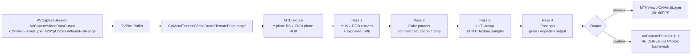
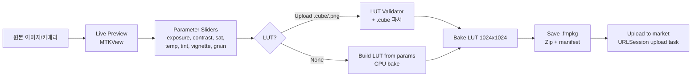
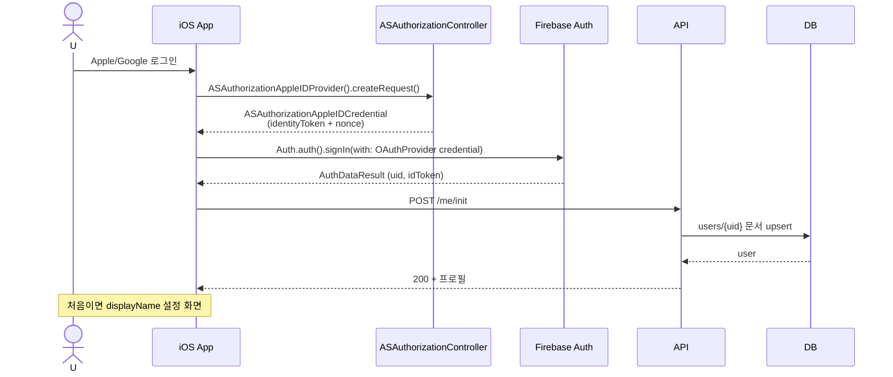
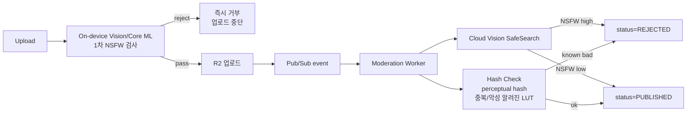
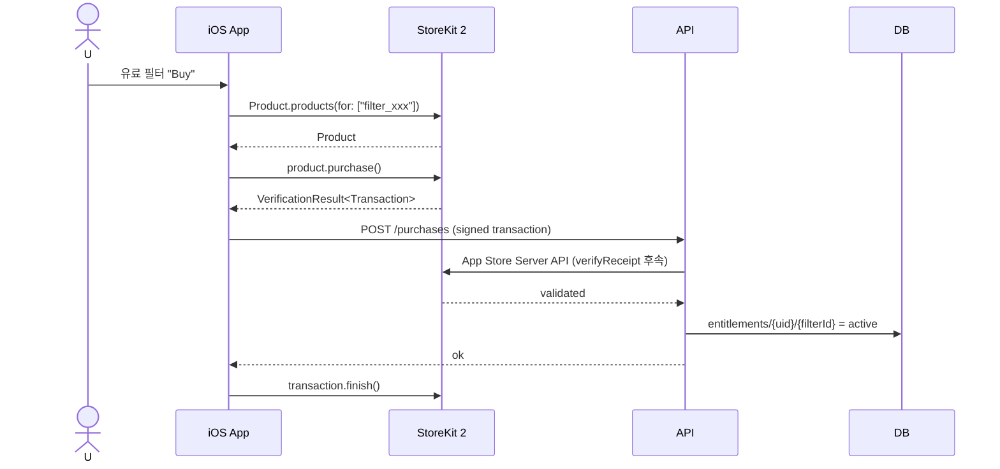

# filterMarket - System Design

> 버전: v1.1 (Draft, iOS native pivot) · 작성일: 2026-05-06
>
> 이 문서는 [ARCHITECTURE.md](./ARCHITECTURE.md)에서 정의한 컴포넌트들의 **내부 동작과 데이터 모델**을 상세화한다. 클라이언트는 **iOS 네이티브(Swift + Metal)** 단일 스택을 가정한다.

---

## 1. 카메라 캡처 + 실시간 필터 렌더링 파이프라인 (Metal)

### 1.1 목표 성능
- **라이브 프리뷰**: 1080p, 30~60FPS, 프레임당 ≤ 16ms GPU 시간 (A14 이상에서 60FPS 목표)
- **고해상 캡처**: 12MP 이상 1초 이내 셔터-투-저장
- **CPU↔GPU 전송 최소화**: `CVMetalTextureCache`로 zero-copy YUV 텍스처 → 셰이더에서 직접 RGB 변환

### 1.2 파이프라인 구조



### 1.3 셰이더 패스 설계 (MSL — Metal Shading Language)

#### Pass 1: YUV → RGB + 사전 보정
- 입력: Y plane (`MTLPixelFormatR8Unorm`) + CbCr plane (`MTLPixelFormatRG8Unorm`)
- BT.709 매트릭스 변환, 노출(exposure)/WB(temperature, tint) 인라인 적용
- Fragment shader 1패스로 융합

#### Pass 2: 기본 보정(파라미터)
- 대비(contrast), 채도(saturation), 색조(tint)
- `float4 result = applyContrast(applySaturation(input, sat), contrast);` 식의 단순 함수 체인

#### Pass 3: LUT 적용 (핵심)
- 33×33×33 또는 65×65×65 3D LUT를 `MTLTextureType.type3D` 텍스처로 직접 업로드
- 보간: `sampler` 의 `mip_filter::linear, mag_filter::linear, min_filter::linear` (trilinear)
- 정밀도: `MTLPixelFormatRGBA16Float` 권장 (banding 방지)
- 강도 믹스: `mix(rgb, lutSample, intensity)`

#### Pass 4: 그레인/비네트
- 그레인: blue noise 텍스처 샘플(미리 베이크된 노이즈 텍스처)
- 비네트: 거리 기반 darkening
- 선택적(필터 메타에서 활성화 여부 지정)

### 1.4 더블/트리플 버퍼링 전략
- `CAMetalLayer.maximumDrawableCount = 3` (트리플 버퍼)
- `MTLCommandQueue` 단일, frame-in-flight 세마포어로 동기화 (`DispatchSemaphore` 또는 Swift Concurrency `actor`)
- 프리뷰와 캡처는 다른 `MTLCommandBuffer` — 셔터 시 별도 고해상 패스 인큐
- Color/depth pixel format은 `bgra8Unorm`, sRGB는 출력 직전 변환

### 1.5 사진 캡처 (고해상)
- `AVCapturePhotoOutput` + `AVCapturePhotoSettings`
- `AVCapturePhotoCaptureDelegate.photoOutput(_:didFinishProcessingPhoto:error:)` 에서 `CVPixelBuffer` 추출
- 동일한 Metal 셰이더 체인을 고해상 텍스처에 재적용
- 결과를 HEIC/JPEG로 인코딩 후 `PHPhotoLibrary.shared().performChanges`로 사진 라이브러리 저장
- EXIF/방향 정보 보존 (`CGImagePropertyOrientation`)

### 1.6 Core Image 보조
- 일부 내장 필터/썸네일 프리뷰 등은 `CIFilter` + `CIContext(mtlDevice:)` 로 가속
- 카메라 라이브 핫패스에는 사용하지 않음 (프레임 예측성 우선)

### 1.7 백엔드 선택 표

| 항목 | 1순위 | 비고 |
|---|---|---|
| 카메라 | AVFoundation (`AVCaptureSession`) | iOS 표준 |
| 프리뷰 렌더 | Metal (`MTKView` / `CAMetalLayer`) | 60FPS 보장 |
| 셰이더 언어 | MSL (`.metal` 소스, `.metallib` 컴파일) | Xcode 빌드 시 컴파일 |
| 일부 합성 | Core Image + `CIFilter` | 비핫패스 보조 |
| 사진 저장 | Photos / PhotoKit | 표준 권한 흐름 |
| 얼굴 검출 (Phase 4) | Vision (`VNDetectFaceRectanglesRequest`) | 온디바이스 |
| 온디바이스 NSFW (Phase 4) | Core ML 모델(예: NudeNet 변형) | 업로드 전 1차 검사 |

---

## 2. 필터 포맷 / 스키마 (Filter Format)

### 2.1 설계 목표
- 메이커가 만들기 쉬워야 함(LUT 업로드만으로 가능)
- 고급 사용자는 MSL 셰이더 / 파라미터 조합 가능 (Phase 3+, 보안 검증 후)
- 앱이 forward-compatible (미래 필드 무시 가능)
- 작은 용량(다운로드 빠름) — 200KB 이내 권장
- **플랫폼 중립**: Phase 4 이후 Android 진출 시 셰이더 외 자산은 그대로 재사용

### 2.2 필터 패키지(.fmpkg) — Zip 컨테이너

```
my_filter.fmpkg/
├── manifest.json        # 메타데이터 + 파라미터 정의
├── lut.png              # 1024x1024 LUT (2D-packed 3D LUT) - optional
├── lut.cube             # (선택) 원본 .cube 백업
├── shaders/
│   ├── filter.metal     # MSL 소스 - optional (Phase 3+)
│   └── filter.metallib  # 사전 컴파일된 Metal Library - optional
├── preview/
│   ├── thumb.jpg        # 256x256 썸네일
│   ├── before.jpg       # before 미리보기
│   └── after.jpg        # after 미리보기
└── README.md            # 메이커 노트 (optional)
```

> `.metal` 소스와 `.metallib` 동시 포함 옵션: 소스는 검증/감사용, `.metallib`는 즉시 로드. 없으면 클라이언트가 런타임에 `MTLDevice.makeLibrary(source:)` 컴파일.

### 2.3 manifest.json 스키마

```json
{
  "schemaVersion": 1,
  "id": "uuid-v4",
  "name": "Sunset Vibes",
  "slug": "sunset-vibes",
  "version": "1.0.0",
  "author": {
    "uid": "firebase-uid",
    "displayName": "Alex"
  },
  "category": "cinematic",
  "tags": ["warm", "golden-hour", "summer"],
  "description": "Warm cinematic look ...",
  "license": "CC-BY-4.0",
  "remix": {
    "enabled": true,
    "parentId": null
  },
  "engine": {
    "type": "lut+params",
    "minAppVersion": "1.0.0",
    "minIOSVersion": "17.0",
    "lutSize": 33,
    "lutFile": "lut.png",
    "shaderFile": null,
    "shaderLib": null
  },
  "parameters": [
    {
      "key": "intensity",
      "label": "Intensity",
      "type": "float",
      "min": 0, "max": 1, "default": 1.0
    },
    {
      "key": "grain",
      "label": "Grain",
      "type": "float",
      "min": 0, "max": 0.3, "default": 0.05
    }
  ],
  "presets": [
    { "name": "Soft", "values": { "intensity": 0.5, "grain": 0.02 } },
    { "name": "Strong", "values": { "intensity": 1.0, "grain": 0.08 } }
  ],
  "createdAt": "2026-05-06T00:00:00Z",
  "checksum": "sha256:..."
}
```

### 2.4 엔진 타입(engine.type) 진화 경로

| 버전 | engine.type | 설명 |
|---|---|---|
| v1 (MVP) | `lut+params` | LUT + 정해진 파라미터 슬라이더 |
| v2 (Phase 3+) | `lut+msl` | LUT + 사용자 커스텀 후처리 MSL 셰이더(서명 + 정적 검증 필수) |
| v3 | `nodegraph` | 노드 그래프 직렬화 → 클라이언트가 MSL로 컴파일 |

### 2.5 메이커 업로드 셰이더 보안 (Phase 3+ 활성화 시)

임의 MSL 셰이더 실행은 GPU 자원 남용/크래시 위험. 다음 다층 방어:

1. **함수 화이트리스트**: 메이커 셰이더는 `fragment` 함수 1개 + 미리 정의된 헬퍼만 사용 가능. `kernel`, atomic, threadgroup 메모리, `device` 포인터 접근 금지.
2. **AST 정적 분석** (서버측): 토큰화 + 파서로 금지 키워드(`device`, `atomic_*`, `threadgroup_barrier`, `simd_*`) 차단, 루프 깊이/길이 상한.
3. **샘플러/텍스처 바인딩 강제**: 입력은 `[[stage_in]]`, `texture2d<float>`(미리 정의), `constant Params&` 만 허용.
4. **컴파일 타임아웃**: `MTLDevice.makeLibrary(source:)` 100ms 한도 (별도 스레드 + 취소).
5. **런타임 가드**: `MTLCommandBuffer.addCompletedHandler`에서 GPU 시간 측정, 16ms × 5 frames 초과 시 셰이더 비활성화.
6. **서명**: 백엔드가 검증 후 `.metallib`에 ed25519 서명, 클라이언트가 검증 후 로드.

> v1 MVP에서는 사용자 셰이더 비활성화(`lut+params`만). 메이커 보안은 Phase 5에서 본격 활성화.

---

## 3. 필터 에디터 설계

### 3.1 MVP 에디터 (Tier 1)



#### LUT 변환 / 베이킹
- 사용자가 `.cube` 파일을 Files 앱/공유 시트로 업로드 → 클라이언트 Swift 파서가 1024×1024 PNG로 변환
- 파라미터만 사용한 경우, 파라미터를 적용한 LUT를 클라이언트가 베이크(파라미터 휘발 방지)
- 베이크된 LUT는 **결정론적**(파라미터 동일 → 동일 LUT) — 이후 재현 가능
- `Accelerate.framework` (vImage)로 LUT bake 가속

### 3.2 Phase 2: 고급 파라미터
- HSL 채널별 보정(8색상 곡선)
- Curves(RGB 톤 곡선) — 4점 베지어
- Split toning(하이라이트/섀도우 색조)
- Selective color

### 3.3 Phase 3: 노드 그래프 에디터(베타)
- 노드 타입: Source, LUT, ColorMatrix, Curve, Blend, Output
- 직렬화: JSON DAG, 클라이언트가 MSL로 컴파일
- 사용성: 복잡 → 고급 사용자만 노출(Firebase Remote Config 피처 플래그)

---

## 4. 마켓플레이스 설계

### 4.1 데이터 모델 (Firestore)

```
/users/{uid}
  displayName, avatarUrl, bio, createdAt
  stats: { followers, following, filterCount, totalDownloads }

/filters/{filterId}
  authorUid, name, slug, category, tags[], description,
  engine: { type, lutSize, minIOSVersion },
  storageRefs: { fmpkg, preview/thumb, preview/before, preview/after, manifest },
  status: PENDING | PUBLISHED | REJECTED | TAKEDOWN,
  visibility: PUBLIC | UNLISTED | PRIVATE,
  remix: { parentId? },
  createdAt, updatedAt,
  metrics: { downloads, likes, ratingAvg, ratingCount, viewCount }

/filters/{filterId}/ratings/{uid}
  stars (1-5), createdAt

/filters/{filterId}/comments/{commentId}
  authorUid, body, createdAt, parentCommentId?, status

/users/{uid}/favorites/{filterId}
  addedAt

/users/{uid}/downloads/{filterId}
  downloadedAt, version

/follows/{followerUid_followingUid}
  followerUid, followingUid, createdAt

/reports/{reportId}
  reporterUid, targetType (filter|user|comment), targetId, reason, status
```

### 4.2 카운터 정확성 (분산 카운터)
- 다운로드 수는 초 단위로 빠르게 증가 → Firestore 단일 문서 쓰기는 1 write/sec 한계
- 해결: **샤드 카운터** (10개 샤드, 합산 캐시 1분)
- 또는 BigQuery에 이벤트 적재 후 5분마다 집계

### 4.3 검색

#### MVP: 단순 prefix 검색
- Firestore `array-contains` + prefix 검색(이름)

#### Phase 4: Algolia (또는 self-hosted Typesense)
- 인덱싱 필드: name, tags, description, category, authorName, popularity
- Ranking: typo + textual + custom(downloads × log(time_decay))
- 동의어 사전(예: "vintage" ≈ "retro")
- Personalization (사용자 클릭 이력 가중치)

### 4.4 추천 (Phase 4+)

| 단계 | 알고리즘 | 입력 | 출력 |
|---|---|---|---|
| v1 | Popularity (다운로드 7일 합) | filters | 글로벌 인기 |
| v2 | Co-occurrence ("이 필터를 받은 사람이 자주 받는 다른 필터") | downloads | item-item |
| v3 | Embeddings (color histogram + tag) | filters + interactions | 사용자별 |
| v4 | Two-tower NN (TF Recommenders) | full event log | 개인화 |

배치 작업: Pub/Sub → Cloud Run 워커 → BigQuery → 결과를 Firestore `recommendations/{uid}`로 저장.

### 4.5 카테고리 / 태그
- 시스템 카테고리(고정 12개): Cinematic, Vintage, Pastel, B&W, Portrait, Food, Travel, Anime, Mood, Bright, Moody, Skin
- 사용자 태그: 자유 텍스트, 정규화(소문자, 공백→하이픈), 모더레이션 후 노출

---

## 5. 인증 / 사용자 시스템

### 5.1 지원 IdP
- **Sign in with Apple** (iOS 필수 정책, `AuthenticationServices`)
- Sign in with Google (Firebase Auth + GoogleSignIn-iOS SDK)
- Email + Password (Phase 2, optional)
- 익명/게스트 (둘러보기만)

### 5.2 사용자 가입 플로우



### 5.3 권한 / Role
- `user` (기본)
- `moderator` (커뮤니티 신고 처리)
- `admin` (시스템 운영)
- Custom Claims로 전달(`auth.token.role`)

### 5.4 GDPR / 개인정보
- 계정 삭제 요청 시 30일 grace 후 영구 삭제
- 다운로드한 필터는 작성자 정보 익명화 옵션
- 데이터 내보내기 API: `GET /me/export` → JSON dump
- App Store **App Privacy 라벨** 정확히 신고: Photos, Camera, User Content, Identifiers, Diagnostics

---

## 6. 콘텐츠 모더레이션 / 신고 / 저작권

### 6.1 자동 모더레이션 (업로드 시)



- 1차 온디바이스 검사: Vision/Core ML(예: 경량 NSFW 분류기)로 **업로드 전** 명백한 위반 차단 → 사용자 프라이버시·서버 비용 우호
- Cloud Vision SafeSearch: adult, racy, violence, medical
- perceptual hash(pHash) → 알려진 악성 / 무단 복제 LUT 차단
- 미리보기 이미지 + 썸네일 양쪽 검사

### 6.2 사용자 신고 플로우
- 사용자가 필터/댓글/사용자 신고 → `reports/` 문서 생성
- 모더레이터 대시보드(웹 어드민)에서 큐로 처리
- 누적 신고 N회 이상 → 자동 비공개

### 6.3 저작권 / DMCA
- DMCA Takedown 양식(이메일 + 웹 폼)
- 신고 검증 24시간 내 비공개 처리
- 반복 침해자 계정 정지 정책 명시(약관)

### 6.4 미성년자 보호
- 13세 미만 가입 차단(연령 확인 필수)
- 미성년자 카메라 콘텐츠는 추가 모더레이션
- COPPA / 한국 정보통신망법 / GDPR-K 준수
- App Store Age Rating: 12+ 또는 17+ 검토(UGC 콘텐츠 노출 수준에 따라)

---

## 7. 결제 / 유료 필터 (Phase 6)

### 7.1 가격 모델 옵션
- A. 일회성 구매 (\$0.99 ~ \$4.99)
- B. 번들(메이커 팩 \$9.99)
- C. 구독(\$4.99/월 — 모든 프리미엄 무제한)

> 1차 출시: A + C 동시. B는 Phase 6.5.

### 7.2 결제 흐름 (iOS)



- **수수료**: Apple 30%(소형 사업자 프로그램은 15%) → 메이커에게 60% 분배(앱 운영 10%)
- **웹 결제 우회**(Phase 6.5): 메이커가 자체 사이트에서 Stripe로 판매(Apple 정책 변화 추이 모니터링)
- StoreKit 2의 `Transaction.updates` 스트림 구독으로 환불/구독 변경 자동 동기화

### 7.3 정산 (Stripe Connect)
- 메이커 KYC → Stripe Connect Express 계정
- 월 \$10 이상부터 자동 정산
- 1099/W-9(미국) / 한국 사업자등록번호 처리

### 7.4 Anti-fraud
- 환불 정책(7일 내 미사용 시) — Apple 정책 준수
- 의심 패턴(같은 IP에서 대량 구매) 차단
- App Attest로 디바이스 무결성 검증

---

## 8. API 설계 (REST, OpenAPI 3.1)

### 8.1 명명 규칙
- 리소스 명사형 복수: `/filters`, `/users`
- 행위 동사 → 하위 리소스: `POST /filters/{id}/use`
- 페이지네이션: `?cursor=...&limit=20`
- 정렬: `?sort=-downloads,createdAt`

### 8.2 핵심 엔드포인트

```
POST   /me/init                          → 사용자 초기화
GET    /me                               → 내 프로필
PATCH  /me                               → 프로필 수정
DELETE /me                               → 계정 삭제 요청

GET    /filters?category=&tag=&q=&cursor=
POST   /filters                          → 메타 + presigned URL
PATCH  /filters/{id}
POST   /filters/{id}/finalize            → 업로드 완료 통지
DELETE /filters/{id}                     → 본인 또는 admin
GET    /filters/{id}
POST   /filters/{id}/use                 → 다운로드/적용 카운트
POST   /filters/{id}/like
DELETE /filters/{id}/like
POST   /filters/{id}/rate                { stars: 1-5 }
POST   /filters/{id}/report              { reason, detail }

GET    /filters/{id}/comments?cursor=
POST   /filters/{id}/comments            { body, parentId? }
DELETE /comments/{id}

GET    /users/{uid}
GET    /users/{uid}/filters
POST   /users/{uid}/follow
DELETE /users/{uid}/follow

GET    /search?q=...
GET    /recommendations                  → 개인화 (Phase 4)
GET    /feed                             → 팔로우 + 추천 혼합

# Phase 6
POST   /purchases                        { signedTransaction }
GET    /entitlements
GET    /payouts                          → 메이커 대시보드
```

### 8.3 표준 응답 envelope

```json
{
  "ok": true,
  "data": { ... },
  "error": null,
  "meta": { "cursor": "...", "total": 1234 }
}
```

에러:
```json
{
  "ok": false,
  "data": null,
  "error": { "code": "FILTER_NOT_FOUND", "message": "..." }
}
```

### 8.4 Rate Limiting
- 익명: 30 req/min/IP
- 인증 사용자: 300 req/min/uid
- 업로드: 20 filters/day/uid (스팸 방지)
- 신고: 10 reports/day/uid

---

## 9. 캐싱 전략

| 자원 | 위치 | TTL | 무효화 |
|---|---|---|---|
| 필터 .fmpkg/preview | Cloudflare CDN | 30일 | 새 버전 시 다른 키(versioned URL) |
| 필터 메타 (서버) | Cloud Run 메모리 + Memorystore | 5분 | publish/update 이벤트 시 invalidate |
| 검색 결과 | Algolia 자체 | - | 인덱서가 push |
| 클라이언트 사진 | Photos 라이브러리 (사용자 관리) | 사용자 정리 | 사용자 직접 |
| 클라이언트 .fmpkg | `Application Support/Filters/` (LRU 200MB) | 무한, LRU | 사용자 정리 / 업데이트 시 |
| 클라이언트 Metal Library | `MTLDevice.makeDefaultLibrary` (앱 번들 캐시) | 빌드 시 컴파일 | 앱 업데이트 시 |

---

## 10. 장애 시나리오 / 회복

| 장애 | 영향 | 완화 |
|---|---|---|
| Firestore 쓰기 실패 | 업로드 실패 | 클라이언트 재시도 + URLSession Background Task 큐 |
| Cloudflare R2 다운 | 다운로드 실패 | CDN edge 캐시(30일 TTL) |
| Algolia 다운 | 검색 실패 | Firestore 직접 쿼리(저성능 fallback) |
| 모더레이션 큐 적체 | 신규 필터 노출 지연 | 모더레이션 동안 비공개 표시 + 본인은 사용 가능 |
| Push 알림 실패 (APNs) | UX 저하 | 비치명적, 인앱 알림 센터로 대체 |
| Metal 디바이스 초기화 실패 | 카메라/필터 사용 불가 | 안내 화면 + Core Image fallback (저성능 모드) |

---

## 11. 관련 문서
- [PRD.md](./PRD.md)
- [ARCHITECTURE.md](./ARCHITECTURE.md)
- [TECH_STACK.md](./TECH_STACK.md)
- [TASK_LIST.md](./TASK_LIST.md)
- [RISKS.md](./RISKS.md)
