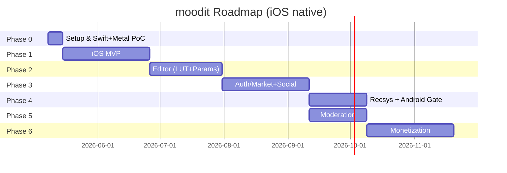

# moodit - Task List & Phased Roadmap

> 버전: v1.1 (Draft, iOS native pivot) · 작성일: 2026-05-06
>
> 추정 공수 단위: **MD = man-day** (1MD = 1인 8시간), 가정 팀 규모: **iOS 2명 + 백엔드 1명 + 디자인 0.5명**

---

## Phase 개요

| Phase | 목표 | 기간 | 인원-월(MM) | 핵심 산출물 |
|---|---|---|---|---|
| 0 | 프로젝트 셋업 + Swift+Metal PoC | 1주 | 0.7 | 카메라+Metal 라이브 필터 PoC, CI 파이프라인 |
| 1 | MVP — 카메라/내장 필터/저장 + 기본 마켓 (iOS) | 6주 | 5.0 | iOS Closed Beta (TestFlight) |
| 2 | 필터 에디터(LUT+파라미터) | 5주 | 4.0 | 메이커가 자체 필터 업로드 가능 |
| 3 | 인증/마켓 강화(검색·평점·소셜) | 6주 | 5.0 | 양면 마켓 활성화 |
| 4 | 추천 + 검색 고도화 + **Android 진출 게이트** | 4주 | 3.5 | Algolia, 협업 필터링 v1, Android 결정 |
| 5 | 모더레이션 / 신고 / 저작권 | 4주 | 3.5 | 운영 안정 |
| 6 | 유료 필터 / 결제 / 정산 | 6주 | 5.0 | 수익화 |

---

## Phase 0: 프로젝트 초기 설정 / Swift+Metal PoC (1주)

### 목표
- 핵심 기술 가정(**Swift + Metal에서 30~60FPS 라이브 카메라 필터**)을 PoC로 검증 (1주 이내)
- Xcode 프로젝트 + SPM 모듈 골격 + Xcode Cloud 파이프라인 확정
- 디자인 시스템 v0

### Tasks

| ID | Task | 의존성 | 추정 (MD) | 위험 |
|---|---|---|---|---|
| P0-01 | Xcode 프로젝트 생성 + SPM 모듈 골격 (App, Camera, FilterEngine, Marketplace, Auth, Storage, Models, DesignSystem) | - | 1 | 낮음 |
| P0-02 | Swift 6 strict concurrency 빌드 설정 + Debug/Staging/Release 컨피그 | P0-01 | 1 | 낮음 |
| P0-03 | Xcode Cloud 파이프라인: lint + 빌드 + 테스트 + TestFlight Internal | P0-02 | 1 | 중 (인증서) |
| P0-04 | Fastlane match 셋업(인증서/프로비저닝) | P0-02 | 1 | 중 |
| P0-05 | Firebase 프로젝트 생성(dev/staging/prod), Firebase iOS SDK 통합 | - | 1 | 낮음 |
| **P0-06** | **PoC: AVCaptureSession + MTKView + 단순 LUT MSL 셰이더 (1080p 30~60FPS 측정)** | P0-01 | 2 | **높음 — 가설 검증** |
| P0-07 | 디자인 시스템 v0(컬러/타이포/스페이싱), Figma 라이브러리 | - | 1 | 낮음 |
| P0-08 | 분석/크래시 SDK 통합(Crashlytics, Sentry, PostHog, MetricKit 래퍼) | P0-05 | 1 | 낮음 |
| P0-09 | 코드 표준 / 린트 (SwiftLint, SwiftFormat, Conventional Commits, DocC 템플릿) | P0-01 | 0.5 | 낮음 |
| P0-10 | PRD/Arch/Design 문서 리뷰 + 수정 | - | 1 | 낮음 |

**총합**: ~9.5MD (1주 × 4명)

### 종료 조건 (Exit Criteria)
- [ ] iPhone 12 이상에서 1080p 60FPS 라이브 프리뷰 + LUT 적용 데모
- [ ] iPhone X 등 저성능 기기에서 1080p 30FPS 보장
- [ ] Xcode Cloud에서 IPA 자동 빌드 + TestFlight Internal 첫 배포
- [ ] PoC 결과 문서화 (`os_signpost` 트레이스 캡처)

---

## Phase 1: MVP — 카메라 + 기본 필터 + 사진 저장 + 기본 마켓 (6주, iOS)

### 목표
- 비메이커(촬영자)가 가치를 느낄 수준의 출시
- 15개 큐레이션 필터 + 다운로드 기능 + 갤러리 저장
- TestFlight Closed Beta 100명 (External Testing)

### Epic & Tasks

#### Epic 1.A: 카메라 (10MD)
| ID | Task | 의존 | MD |
|---|---|---|---|
| 1A-01 | 카메라 권한 + 권한 거부 UX (`AVCaptureDevice.requestAccess`) | - | 1 |
| 1A-02 | 전후면 전환, 줌, 노출/포커스 탭 (`AVCaptureDevice.focus*`, `exposure*`) | - | 2 |
| 1A-03 | 비율 전환 16:9 / 4:3 / 1:1 | - | 2 |
| 1A-04 | 셔터 + 햅틱 + 사진 저장 (`AVCapturePhotoOutput` + PhotoKit) | - | 3 |
| 1A-05 | 필터 강도 슬라이더 + 실시간 반영 | 1A-04 | 1 |
| 1A-06 | 카메라 그리드/수평계 보조 UI | - | 1 |

#### Epic 1.B: 필터 런타임 (Metal) (15MD)
| ID | Task | 의존 | MD |
|---|---|---|---|
| 1B-01 | Metal 디바이스/큐 추상화, MTKView 래퍼 (`UIViewRepresentable`) | P0-06 | 3 |
| 1B-02 | LUT 로더 (PNG → MTLTexture 3D, RGBA16F) | 1B-01 | 3 |
| 1B-03 | 4-pass 셰이더 파이프라인 (YUV→RGB / params / LUT / post) | 1B-01 | 4 |
| 1B-04 | 그레인/비네트 셰이더 + blue noise 텍스처 베이크 | 1B-01 | 2 |
| 1B-05 | 15개 큐레이션 LUT 패키지(.fmpkg) 자체 제작 + 시드 도구 | 1B-02 | 3 |

#### Epic 1.C: 갤러리 + 후보정 (7MD)
| ID | Task | 의존 | MD |
|---|---|---|---|
| 1C-01 | 사진 가져오기 (`PHPickerViewController` + Photos 권한) | - | 2 |
| 1C-02 | 후보정 화면(필터 선택 + 강도 슬라이더, SwiftUI) | 1B-* | 3 |
| 1C-03 | Before/After 토글 (제스처) | 1C-02 | 1 |
| 1C-04 | 저장 + 공유(`UIActivityViewController`) | 1C-02 | 1 |

#### Epic 1.D: 인증 (4MD)
| ID | Task | 의존 | MD |
|---|---|---|---|
| 1D-01 | Sign in with Apple 통합 (`AuthenticationServices`) | P0-05 | 2 |
| 1D-02 | Sign in with Google 통합 (`GoogleSignIn-iOS`) | P0-05 | 1 |
| 1D-03 | 게스트 모드 + 가입 유도 UX | - | 0.5 |
| 1D-04 | `/me/init` API + 사용자 문서 | - | 0.5 |

#### Epic 1.E: 마켓플레이스 (둘러보기 + 다운로드) (10MD)
| ID | Task | 의존 | MD |
|---|---|---|---|
| 1E-01 | 마켓 홈 피드(인기/신규 탭, SwiftUI `LazyVGrid`) | 1B-* | 3 |
| 1E-02 | 카테고리 화면 (12개 시스템 카테고리) | - | 1.5 |
| 1E-03 | 필터 상세 화면(미리보기, 메이커, 다운로드 버튼) | 1E-01 | 2.5 |
| 1E-04 | 다운로드 / 캐싱 / 적용 플로우 (URLSession Background Task) | 1B-02 | 2 |
| 1E-05 | 내가 받은 필터 / 즐겨찾기 화면 | 1E-04 | 1 |

#### Epic 1.F: 백엔드 / 인프라 (8MD)
| ID | Task | 의존 | MD |
|---|---|---|---|
| 1F-01 | Firestore 스키마 + Security Rules (필터/사용자) | - | 2 |
| 1F-02 | 큐레이션 필터 시드 데이터 업로드 도구 | 1F-01 | 2 |
| 1F-03 | Cloudflare R2 버킷 + Worker presigned URL | - | 2 |
| 1F-04 | Cloud Functions: `/filters/use` 카운터(샤드) | 1F-01 | 2 |

#### Epic 1.G: 운영 / 출시 준비 (6MD)
| 1G-01 | Privacy Policy / EULA / 약관 (한/영) | - | 2 |
| 1G-02 | App Store 등록 자료(스크린샷, 설명, App Privacy 라벨) | - | 2 |
| 1G-03 | TestFlight External Closed Beta 모집 + 피드백 채널 | - | 1 |
| 1G-04 | KPI 대시보드(PostHog) + MetricKit 수집 | - | 1 |

#### Epic 1.H: 품질/테스트 (5MD)
| ID | Task | 의존 | MD |
|---|---|---|---|
| 1H-01 | XCTest 단위 테스트 (FilterEngine, Models, Storage) — 커버리지 60%+ | 1B-* | 2 |
| 1H-02 | 스냅샷 테스트 (마켓 피드, 에디터) — `swift-snapshot-testing` | 1E-* | 2 |
| 1H-03 | XCUITest 핵심 플로우 (가입 → 카메라 → 다운로드) | 1A-*,1D-*,1E-* | 1 |

**Phase 1 총합**: ~65MD = 약 6주 × 4명 (이전 ~67MD/8주에서 단축)

### 종료 조건
- [ ] App Store Connect TestFlight External Beta 출시 (100명)
- [ ] D1 리텐션 ≥ 25% (베타 사용자 100명)
- [ ] 카메라 평균 FPS ≥ 30 (95퍼센타일), iPhone 12+에서 ≥ 60
- [ ] Crashlytics 크래시율 < 1%
- [ ] 첫 촬영까지 시간 < 60s

### 위험 (Phase 1)
- **R-1.1**: Metal 4-pass 파이프라인의 thermal 압박 — 완화: thermalState 모니터링 + FPS 다운
- **R-1.2**: Sign in with Apple 정책(필수) 미이행 → 리젝트 — 완화: 1D-01을 Phase 1 초반에 배치
- **R-1.3**: Firebase 비용 예측 실패 — 완화: 처음부터 R2로 미디어 분기

---

## Phase 2: 필터 에디터 (LUT + 파라미터 기반) (5주)

### 목표
- 메이커가 iOS에서 필터를 만들고 업로드
- LUT 업로드 + 7~10개 파라미터 + 미리보기

### Tasks

| ID | Task | 의존 | MD | 위험 |
|---|---|---|---|---|
| 2-01 | .cube 파서 (Swift) → 1024×1024 PNG LUT 변환 (vImage 가속) | - | 3 | 중 |
| 2-02 | 파라미터 → LUT 베이크 알고리즘(결정론적) | 2-01 | 4 | 중 |
| 2-03 | 에디터 UI: 슬라이더 + 라이브 미리보기 + 비교 (SwiftUI) | 2-02 | 5 | 낮음 |
| 2-04 | manifest.json 빌더 + 검증(JSON Schema, Codable) | 2-02 | 2 | 낮음 |
| 2-05 | 미리보기 자동 생성(thumb / before / after, Core Image) | 2-03 | 2 | 낮음 |
| 2-06 | .fmpkg 패키징 + R2 presigned 업로드 (URLSession) | 2-04, 1F-03 | 3 | 낮음 |
| 2-07 | 업로드 진행률 + 백그라운드 재개(URLSessionConfiguration.background) | 2-06 | 2 | 중 |
| 2-08 | 업로드 후 프리뷰 + 메타 수정 화면 | 2-06 | 2 | 낮음 |
| 2-09 | 메이커용 KPI 대시보드(다운로드/평점) | 1F-04 | 2 | 낮음 |
| 2-10 | 라이선스 선택(CC-BY, CC0, All Rights Reserved) | 2-04 | 1 | 낮음 |
| 2-11 | 자동 모더레이션 1차(미리보기 SafeSearch + 온디바이스 Vision NSFW) | 2-06 | 2 | 중 |

**Phase 2 총합**: ~28MD ≈ 5주 × 3명

### 종료 조건
- [ ] 베타 메이커 50명이 필터 업로드 성공
- [ ] 업로드 성공률 ≥ 95%
- [ ] 평균 업로드 시간 < 30s

---

## Phase 3: 인증/마켓 강화(검색·카테고리·평점·소셜) (6주)

### Tasks

| ID | Task | 의존 | MD | 위험 |
|---|---|---|---|---|
| 3-01 | 사용자 프로필 페이지(아바타, 바이오, 만든/즐겨찾기 필터) | 1D-* | 4 | 낮음 |
| 3-02 | 팔로우 / 팔로잉 시스템 + 카운터 | 3-01 | 4 | 중 |
| 3-03 | 평점(1-5 stars) + 평균 표시 | 1F-01 | 3 | 낮음 |
| 3-04 | 댓글 시스템(스레드 1단계) | 3-01 | 5 | 중 (모더레이션) |
| 3-05 | 좋아요 / 즐겨찾기 분리 | - | 2 | 낮음 |
| 3-06 | 검색(MVP — Firestore 기반): 이름 prefix + 카테고리 + 태그 | 1F-01 | 3 | 낮음 |
| 3-07 | 정렬: 인기/신규/평점 | 3-06 | 2 | 낮음 |
| 3-08 | 필터 Remix(파생) — parentId 추적 + 크레딧 | 2-* | 3 | 중 (저작권) |
| 3-09 | Universal Link — 링크 클릭 시 필터 적용 (`onOpenURL`, Associated Domains) | 1E-04 | 3 | 중 |
| 3-10 | APNs 푸시 알림 (FCM 경유): 새 팔로워, 새 댓글 | 3-01 | 3 | 낮음 |
| 3-11 | 알림 센터 화면 | 3-10 | 2 | 낮음 |

**Phase 3 총합**: ~34MD ≈ 6주 × 3명

### 종료 조건
- [ ] 사용자당 일평균 필터 적용 ≥ 5
- [ ] 마켓 둘러보기 → 다운로드 전환율 ≥ 8%
- [ ] 평균 검색 응답 < 500ms
- [ ] D7 리텐션 ≥ 18%

---

## Phase 4: 추천 + 검색 고도화 + **Android 진출 게이트** (4주)

### Tasks

| ID | Task | 의존 | MD | 위험 |
|---|---|---|---|---|
| 4-01 | Algolia 인덱스 설정 + 인덱서 워커(Pub/Sub) | 1F-* | 4 | 중 |
| 4-02 | Algolia iOS SDK 통합 + Personalization | 4-01 | 3 | 낮음 |
| 4-03 | 추천 v1: 인기 + 최신성 가중 | - | 2 | 낮음 |
| 4-04 | 추천 v2: co-occurrence (item-item) | 이벤트 로그 | 5 | 중 |
| 4-05 | 사용자별 홈 피드(For You) | 4-04 | 4 | 중 |
| 4-06 | 이벤트 로그 → BigQuery export 파이프라인 | 1F-* | 3 | 중 |
| 4-07 | 동의어 사전 + 한국어 형태소 분석(Mecab) | 4-01 | 3 | 중 |
| **4-08** | **Android 진출 의사결정 게이트 — 시장조사 + 옵션 비교(네이티브 Kotlin / Compose MP / iOS only 유지)** | - | 3 | **높음 (전략)** |

**Phase 4 총합**: ~27MD ≈ 4주 × 3명

### 종료 조건
- [ ] 검색 p95 < 200ms
- [ ] For You 추천 CTR ≥ 12%
- [ ] 추천 기반 다운로드 전환 ≥ 8%
- [ ] **Android 진출 결정 문서화** (옵션 + 결정 + 다음 Phase의 Android 작업 추가 또는 보류)

### Android 진출 게이트 결정 프레임워크 (4-08 상세)
| 입력 지표 | 옵션 A: 네이티브 Kotlin | 옵션 B: Compose MP | 옵션 C: iOS only 유지 |
|---|---|---|---|
| 현 iOS MAU | 100K+ | 50~100K | <50K |
| 메이커 수 | 5K+ | 2~5K | <2K |
| 누적 매출(Phase 6 진입 기준) | \$50K/월+ | \$20~50K/월 | <\$20K/월 |
| 팀 인원 | 5명+ | 4~5명 | <4명 |
| 예상 Android 시장 규모(국가별) | 큼(인도/동남아 진출) | 중간 | 작음 |
| 셰이더 자산 재사용 | 별도 GLSL/Vulkan 포팅 | Skia + AGSL | 해당 없음 |

> 결정은 정량(매출/MAU) + 정성(시장 검증) 양쪽으로 평가.

---

## Phase 5: 모더레이션 / 신고 / 저작권 (4주)

### Tasks

| ID | Task | 의존 | MD | 위험 |
|---|---|---|---|---|
| 5-01 | Cloud Vision SafeSearch 통합 (워커) | 2-11 | 3 | 낮음 |
| 5-02 | 신고 양식 + reason 카테고리 | - | 2 | 낮음 |
| 5-03 | 모더레이터 웹 어드민(Next.js) | - | 6 | 중 |
| 5-04 | 자동 비공개 룰(누적 신고 N회) | 5-02 | 2 | 중 |
| 5-05 | 차단 사용자 / 차단 필터 | - | 2 | 낮음 |
| 5-06 | 미성년자 보호(연령 확인 게이트) | 1D-* | 2 | 중 (UX) |
| 5-07 | DMCA Takedown 양식 + 워크플로 | 5-03 | 3 | 중 |
| 5-08 | perceptual hash(pHash) 중복/악성 LUT 검출 | 2-* | 3 | 중 |
| 5-09 | GDPR 데이터 내보내기 / 삭제 API | 1D-* | 4 | 중 |
| 5-10 | (조건부) 사용자 업로드 MSL 셰이더 보안 게이트 — AST 화이트리스트 + 컴파일 타임아웃 + 서명 | 2-* | 5 | **높음** |

**Phase 5 총합**: ~32MD ≈ 4주 × 3명

### 종료 조건
- [ ] 신고 처리 SLA: 24시간 내 1차 응답
- [ ] 자동 모더레이션 정확도 ≥ 90%
- [ ] False Positive ≤ 5%
- [ ] DMCA 처리 시간 < 24h
- [ ] (활성화 시) 메이커 셰이더 검증 통과율 ≥ 95%

---

## Phase 6: 유료 필터 / 결제 / 정산 (6주)

### Tasks

| ID | Task | 의존 | MD | 위험 |
|---|---|---|---|---|
| 6-01 | Apple IAP 통합 (StoreKit 2) — 비소비형 + 구독 | - | 5 | 높음 |
| 6-02 | 영수증 서버 검증 (App Store Server API) | 6-01 | 3 | 중 |
| 6-03 | Entitlements 저장 + `Transaction.updates` 동기화 | 6-02 | 3 | 중 |
| 6-04 | 유료 필터 메타(가격, 타이어) + 가격 책정 가이드 | 6-01 | 2 | 낮음 |
| 6-05 | 메이커 KYC + Stripe Connect Express 가입 플로우 | - | 5 | 높음 |
| 6-06 | 정산 계산(메이커 60% / 플랫폼 10% / 스토어 30% 또는 15%) | 6-05 | 4 | 중 |
| 6-07 | 메이커 정산 대시보드(매출/예상정산/실제 입금) | 6-06 | 4 | 낮음 |
| 6-08 | 환불 정책 / 정책 페이지 | 6-01 | 1 | 낮음 |
| 6-09 | 구독 모델(\$4.99/mo, 모든 프리미엄) | 6-01 | 4 | 중 |
| 6-10 | 유료 컨텐츠 마케팅 페이지 / 인앱 프로모 | - | 3 | 낮음 |

**Phase 6 총합**: ~34MD ≈ 6주 × 3명

### 종료 조건
- [ ] 첫 매출 발생
- [ ] 유료 필터 평균 가격 \$1.99
- [ ] 메이커 정산 100% 정확
- [ ] 결제 성공률 ≥ 95%

---

## 의존성 다이어그램 (Phase 간)

> Phase 4와 Phase 5는 부분적으로 병렬 가능(검색팀 vs 모더레이션팀 분리 시).
> 전체 일정: 약 32주 (이전 36주에서 4주 단축).

---

## 공통 위험 트래킹

| 위험 | Phase | 영향 | 완화 |
|---|---|---|---|
| Metal 셰이더 보안(메이커 업로드) | 3~5 | 사용자 디바이스 GPU 자원 남용/크래시 | 화이트리스트 + AST 검증 + 컴파일 타임아웃 + 서명 |
| 모더레이션 누락(NSFW 노출) | 1~5 | 스토어 리젝트 | 온디바이스 1차 + Cloud Vision + 24h SLA |
| Firebase 비용 예측 실패 | 1~4 | 마진 압박 | 조기 모니터링, 5% 트리거 시 R2/Postgres 이전 |
| 메이커 풀 부족(콜드 스타트) | 1~3 | 마켓 가치 저하 | 사내 큐레이션 15개 + 베타 메이커 인플루언서 영입 |
| 결제 정책 변경 (Apple) | 6 | 매출 모델 위협 | IAP + 웹(Stripe) 이중 전략 |
| iOS 단독으로 인한 Android 시장 기회비용 | 0~4 | 잠재 사용자 손실 | Phase 4 게이트에서 정량 평가 후 결정 |

---

## 변경 관리

- 본 작업 분해는 Phase 종료 시점마다 재산정한다.
- 새 위험 발견 시 [RISKS.md](./RISKS.md)에 기록 + 본 문서에 완화 태스크 추가.
- 추정 공수 vs 실측 차이가 30% 초과면 회고 + 가정 재검토.
- Phase 4 게이트(Android 진출 결정)는 별도 ADR로 문서화.

---

## 관련 문서
- [PRD.md](./PRD.md)
- [ARCHITECTURE.md](./ARCHITECTURE.md)
- [SYSTEM_DESIGN.md](./SYSTEM_DESIGN.md)
- [TECH_STACK.md](./TECH_STACK.md)
- [RISKS.md](./RISKS.md)
