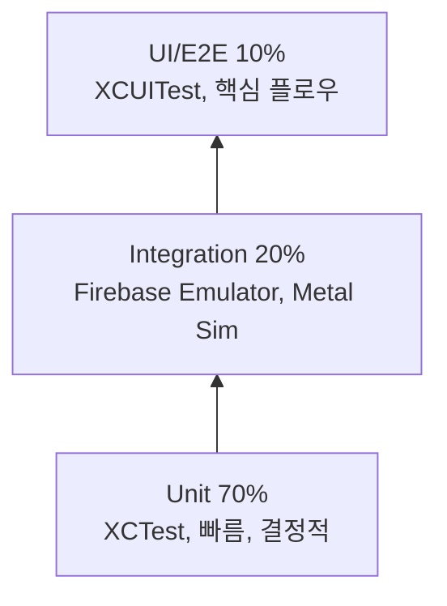

# filterMarket - 테스트 전략

> 버전: v1.0 · 작성일: 2026-05-06
>
> 본 문서는 [TECH_STACK.md](./TECH_STACK.md) §10.3 (테스트 전략)을 정식 전략으로 확장한다. iOS 네이티브 단일 스택 가정.

---

## 1. 원칙

1. **Test-Driven Development (TDD)** — 새 기능/버그 수정 시 실패하는 테스트부터
2. **테스트 피라미드** — 빠른 단위 다수 + 정기적 통합 + 핵심 E2E 소수
3. **결정론적**(deterministic) — 시간/네트워크/난수 의존성은 의존성 주입으로 대체
4. **빠른 피드백** — PR 단위 단위/스냅샷 < 5분, 통합 < 15분
5. **고비용 테스트는 늦게** — UI/E2E는 머지 후 또는 nightly

> 글로벌 테스트 정책 참고: `~/.claude/rules/common/testing.md` (커버리지 80%+, TDD 워크플로)

---

## 2. 테스트 피라미드



| 계층 | 비중 | 도구 | 실행 시점 |
|---|---|---|---|
| Unit | ~70% | XCTest, swift-snapshot-testing | PR 모든 푸시 |
| Integration | ~20% | XCTest + Firebase Emulator + MTKView | PR 머지 가능 시점 |
| UI / Snapshot | ~7% | XCUITest, swift-snapshot-testing | PR + nightly |
| E2E | ~3% | Maestro 또는 XCUITest 시나리오 | nightly + 출시 전 |

---

## 3. 도구 표

| 도구 | 용도 | 채택 시점 |
|---|---|---|
| **XCTest** | 단위/통합/UI | Phase 0 |
| **swift-snapshot-testing** (pointfreeco) | UI 회귀 / JSON 회귀 | Phase 0 |
| **XCUITest** | UI 플로우 | Phase 1 |
| **Firebase Emulator Suite** | Auth/Firestore/Functions 통합 | Phase 0 |
| **Quick / Nimble** (선택) | BDD 스타일 — 도입 보류, XCTest 1차 | — |
| **Sourcery** (선택) | 모킹 코드 생성 | Phase 2 |
| **Maestro** (선택) | 가벼운 E2E flow | Phase 3 |
| **Instruments** | 성능/메모리/Metal | 모든 Phase |
| **MetricKit** | 실사용 디바이스 지표 수집 | Phase 1 |
| **XCTest performance metrics** | XCTMetric, regression | Phase 1 |

---

## 4. 단위 테스트 가이드

### 4.1 대상
- 도메인 로직, 모델 변환, 계산, 검증
- 파서 (.cube, manifest.json)
- 카운터/페이지네이션 알고리즘
- 셰이더 헬퍼(C/CPU 등가물), 파라미터 → LUT 베이크

### 4.2 모킹 / 의존성 주입
- 프로토콜 + initializer injection (참고: [CODING_CONVENTIONS.md](./CODING_CONVENTIONS.md) §6)
- 기본 패턴:

```swift
final class FilterListViewModelTests: XCTestCase {
    func testFetchSuccess() async throws {
        let stub = StubFilterRepository(filters: [.fixture(id: "a"), .fixture(id: "b")])
        let sut = FilterListViewModel(repository: stub)
        await sut.load()
        XCTAssertEqual(sut.filters.count, 2)
    }
}

private struct StubFilterRepository: FilterRepository {
    let filters: [Filter]
    func list(query: FilterQuery) async throws -> [Filter] { filters }
    func fetch(id: Filter.ID) async throws -> Filter {
        filters.first { $0.id == id } ?? { throw FilterError.notFound(id: id) }()
    }
}
```

### 4.3 fixture
- `Filter.fixture(...)` 빌더 — 합리적 default + 일부 파라미터만 override
- 도메인 모델 SPM 모듈 `Models` 에 `#if DEBUG` 으로 노출

### 4.4 Async/await 테스트
- `async throws` 그대로 테스트 메서드에 사용
- `XCTestExpectation`은 콜백 API 한정

```swift
func testStreamYieldsTwo() async throws {
    var received: [Filter] = []
    for await f in repository.stream(.popular) { received.append(f); if received.count == 2 { break } }
    XCTAssertEqual(received.count, 2)
}
```

### 4.5 시간 / 난수 의존성
- `Clock` 프로토콜 주입 (기본 `ContinuousClock`, 테스트는 `ImmediateClock`)
- 난수: `RandomNumberGenerator` 주입

---

## 5. 통합 테스트

### 5.1 Firebase Emulator Suite

```bash
firebase emulators:start --only auth,firestore,functions --import .firebase-data
```

- `firestore.rules`는 emulator에 자동 로드
- 테스트 셋업: `setUp` 에서 `clearFirestoreData(...)` 후 시드
- 모든 테스트는 격리된 프로젝트 ID 사용 (`filtermarket-test-${UUID}`)

```swift
final class FilterUploadIntegrationTests: XCTestCase {
    var app: FirebaseApp!
    override func setUp() async throws {
        app = try Firebase.testApp(emulator: .local)
        try await app.firestore.clear()
    }
    func testUploadFlow() async throws {
        let user = try await app.auth.signIn(uid: "alice", role: "user")
        let id = try await api.createFilterDraft(...)
        try await api.finalizeUpload(id: id, checksum: "...")
        let filter = try await app.firestore.fetch("filters/\(id)")
        XCTAssertEqual(filter["status"], "PENDING")
    }
}
```

### 5.2 Metal 통합
- iOS Simulator는 Metal 지원 (제한적, 일부 GPU family 미지원)
- 핵심 셰이더 정확도 테스트는 시뮬레이터에서 픽셀 단위 비교
- 성능 테스트는 실기기 nightly job

### 5.3 보안 룰 테스트
- `@firebase/rules-unit-testing` Node.js 패키지
- [FIRESTORE_RULES.md](./FIRESTORE_RULES.md) §6 의 시나리오 매트릭스 전부 자동화

---

## 6. UI 테스트 (XCUITest)

### 6.1 핵심 플로우
1. **온보딩 → 가입(Apple) → 카메라 → 필터 선택 → 촬영 → 사진 라이브러리 저장**
2. **마켓 → 카테고리 → 필터 상세 → 다운로드 → 라이브 적용**
3. **에디터 → LUT 업로드 → 파라미터 조정 → 저장 → 업로드 → 검수 큐**
4. **프로필 → 팔로우 → 알림 수신**

### 6.2 패턴
- Page Object Model (각 화면당 `XCUIScreen` 객체)
- `accessibilityIdentifier` 기반 선택자 — 텍스트 매칭 회피 (i18n 견고)
- 카메라/Photos 권한은 `setLaunchArguments(["-AppleLanguages","(en)","-uitest","stub-permissions"])`로 모킹

### 6.3 시뮬레이터 vs 실기기
- 카메라 화면 검증은 mock service 주입 (UI 테스트 빌드는 `MOCK_CAMERA=1`)
- 실기기 검증은 nightly + 출시 전 회귀 (Xcode Cloud에 다양한 디바이스 lane)

---

## 7. 스냅샷 테스트

### 7.1 SwiftUI 뷰 회귀
- `swift-snapshot-testing` (pointfreeco)
- 모든 화면 단위 View에 1+ 스냅샷
- 다국어 (en, ko), 테마 (light/dark), Dynamic Type (small/xxLarge) 매트릭스

```swift
import SnapshotTesting
import XCTest

final class FilterDetailScreenSnapshotTests: XCTestCase {
    func testLoadedDarkKorean() {
        let view = FilterDetailScreen(viewModel: .preview(.loaded(.fixture())))
            .preferredColorScheme(.dark)
            .environment(\.locale, Locale(identifier: "ko"))
        assertSnapshot(of: view, as: .image(layout: .device(config: .iPhone15Pro)))
    }
}
```

### 7.2 회귀 정책
- diff > 0.5% pixel → 실패
- 의도한 변경은 `record = true` 일회 갱신 + PR review 필수

---

## 8. 셰이더 테스트

### 8.1 알려진 입력 → 픽셀 단위 검증
- 32×32 reference 이미지 + 알려진 LUT → 출력 PNG의 픽셀 단위 비교
- 퍼지 매칭 허용: 채널당 ≤ 2/255 (drift) — GPU dithering 변동 흡수
- 시뮬레이터/실기기 결과가 다른 경우 실기기 결과를 SoT

```swift
final class LUTApplyTests: XCTestCase {
    func testIdentityLUT() throws {
        let device = MTLCreateSystemDefaultDevice()!
        let pipeline = try LutPipeline(device: device)
        let input = try Image.load("ref/inputs/checkerboard.png")
        let lut = try LUT.identity33()
        let output = try pipeline.apply(input, lut: lut, intensity: 1.0)
        try assertImagesAlmostEqual(output, expected: input, tolerance: 2)
    }
}
```

### 8.2 화이트리스트 검증 ([MSL_SECURITY.md](./MSL_SECURITY.md))
- 거부 사례 .metal fixtures 디렉토리 → 모두 reject 결과 확인
- 허용 사례 fixtures → 모두 accept 결과 확인

### 8.3 퍼포먼스
- 1080p 입력 + 4-pass → frame time ≤ 16ms 회귀 검증 (XCTMetric)
- nightly 실기기에서 iPhone 12 / 15 Pro 측정

---

## 9. 성능 테스트

### 9.1 XCTest measure
```swift
func testApply4PassPerformance() {
    measure(metrics: [XCTClockMetric(), XCTMemoryMetric(), XCTCPUMetric()]) {
        for _ in 0..<100 { _ = try! pipeline.apply(...) }
    }
}
```

### 9.2 MetricKit 실사용 수집
- `MXMetricManagerSubscriber`로 hang/disk/launch/cpu/gpu 데이터 누적
- `MXSignpostMetric`으로 사용자 정의 지표(카메라 첫 프레임, 마켓 피드 로드)
- 데이터는 Firebase Performance / BigQuery로 export

### 9.3 회귀 정책
- 핵심 지표 (camera FPS, market feed p95) 5% 이상 회귀 시 PR 차단
- 회귀는 Phase 0의 베이스라인 기준

---

## 10. 커버리지 목표

| 모듈 | 단위 커버리지 | 비고 |
|---|---|---|
| `FilterEngine` | 90%+ | 핵심 도메인, 회귀 위험 큼 |
| `Camera` | 90%+ | 권한/세션 시나리오 |
| `Editor` | 85%+ | LUT 베이크/파서 |
| `Models` | 90%+ | Codable / 검증 |
| `Storage` | 85%+ | 캐시/동시성 |
| `Marketplace` | 70%+ | UI 비중 큼 |
| `Auth` | 80%+ | flow + 토큰 |
| `Profile` | 70%+ | UI 비중 |
| `DesignSystem` | 50%+ | 스냅샷 위주 |
| `Analytics` | 60%+ | 래퍼 위주 |
| **전체** | 80%+ | 글로벌 정책 |

측정: Xcode 코드 커버리지 (스킴 옵션) + `xccov` CLI → CI 리포트

---

## 11. 플레이키 테스트 정책

### 11.1 분류
- **PASS_FLAKY** (1주 내 < 3회 실패): 격리 + 책임자 지정 + 1주 내 수정 또는 제거
- **PASS_FLAKY_REPEATED** (1주 내 ≥ 3회): 즉시 격리 (`disabled`) + 이슈 트래커 등록
- **수정 또는 제거** — 절대 retry로 우회하지 않는다

### 11.2 retry 정책
- `XCTestRetryCount=3`은 사용 안 함
- nightly에서 동일 테스트 N회 실행으로 안정성 측정 (Lab 환경)

### 11.3 격리 흐름
1. CI에서 실패 → Slack 알람 + 격리 PR 자동 생성 (`@disabled("FLAKY-#123")`)
2. 책임자 7일 내 수정
3. 미수정 시 마이너 회귀로 분류 후 backlog로 이동

---

## 12. CI 통합 (Xcode Cloud)

### 12.1 Workflow

```yaml
# Xcode Cloud workflows/main.yml (개념)
workflows:
  pr:
    triggers: [pull_request]
    actions:
      - lint: { command: "swiftlint && swiftformat --lint Sources Tests" }
      - test_unit: { destination: "iOS Simulator/iPhone 15 Pro", testPlan: "Unit" }
      - test_snapshot: { testPlan: "Snapshots" }
  pr_full:
    triggers: [pull_request, label: "ci:full"]
    actions:
      - test_integration: { dependencies: [firebase_emulator] }
      - test_ui: { destination: "iOS Simulator/iPhone 15 Pro", testPlan: "UI" }
  nightly:
    triggers: [schedule: "0 2 * * *"]
    actions:
      - test_full: { devices: ["iPhone 12", "iPhone 15 Pro"] }
      - perf_baseline: { generate_report: true }
  release:
    triggers: [tag: "v*"]
    actions:
      - archive_release
      - testflight_distribute
```

### 12.2 게이트
- `pr` 워크플로 통과 못하면 PR 머지 차단
- `nightly` 회귀 발견 시 인시던트 채널에 자동 보고

### 12.3 테스트 플랜
- `Unit.xctestplan` — 모든 단위 + 일부 빠른 통합
- `Snapshots.xctestplan` — 모든 스냅샷
- `Integration.xctestplan` — Firebase Emulator + Metal Sim 종합
- `UI.xctestplan` — 핵심 XCUITest 시나리오
- `Perf.xctestplan` — XCTMetric 회귀

---

## 13. 데이터 / 환경

| 항목 | 정책 |
|---|---|
| 실 사용자 데이터 | 절대 테스트 사용 금지 |
| 시드 데이터 | `Tests/Fixtures/` (.json + .png 등 실제 자산 미러링) |
| 인증 | Emulator의 `signIn(withCustomToken:)`로 임의 uid + Custom Claims |
| 시크릿 | 테스트 전용 키 (격리된 Firebase 프로젝트 `filtermarket-test`) |
| 네트워크 | OHHTTPStubs / URLProtocol 모킹 |

---

## 14. Phase별 도입 로드맵

| Phase | 추가 항목 |
|---|---|
| 0 | XCTest 골격, Firebase Emulator, Snapshot framework, Lint |
| 1 | 핵심 단위 60%+, 핵심 XCUITest 1개, 셰이더 픽셀 비교 |
| 2 | 단위 80%, 에디터 통합, .fmpkg 검증 자동화 |
| 3 | 보안 룰 시나리오 매트릭스, 알림/팔로우 통합 |
| 4 | 추천/Algolia 통합 테스트, 성능 베이스라인 갱신 |
| 5 | 모더레이션 시나리오, MSL 화이트리스트 회귀 |
| 6 | StoreKit 2 통합 테스트 (StoreKit Testing in Xcode), 정산 검증 |

---

## 15. 관련 문서

- [TECH_STACK.md](./TECH_STACK.md) §10.3
- [FIRESTORE_RULES.md](./FIRESTORE_RULES.md) §6 — Emulator 시나리오
- [MSL_SECURITY.md](./MSL_SECURITY.md) §10 — CI 검증
- [CODING_CONVENTIONS.md](./CODING_CONVENTIONS.md)
- [SETUP.md](./SETUP.md)
